# Technical Architecture — LMS

| Field | Value |
|---|---|
| Product | Learning Management System (single organisation) |
| Document | Technical Architecture |
| Version | 1.1 |
| Status | Revision 1.1 — incorporates the customer Phase 0 decisions of 2026-08-12. Awaiting Phase 0 sign-off. |
| Last updated | 2026-08-12 |
| Related documents | [requirements.md](requirements.md), [phases.md](phases.md), [planning.md](planning.md) |

---

## 1. Architectural principles

These principles decide every ambiguous call in this document.

| # | Principle | Consequence |
|---|---|---|
| P-1 | **The backend is the only authority.** | The browser is a rendering surface. Access, pricing, grading and enrollment are decided server-side, always. |
| P-2 | **Money and access are driven by the gateway, not the buyer.** | Enrollment is created by a signature-verified webhook or an audited admin grant. Nothing else. |
| P-3 | **Deny by default.** | A route or record with no explicit policy is inaccessible, not open. |
| P-4 | **Conventional Laravel first.** | Deviating from framework convention requires an ADR in `planning.md`. |
| P-5 | **Thin edges, rich middle.** | Controllers and Livewire components orchestrate; Actions and Services own behaviour; Models own data and relationships. |
| P-6 | **One organisation now, many later — by design, not by luck.** | Every seam that multi-tenancy will need (settings, storage paths, query scopes, branding, job context) exists from day one, unpopulated. |
| P-7 | **Extend by registration, not by modification.** | New content types, question types and payment gateways plug into registries behind interfaces. |
| P-8 | **Derive, then cache — never duplicate truth.** | Progress percentages and scores are computed from facts and cached for speed; the cache is always rebuildable. |
| P-9 | **Everything slow is queued.** | Email, media cleanup, progress recalculation, webhook processing and exports run on workers. |
| P-10 | **If it touches money, identity or access, it is audited.** | Append-only audit log with actor, action, entity, before/after, IP, timestamp. |

---

## 2. High-level architecture

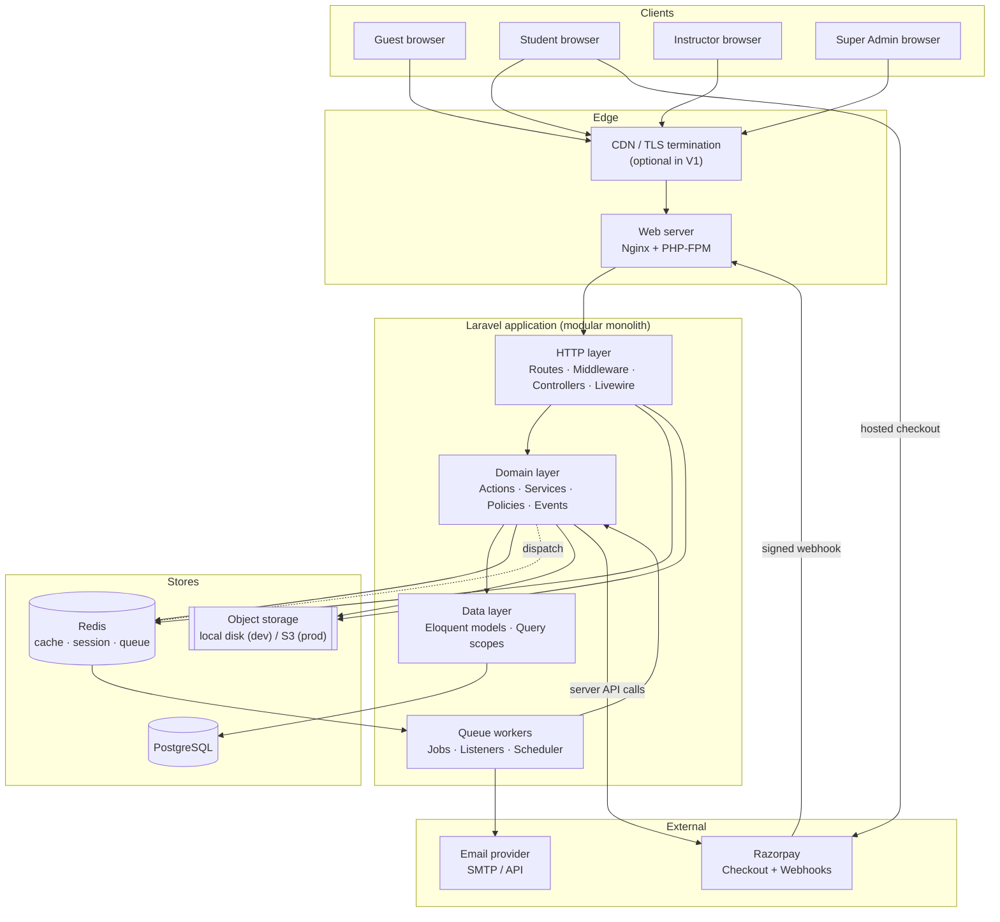

**Style: modular monolith.** One deployable Laravel application with strong internal module boundaries. Microservices are rejected for V1 — the domain is cohesive, the team is small, and distributed transactions between payment and enrollment would create exactly the consistency risk the customer is most concerned about.

---

## 3. Application architecture

### 3.1 Layers

```mermaid
graph LR
    subgraph L1["1 · Presentation"]
        BL["Blade views<br/>layouts · partials · components"]
        LW["Livewire components<br/>interactive UI"]
        AL["Alpine.js<br/>local UI state"]
        TW["Tailwind CSS"]
    end
    subgraph L2["2 · HTTP"]
        RT["Routes"]
        MW["Middleware"]
        CT["Controllers"]
        FR["Form Requests"]
        VR["View Models / Data objects"]
    end
    subgraph L3["3 · Domain"]
        AC["Actions<br/>single use-case, write"]
        SV["Services<br/>cross-cutting capability"]
        PL["Policies"]
        EV["Events / Listeners"]
        JB["Jobs"]
        RG["Registries<br/>content · question types"]
    end
    subgraph L4["4 · Data"]
        MD["Eloquent models"]
        SC["Query scopes / builders"]
        MG["Migrations · Seeders · Factories"]
    end
    subgraph L5["5 · Infrastructure"]
        ST["Storage (Filesystem)"]
        PY["Payment gateway client"]
        ML["Mail transport"]
        QU["Queue"]
        LG["Logging"]
    end

    L1 --> L2 --> L3 --> L4
    L3 --> L5
```

**Dependency rule.** Layers depend downward only. Presentation never touches Eloquent for writes. Domain never references `request()`, `session()` or `auth()` implicitly — the acting user is passed in explicitly. Infrastructure is reached through interfaces owned by the domain.

### 3.2 Component responsibilities

| Component | Owns | Must not |
|---|---|---|
| **Route + Middleware** | URL shape, coarse auth, throttling, tenant resolution seam | Business rules |
| **Controller / Livewire** | Request→Action translation, response/redirect, flash messaging | Multi-step business logic, direct raw SQL |
| **Form Request** | Validation and authorisation of *input shape* | Domain invariants |
| **Policy** | "May this user do this to this record?" | Data mutation |
| **Action** | Exactly one write use-case, transactional, returns a result | Rendering, HTTP concerns |
| **Service** | A reusable capability (storage paths, grading, payment client, progress calculation) | Owning a use-case end to end |
| **Event / Listener** | Reacting to a completed fact (send email, recalc progress, audit) | Being required for the primary transaction's correctness |
| **Job** | Deferred, retryable, idempotent work | Depending on ambient request state |
| **Model** | Persistence, relationships, casts, scopes, small derived accessors | Orchestration, external calls |

### 3.3 Directory structure

Standard Laravel skeleton, grouped by bounded context inside the conventional folders. This keeps `artisan` generators, IDE tooling and Laravel idiom intact while giving clear module seams.

```
app/
├── Actions/                      # one class = one write use-case
│   ├── Fortify/                  #   framework-expected location; thin adapters that
│   │                             #   delegate to Identity/ Actions (ADR-013)
│   ├── Catalog/                  #   CreateCourse, PublishCourse, ReorderModules, ...
│   ├── Content/                  #   AttachLessonMedia, ReplaceLessonVideo, ...
│   ├── Identity/                 #   RegisterStudent, CreateInstructor, ActivateAccount, ...
│   ├── Enrollment/               #   GrantEnrollment, RevokeEnrollment, ...
│   ├── Billing/                  #   PlaceOrder, ProcessPaymentWebhook, ReconcileOrder, ...
│   ├── Assessment/               #   StartAttempt, SaveAnswer, SubmitAttempt, ...
│   └── Progress/                 #   RecordLessonProgress, RecalculateCourseProgress, ...
├── Services/
│   ├── Content/                  # ContentTypeRegistry, LessonContentHandler impls
│   ├── Media/                    # MediaStorageService, MediaPathResolver, SignedMediaUrl
│   ├── Billing/                  # PaymentGateway contract, RazorpayGateway, SignatureVerifier
│   ├── Assessment/               # GradingService, QuestionTypeRegistry, AttemptClock
│   ├── Progress/                 # ProgressCalculator
│   ├── Reporting/                # report builders + CSV exporters
│   ├── Audit/                    # AuditLogger
│   └── Settings/                 # SettingsRepository, BrandingService
├── Models/
├── Policies/
├── Http/
│   ├── Controllers/{Admin,Instructor,Student,Public,Webhook,Media}/
│   ├── Middleware/
│   └── Requests/{Admin,Instructor,Student,...}/
├── Livewire/{Admin,Instructor,Student,Shared}/
├── Jobs/{Billing,Mail,Media,Progress,Reporting}/
├── Events/  Listeners/  Notifications/  Mail/
├── Enums/                        # native PHP 8 backed enums for every status/type
├── Exceptions/                   # domain exceptions
├── Support/                      # framework-agnostic helpers, value objects (Money)
└── Providers/
resources/views/
├── layouts/{public,app,admin,instructor,mail}.blade.php
├── components/                   # Blade UI components (button, card, table, modal, ...)
├── livewire/
└── {public,student,instructor,admin}/
database/{migrations,seeders,factories}/
routes/{web.php,admin.php,instructor.php,student.php,webhooks.php,media.php,console.php}
tests/{Unit,Feature,Browser}/
docs/adr/                         # architecture decision records
```

**Why not `app/Modules/*` with per-module service providers?** It fights Laravel's discovery conventions (P-4) for a codebase this size, and the same isolation benefit is obtained by folder grouping plus disciplined dependency direction. Revisit if the codebase exceeds ~400 classes.

---

## 4. Technology stack

| Concern | Choice | Notes |
|---|---|---|
| Language | **PHP 8.5** | Enums, readonly props, typed properties, property hooks used throughout |
| Framework | **Laravel 13.x** — pinned to the major version | Latest stable 13.x patch at installation. The major version never floats (PD-01, C-02) |
| Database | PostgreSQL 16+ | JSONB, partial indexes, normalised email storage, real CHECK constraints |
| UI | Blade + **Livewire 4** + Alpine.js | Server-driven; no SPA |
| CSS | Tailwind CSS (v4) + Vite | Design tokens from a single config |
| Auth | **Laravel Fortify** (headless) + LMS-owned UI | Session guard and password broker underneath; no starter-kit UI (PD-03, C-06) |
| Payments | Razorpay | Behind a `PaymentGateway` interface. All V1 courses are paid |
| Queue | Redis (prod) / database (dev) | Same job code either way |
| Cache & session | Redis (prod) / file+database (dev) | |
| Storage | `local` private disk (dev) / S3-compatible (prod) | Same `Storage` API |
| Mail | Laravel Mail — Mailpit/log (dev), provider (prod, **PD-07**) | Always queued |
| Testing | **Pest** + Laravel testing helpers | PD-04 |
| Quality | Laravel Pint, Larastan | Enforced in CI |
| Logs | Monolog → daily files (dev), stdout/aggregator (prod) | |

> **Version compatibility must be verified, not assumed.** The first task of Phase 1 is to confirm, from the official sources, the current stable Laravel 13.x patch, its supported PHP range, and that Livewire 4, Fortify, Pest, Larastan and the Razorpay SDK all have releases compatible with that combination. If PHP 8.5 is not supported by every one of them, the project drops to the highest PHP version they all support and the deviation is recorded as a decision — the dependency set is not compromised to reach a version number.

---

## 5. Frontend architecture

### 5.1 Rendering model

Server-rendered Blade is the default. Livewire is used only where interactivity genuinely needs server state; Alpine handles purely local UI state (dropdowns, tabs, modals). No JSON API is built for the first-party UI in V1.

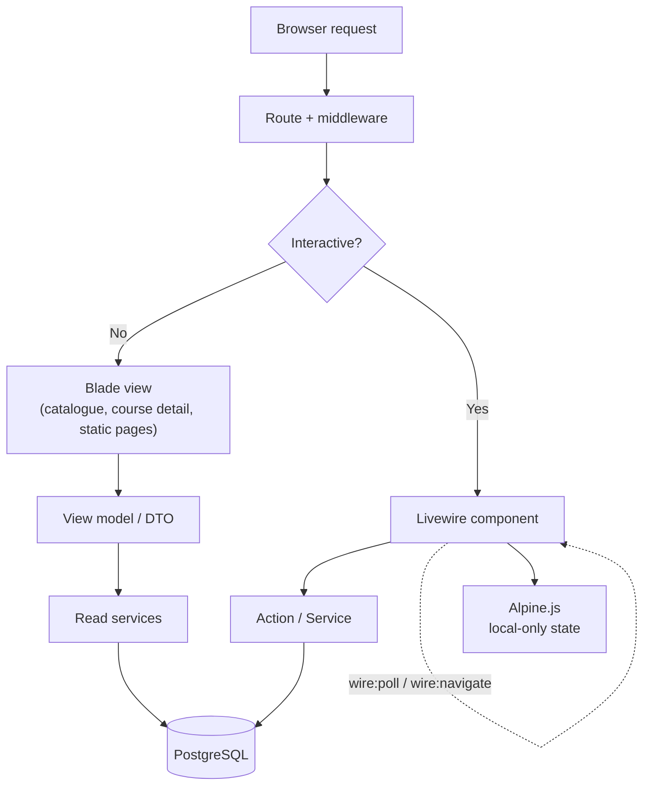

### 5.2 Where Livewire is used

| Area | Component | Why Livewire |
|---|---|---|
| Course Builder | `Admin\CourseBuilder`, `ModuleList`, `LessonEditor`, `MediaUploader` | Drag-reorder, inline edit, upload progress, live outline |
| Question authoring | `Admin\QuestionEditor`, `Instructor\QuestionEditor` | Dynamic option rows, live validation, per-type forms |
| Assessment player | `Student\AttemptRunner` | Server-held timer, per-question autosave, guarded submit |
| Course player | `Student\LessonPlayer`, `CurriculumSidebar` | Progress ticks, mark-complete, lesson switching |
| Admin tables | `Admin\{Students,Instructors,Enrollments,Orders,AuditLog}Table` | Search, filter, sort, paginate without a JS stack |
| Checkout status | `Student\PaymentStatus` | Polls for webhook-confirmed state (FR-PAY-11) |
| Settings | `Admin\SettingsForm` | Grouped live-validated form |

**Livewire rules.** Public component properties never hold secrets or authorisation flags. Every mutating method re-checks authorisation server-side (`$this->authorize(...)`) — component state is client-influenceable. File uploads use Livewire's temporary-upload mechanism with validation applied on both the temporary file and the final store. Long lists are paginated, never fully hydrated.

### 5.3 UI structure

Four layouts: `public` (catalogue/marketing), `app` (student), `instructor`, `admin`. A shared Blade component library (`<x-button>`, `<x-card>`, `<x-table>`, `<x-modal>`, `<x-form.*>`, `<x-badge>`, `<x-empty-state>`) enforces visual consistency. Tailwind design tokens (colour, spacing, radius, typography) are defined once; arbitrary values are discouraged in views.

---

## 6. Database architecture

### 6.1 Design decisions

| Decision | Rationale |
|---|---|
| PostgreSQL with `bigint` identity primary keys | Simple, fast joins, natural ordering. Public-facing identifiers use slugs/order numbers, not raw IDs. |
| ULID/UUID for externally exposed opaque handles (media, attempts) | Prevents enumeration where the ID appears in URLs. |
| Money as `bigint` minor units + `char(3)` currency | Never floating point. `Money` value object in `app/Support`. |
| Native PHP enums cast to string columns, guarded by DB `CHECK` constraints | Type safety in code *and* integrity in the database. Avoids PostgreSQL enum-type ALTER pain. |
| `JSONB` for genuinely open-ended data (`lessons.meta`, `settings.value`, raw gateway payloads, attempt snapshots) | Extensibility without schema churn. Never used for data that needs relational integrity. |
| Soft deletes on `users`, `courses`, `modules`, `lessons` | Recoverability; financial and progress history stays intact. |
| Hard FKs with explicit `ON DELETE` behaviour everywhere | The database refuses to become inconsistent. |
| Timestamps in UTC (`timestamptz`) | Display converts to local time. |
| Every FK indexed; composite indexes for real access paths | Deliberate, not blanket. |

### 6.2 Entity analysis — why the schema is smaller than the brief's table list

The brief listed candidate tables and asked for the cleanest schema instead of all of them. Nine candidate tables collapse:

| Candidate tables | Resolution | Reason |
|---|---|---|
| `videos`, `notes`, `presentations`, `resources` | → **`media_files`** (polymorphic) + `lessons.type` + `lessons.meta` | These four differ only in MIME type and how they render. Four near-identical tables would force a schema migration for every new content type, violating P-7 and FR-CNT-07. |
| `quizzes`, `tests` | → **`assessments`** with a `type` discriminator | Structurally identical: questions, marks, pass %, time limit, attempts. They differ only in what they attach to (lesson/module vs course) and intent. One table, one engine, one set of policies — half the code, half the bugs. |
| `quiz_questions`, `test_questions` | → **`questions`** (FK to `assessments`) | Same entity. |
| `quiz_attempts`, `test_attempts` | → **`assessment_attempts`** | Same entity. |
| `quiz_results`, `test_results` | → **columns on `assessment_attempts`** | A result is not an entity — it is the graded state *of* an attempt. A separate table would create a 1:1 that can drift out of sync. |
| `progress` (single generic table) | → **`lesson_progress`** + cached aggregates on `enrollments`; module/course progress **derived** | Only lesson-level progress is a fact. Module and course progress are functions of it. Storing all three invites contradiction (P-8). |
| `password/account activation tokens` | → **`password_reset_tokens`** (Laravel's own, used by the password broker) | Already hashed, expiring, single-use and throttled. Writing our own is unnecessary risk (P-4). |

The result: **21 domain tables** (Phase 2 creates 4, Phase 3 creates 17) plus Laravel's own framework tables. Nine candidate tables are eliminated by consolidation, with no lost capability.

### 6.3 Entity–relationship diagram

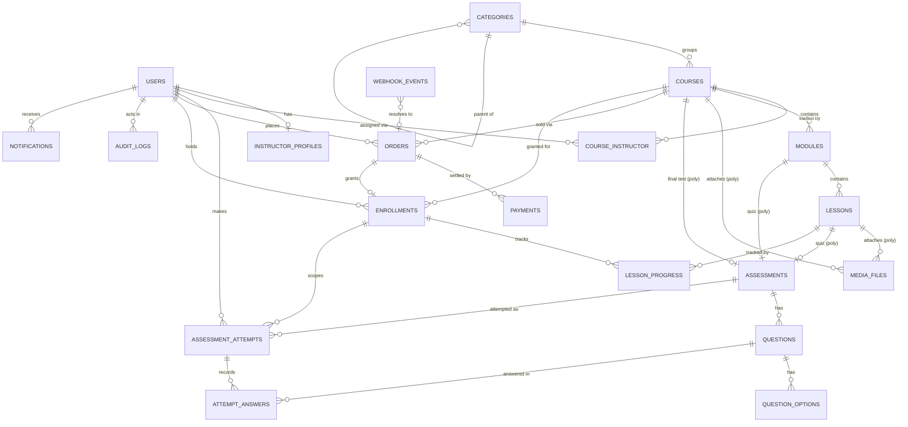

### 6.4 Table specifications

Column lists are indicative; exact types are fixed in the Phase 3 migrations.

#### Identity

**`users`** — `id`, `name`, `email` (unique, stored normalised lower-case), `email_verified_at`, `password` (nullable until activation), `role` (`super_admin|instructor|student`, CHECK-constrained), `status` (`pending_verification|pending_activation|active|inactive|suspended` — see §7.2), `phone`, `avatar_path`, `last_login_at`, `remember_token`, timestamps, `deleted_at`.
*Indexes:* unique(`email`), (`role`,`status`), (`status`,`created_at`).
*Note:* `password` nullable is the mechanism for purchase-created accounts. A null password can never satisfy `Hash::check`, so such accounts cannot log in until activation — a fail-safe default.

**`instructor_profiles`** — `id`, `user_id` (unique FK), `headline`, `bio`, `expertise` (JSONB), `links` (JSONB), timestamps. Keeps `users` lean and role-neutral.

#### Catalogue & content

**`categories`** — `id`, `parent_id` (nullable self-FK), `name`, `slug` (unique — *composite-ready*), `position`, timestamps.

**`courses`** — `id`, `category_id` (nullable, `ON DELETE SET NULL`), `title`, `slug` (unique — *composite-ready*), `subtitle`, `description`, `outcomes` (JSONB), `requirements` (JSONB), `level` (`beginner|intermediate|advanced`), `language`, `thumbnail_path`, `promo_media_id`, `price_amount` (bigint minor units, **CHECK > 0** — all V1 courses are paid), `currency`, `status` (`draft|published|archived`), `published_at`, `requires_final_test`, `created_by` (FK users), `modules_count`, `lessons_count`, `total_duration_seconds`, timestamps, `deleted_at`.
*Indexes:* unique(`slug`), (`status`,`published_at`), (`category_id`,`status`).

**`course_instructor`** — `id`, `course_id`, `user_id`, `role_in_course` (`lead|assistant`), `assigned_by`, `assigned_at`, timestamps. Unique(`course_id`,`user_id`). This pivot is the **entire basis of instructor authorisation**.

**`modules`** — `id`, `course_id` (`ON DELETE CASCADE`), `title`, `description`, `position`, `is_published`, `lessons_count`, timestamps.
*Indexes:* (`course_id`,`position`), (`course_id`,`is_published`).

**`lessons`** — `id`, `module_id` (`ON DELETE CASCADE`), `title`, `slug`, `type` (`video|document|presentation|text|resource|quiz`), `summary`, `body` (sanitised HTML, for `text`), `position`, `duration_seconds`, `is_published`, `meta` (JSONB), timestamps, `deleted_at`.
*No `is_preview` column* — guests get metadata only in V1 (§8.5). Adding preview later is a single additive nullable boolean.
*Indexes:* (`module_id`,`position`), (`module_id`,`is_published`), unique(`module_id`,`slug`).
`meta` holds type-specific attributes (e.g. video `provider`, `original_duration`, `poster_media_id`) so a new content type adds **no columns** (FR-CNT-07).

**`media_files`** — `id`, `ulid` (unique, used in URLs), `attachable_type`, `attachable_id`, `disk`, `path`, `original_name`, `mime_type`, `extension`, `size_bytes`, `checksum_sha256`, `purpose` (`video|document|presentation|attachment|thumbnail|caption`), `is_downloadable`, `position`, `uploaded_by`, timestamps.
*Indexes:* (`attachable_type`,`attachable_id`,`position`), unique(`ulid`), (`disk`,`path`).
One table for every uploaded byte, attachable to a Lesson, Course, Question or User.

#### Assessments

**`assessments`** — `id`, `assessable_type`, `assessable_id` (Lesson | Module | Course), `type` (`quiz|test`), `title`, `instructions`, `passing_percentage`, `time_limit_minutes` (nullable = untimed), `max_attempts` (nullable = unlimited), `scoring_policy` (`highest|latest|first`, default `highest`), `shuffle_questions`, `shuffle_options`, `answer_reveal` (`never|after_submit|after_pass`), `negative_marking_enabled`, `total_marks` (derived cache), `questions_count`, `is_published`, `available_from`, `available_until`, `created_by`, timestamps.
*Indexes:* (`assessable_type`,`assessable_id`), (`type`,`is_published`).

**`questions`** — `id`, `assessment_id` (`ON DELETE CASCADE`), `type` (`single_choice|multiple_choice|true_false|short_answer`), `body`, `explanation`, `marks`, `negative_marks`, `position`, `meta` (JSONB — e.g. accepted answers for short answer, matching config later), timestamps.
*Indexes:* (`assessment_id`,`position`).

**`question_options`** — `id`, `question_id` (`ON DELETE CASCADE`), `body`, `is_correct`, `position`, timestamps.
*Never serialised to the student before submission with `is_correct` present* (NFR-SEC-21) — a dedicated presenter strips it.

**`assessment_attempts`** — `id`, `ulid` (unique, URL handle), `assessment_id`, `user_id`, `enrollment_id`, `attempt_number`, `status` (`in_progress|submitted|graded|expired|abandoned`), `started_at`, `expires_at`, `submitted_at`, `graded_at`, `score_marks`, `max_marks`, `score_percentage`, `is_passed`, `time_spent_seconds`, `question_order` (JSONB snapshot — FR-ASMT-18), timestamps.
*Indexes:* (`assessment_id`,`user_id`,`attempt_number`) unique, (`user_id`,`status`), **partial unique** on (`assessment_id`,`user_id`) `WHERE status = 'in_progress'` — this single constraint enforces FR-ASMT-16 at the database level.

**`attempt_answers`** — `id`, `attempt_id` (`ON DELETE CASCADE`), `question_id`, `selected_option_ids` (JSONB array), `answer_text`, `is_correct`, `marks_awarded`, `answered_at`, timestamps. Unique(`attempt_id`,`question_id`).

#### Commerce & access

**`orders`** — `id`, `order_number` (unique, human-readable — *composite-ready*), `user_id` (nullable until buyer resolved), `course_id`, `buyer_name`, `buyer_email` (normalised), `buyer_phone`, `amount_subtotal`, `discount_amount`, `amount_total`, `currency`, `status` (`created|pending|paid|failed|cancelled|refunded`), `gateway` (`razorpay`), `gateway_order_id` (unique nullable), `placed_at`, `paid_at`, `failed_reason`, `meta` (JSONB), timestamps.
*Indexes:* unique(`gateway_order_id`), (`buyer_email`), (`status`,`created_at`), (`course_id`,`status`).

**`payments`** — `id`, `order_id`, `gateway`, `gateway_payment_id` (unique), `method`, `amount`, `currency`, `status` (`created|authorized|captured|failed|refunded`), `captured_at`, `refunded_amount`, `failure_code`, `failure_reason`, `raw_payload` (JSONB), timestamps.
Separated from `orders` because one order legitimately has several payment attempts (fail → retry → capture), and Razorpay models order and payment separately.

**`webhook_events`** — `id`, `gateway`, `event_id` (**unique** — the idempotency key), `event_type`, `payload` (JSONB), `signature`, `status` (`received|processing|processed|failed|ignored`), `attempts`, `received_at`, `processed_at`, `last_error`, timestamps.

**`enrollments`** — `id`, `user_id`, `course_id`, `order_id` (nullable), `source` (`purchase|admin_grant|import`), `status` (`active|suspended|completed|expired|refunded`), `enrolled_at`, `expires_at`, `completed_at`, `granted_by`, `revoked_by`, `revoked_at`, `revoke_reason`, `progress_percentage`, `completed_lessons_count`, `last_lesson_id`, `last_accessed_at`, timestamps.
*Indexes:* **unique(`user_id`,`course_id`)** — the structural guarantee behind FR-ENR-04 and idempotent enrollment; (`course_id`,`status`), (`user_id`,`status`).

#### Progress

**`lesson_progress`** — `id`, `enrollment_id` (`ON DELETE CASCADE`), `lesson_id`, `user_id` (denormalised for query speed), `status` (`not_started|in_progress|completed`), `video_position_seconds`, `video_watched_seconds`, `video_duration_seconds`, `completion_source` (`manual|video|assessment|download`), `first_accessed_at`, `completed_at`, timestamps.
*Indexes:* unique(`enrollment_id`,`lesson_id`), (`user_id`,`status`), (`lesson_id`,`status`).

#### Platform

**`settings`** — `id`, `group`, `key` (unique — *composite-ready*), `value` (JSONB), `type`, `is_public`, timestamps. All organisation-level configuration (FR-SYS-01).

**`audit_logs`** — `id`, `user_id` (nullable), `action`, `auditable_type`, `auditable_id`, `description`, `changes` (JSONB `{before, after}`), `ip_address`, `user_agent`, `created_at`. Append-only; no `updated_at`, no update/delete path in code (NFR-SEC-17). Indexed on (`auditable_type`,`auditable_id`,`created_at`) and (`user_id`,`created_at`).

**`email_logs`** — `id`, `to_email`, `mailable`, `subject`, `status` (`queued|sent|failed`), `error`, `sent_at`, `context` (JSONB), timestamps (FR-MAIL-10).

**Laravel-provided:** `password_reset_tokens` (used for both reset and activation), `sessions`, `cache`, `cache_locks`, `jobs`, `job_batches`, `failed_jobs`, `notifications`.

### 6.5 Key database-enforced invariants

The database, not just the code, guarantees:

| Invariant | Mechanism |
|---|---|
| One enrollment per student per course | `UNIQUE(user_id, course_id)` on `enrollments` |
| One in-progress attempt per student per assessment | Partial unique index `WHERE status='in_progress'` |
| One progress row per lesson per enrollment | `UNIQUE(enrollment_id, lesson_id)` |
| A webhook event is processed once | `UNIQUE(event_id)` on `webhook_events` |
| A gateway payment is recorded once | `UNIQUE(gateway_payment_id)` on `payments` |
| One email = one account | `UNIQUE(email)` on `users` + normalisation on write |
| No orphan content | FKs with `ON DELETE CASCADE` down the course hierarchy |
| Status/type values are legal | `CHECK` constraints mirroring PHP enums |
| Financial records survive user deletion | Soft deletes on `users`; `RESTRICT`/`SET NULL` on financial FKs |

---

## 7. Authentication architecture

### 7.1 Mechanism

**Laravel Fortify** provides the authentication backend (ADR-013). Fortify is headless — it ships routes, controllers and pipeline actions but **no views** — which is exactly the shape this project needs: battle-tested security primitives underneath, a fully LMS-owned interface on top. Underneath Fortify sit Laravel's session guard, database user provider and password broker.

Passwords are hashed with bcrypt (cost tuned at deployment) or argon2id. The password broker (`password_reset_tokens`) serves **both** password reset and first-time account activation — the token is stored hashed, expires, is throttled, and is deleted on use.

**Decision (ADR-004):** reuse the password broker for activation rather than building an `account_activations` table. Rationale — identical security properties (hashed, expiring, single-use, throttled), zero new attack surface, and Laravel maintains it. A distinct `AccountActivationNotification` and a longer configured TTL provide the different UX. If a per-activation audit trail is later required, an `audit_logs` entry on activation covers it without a new table.

### 7.1.1 Fortify configuration

| Fortify feature | V1 state | Notes |
|---|---|---|
| `Features::registration()` | **Enabled** | Student self-registration only; role is forced to `student` server-side |
| `Features::emailVerification()` | **Enabled** | Required before a self-registered account becomes `active` |
| `Features::resetPasswords()` | **Enabled** | Also the substrate for the activation link |
| `Features::updatePasswords()` | **Enabled** | Used by the profile screen |
| `Features::updateProfileInformation()` | **Disabled** | The LMS owns profile updates through its own Action (email change requires re-verification) |
| `Features::twoFactorAuthentication()` | **Disabled** | [V1.1] — FR-AUTH-13. Enabled later by turning the feature on and building the UI |

**View binding.** Every Fortify view callback (`Fortify::loginView()`, `registerView()`, `requestPasswordResetLinkView()`, `resetPasswordView()`, `verifyEmailView()`, `confirmPasswordView()`) returns an LMS Blade view. No Fortify or starter-kit markup is used.

**Pipeline customisation.** Fortify's default `app/Actions/Fortify` classes (`CreateNewUser`, `ResetUserPassword`, `UpdateUserPassword`) are kept where the framework expects them, but each is a **thin adapter that delegates to the corresponding LMS domain Action** — so `RegisterStudent` remains the single implementation, callable from HTTP, a job or a console command (P-5, ADR-013).

**Status gating is inside the pipeline, not only in middleware.** `Fortify::authenticateUsing()` is overridden so credential verification and the `status === active` check happen together. This matters: a status check applied only as route middleware would still let Fortify establish a session for a suspended user before the middleware fired. The `EnsureUserIsActive` middleware remains as defence in depth for already-established sessions whose user is deactivated mid-session.

**Rate limiting.** Fortify's `login` and `two-factor` limiters are configured through `RateLimiter::for()` alongside the LMS's own limiters (§18.3), keyed on email + IP.

**What Fortify does not do, and the LMS owns:** the purchase-driven account creation and activation flow (§11.2, FR-MAIL-01), account status lifecycle, role assignment and routing, audit logging of authentication events, and every view.

### 7.2 Account states

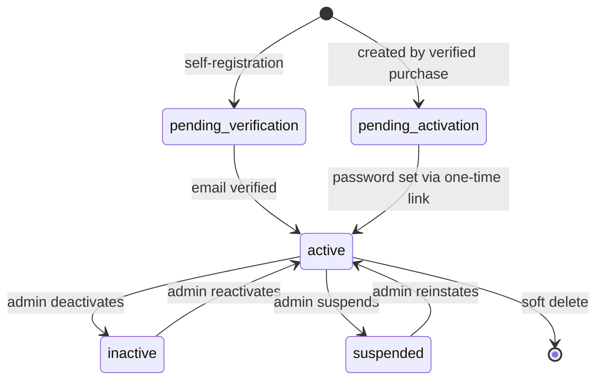

Only `active` may authenticate. A `pending_activation` user has `password = NULL`, so authentication is structurally impossible before activation.

### 7.3 Authentication flows

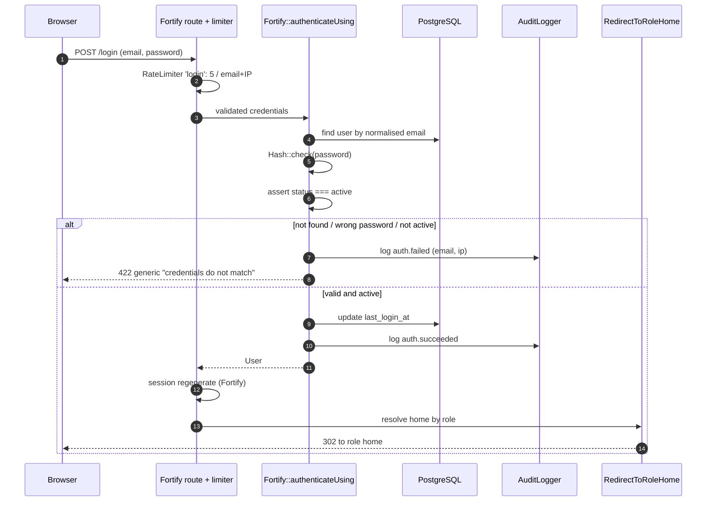

The status assertion sits **inside** `authenticateUsing`, so a suspended or unactivated user never reaches an established session. The generic failure message is identical for every failure cause — no user enumeration.

Role home: `super_admin` → `/admin`, `instructor` → `/instructor`, `student` → `/dashboard`.

### 7.4 Session security

Secure + `HttpOnly` + `SameSite=Lax` cookies; encrypted session store; ID regenerated on login and on privilege change; all other sessions invalidated on password change; configurable idle lifetime (default 120 min, shorter for admin — **PD-06**).

---

## 8. RBAC architecture

### 8.1 Model

Three fixed roles, one per user, stored on `users.role` as a string with a CHECK constraint and a native PHP enum (`App\Enums\UserRole`).

**Decision (ADR-005):** no permission package (Spatie or otherwise) in V1. Three fixed roles with fixed capabilities do not need a runtime permission engine; policies express the rules more precisely and with zero dependency. **Migration path if custom roles are ever needed:** the accessor `$user->hasRole(UserRole::Instructor)` is the only call site pattern used anywhere in the codebase. Introducing a `role_user` pivot later means changing that one method plus a data migration — no policy, middleware or view changes.

### 8.2 Enforcement layers

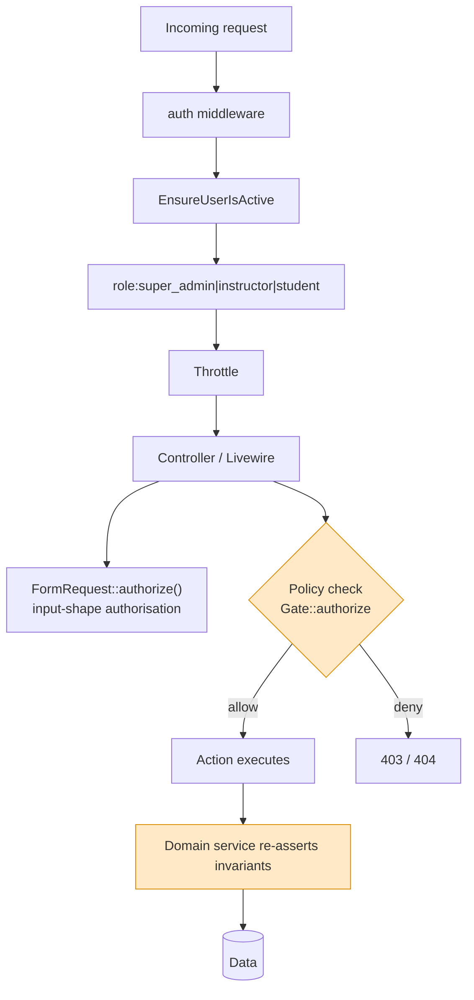

Four independent gates. Middleware is coarse; the **Policy is the authority** for record access; the Action re-asserts domain invariants so it is safe to call from a job or console command where no middleware ran.

### 8.3 Policies

| Policy | Governs | Core rule |
|---|---|---|
| `CoursePolicy` | view / create / update / delete / publish / manageContent | Admin: all. Instructor: `view` + `viewStudents` only if assigned. Student: `view` if published; `access` if actively enrolled. |
| `ModulePolicy`, `LessonPolicy` | CRUD, reorder | Delegates to the parent `CoursePolicy`. |
| `MediaFilePolicy` | download / stream | Resolves the owning course, then requires active enrollment, instructor assignment, or admin. No public path exists. |
| `AssessmentPolicy` | CRUD, publish, viewResults | Admin: all. Instructor: only on assigned courses. Student: none. |
| `AttemptPolicy` | start / answer / submit / review | Owner only for write; instructor/admin read within scope. |
| `EnrollmentPolicy` | view / grant / revoke | Admin only for write; student reads own; instructor reads within assigned course. |
| `OrderPolicy`, `PaymentPolicy` | view | Admin: all. Student: own only. **Instructor: never** (FR-INS-10). |
| `UserPolicy` | CRUD, activate, changeRole | Admin only; guards the last-Super-Admin rule (FR-RBAC-09) and self-modification of role/status. |
| `ReportPolicy` | view | Admin: all. Instructor: assigned-course, non-financial only. |
| `AuditLogPolicy` | view | Admin only. `create` returns false for everyone — the log is written by the service, never by a user action. |

### 8.4 The instructor scope

Instructor authorisation reduces to one question: *is this course in `course_instructor` for this user?* One `Course::scopeAssignedTo(User $user)` scope and one `CoursePolicy::isAssigned()` helper are the only implementations. Every instructor query begins from `Course::assignedTo($user)` rather than from `Course::query()`, so scope leakage requires actively bypassing the standard entry point (FR-RBAC-04, AC-03).

### 8.5 The student access gate

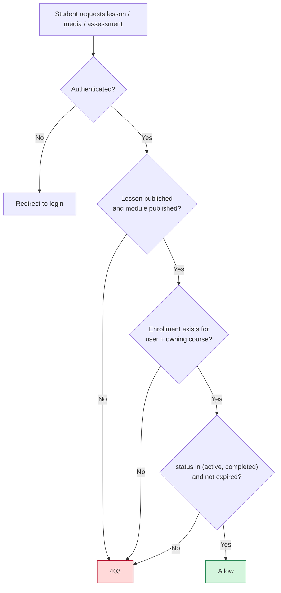

**There is no preview branch.** Guests reach course *metadata* only — title, description, outcomes, requirements, instructors, curriculum titles and durations, price. No lesson body, no media, no resource, no assessment is publicly reachable by any path (FR-RBAC-05, AC-01). Free-preview lessons are a [V1.1] item; adding one later means one additive column and one branch in this diagram.

This gate is implemented **once**, in `EnrollmentAccessService::grantsAccess(User, Course)`, and consumed by every policy that needs it. There is exactly one definition of "has access" in the system.

---

## 9. Course & content architecture

### 9.1 Hierarchy

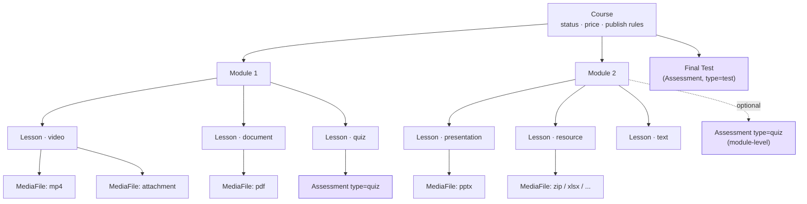

### 9.2 Content type registry (P-7, FR-CNT-07)

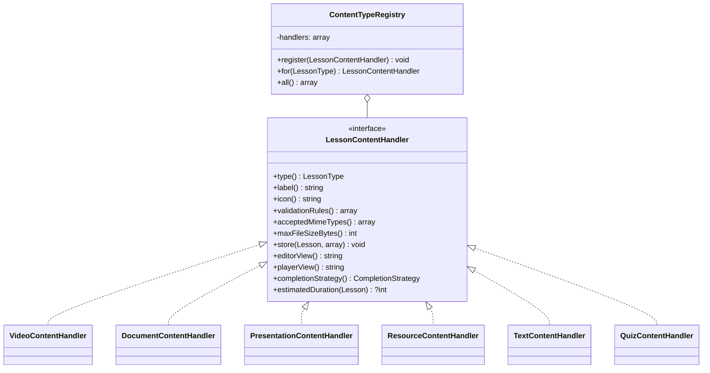

Handlers are registered in `ContentServiceProvider`. The Course Builder renders the editor for `registry->for($lesson->type)->editorView()`; the player renders `playerView()`. **Adding "SCORM package" or "embedded video" later = one new handler class + two Blade partials + one enum case. Zero schema change, zero controller change.**

### 9.3 Course Builder

A Livewire-driven single screen: course meta panel, drag-reorderable module list, drag-reorderable lesson list per module, and a per-lesson editor rendered by the registry. Reordering posts an ordered ID array; the server validates that the set is exactly the current children (no additions, no removals) and rewrites positions inside one transaction (FR-CNT-04).

Publish validation lives in `CoursePublishValidator` and is invoked by both the UI (for live feedback) and `PublishCourse` (for enforcement) — the same rules, one implementation.

---

## 10. Assessment architecture

### 10.1 Unified model

`Assessment` is polymorphic on `assessable`: attached to a `Lesson` (inline quiz), a `Module` (end-of-module quiz), or a `Course` (final test, `type = test`).

### 10.2 Attempt lifecycle

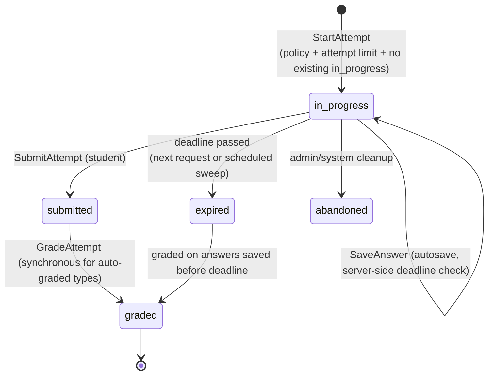

### 10.3 Grading

```mermaid
sequenceDiagram
    autonumber
    participant S as Student (Livewire)
    participant A as SubmitAttempt action
    participant CK as AttemptClock
    participant G as GradingService
    participant QR as QuestionTypeRegistry
    participant DB as PostgreSQL
    participant EV as Events

    S->>A: submit(attemptUlid)
    A->>A: authorize (owner, status=in_progress)
    A->>CK: withinDeadline(attempt)?
    CK-->>A: true / false (server clock only)
    A->>DB: BEGIN; lock attempt FOR UPDATE
    A->>G: grade(attempt)
    loop each question
        G->>QR: grader for question.type
        QR-->>G: marks awarded (+ negative if wrong and enabled)
        G->>DB: update attempt_answers.is_correct, marks_awarded
    end
    G-->>A: score, max, percentage, passed
    A->>DB: update attempt (status=graded, scores, submitted_at)
    A->>DB: COMMIT
    A->>EV: AttemptGraded
    EV-->>S: redirect to result (reveal per policy)
    Note over EV: listeners → recalc lesson progress,<br/>maybe complete course, queue result email
```

**Security properties.** `is_correct` and `questions.meta` accepted answers never leave the server before grading — a `QuestionPresenter` produces the student-facing payload (NFR-SEC-21). The deadline is `attempt.expires_at`, set server-side at start; the client timer is decoration. The attempt limit is checked inside the transaction that creates the attempt, so replaying the start request cannot exceed it (AC-25).

### 10.4 Question type registry

Mirrors the content registry: `QuestionTypeHandler` with `validationRules()`, `editorView()`, `playerView()`, `grade(Question, Answer): float`, `presentForStudent(Question): array`. Adding "matching" or "fill in the blank" is one class.

---

## 11. Payment architecture

### 11.1 Gateway abstraction

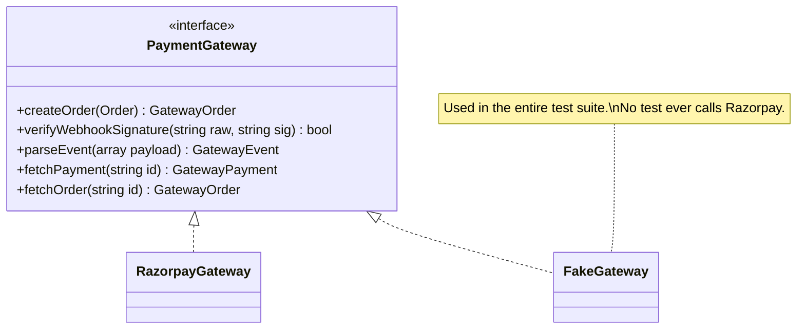

All Razorpay specifics — SDK usage, signature algorithm, event names, amount units — live inside `RazorpayGateway`. Domain code speaks only `GatewayOrder`, `GatewayEvent`, `GatewayPayment`. Adding Stripe later is one class plus a config switch.

### 11.2 Purchase flow — the critical path

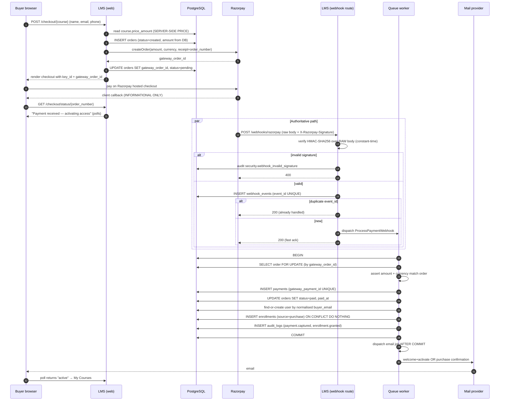

### 11.3 Non-negotiable payment rules

| # | Rule | Enforcement |
|---|---|---|
| 1 | The browser never sets or influences the price | Amount always read from `courses.price_amount`; the gateway order is created server-side |
| 2 | The browser callback grants nothing | The callback route only reads order status; it has no write path to `enrollments` |
| 3 | Signature verified before parsing | Raw body captured before JSON decode; `hash_equals` comparison |
| 4 | Idempotent by construction | `UNIQUE(event_id)` + `UNIQUE(gateway_payment_id)` + `UNIQUE(user_id, course_id)` |
| 5 | Amount and currency re-checked against the order | Mismatch → no enrollment, order flagged, alert raised (FR-PAY-13) |
| 6 | Webhook acknowledges fast, processes on the queue | Endpoint does verify + persist + dispatch only |
| 7 | Emails dispatched only after commit | `DB::afterCommit()` / `ShouldDispatchAfterCommit` |
| 8 | Missed webhooks are self-healing | Scheduled `ReconcileOrders` queries the gateway for `pending` orders older than N minutes and settles them through the *same* action |
| 9 | Enrollment logic exists in exactly one place | `GrantEnrollment` action — called by webhook processing, reconciliation and admin grant alike. Those are the only three callers in V1 |

### 11.4 Order state machine

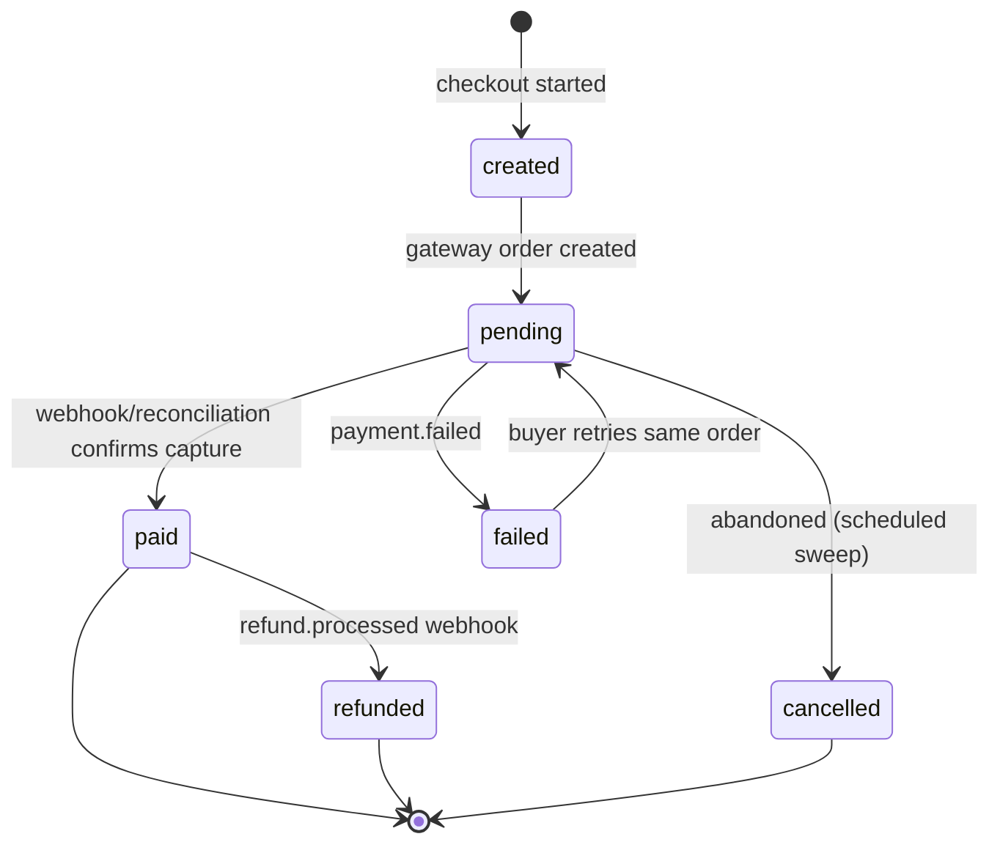

Only the `pending → paid` transition may create an enrollment. Only `paid → refunded` may revoke one.

---

## 12. Enrollment architecture

### 12.1 One writer

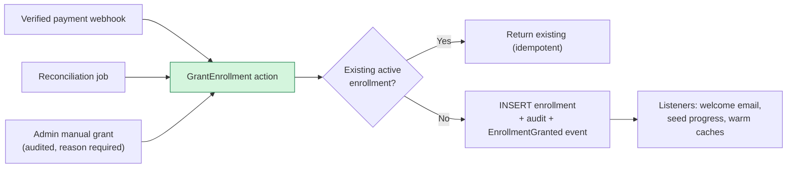

There is **one** code path that creates an enrollment. That is what makes AC-09, AC-11 and AC-13 testable rather than hopeful.

### 12.2 Access resolution

`EnrollmentAccessService::grantsAccess(User $user, Course $course): bool` returns true when an enrollment exists with `status ∈ {active, completed}` and (`expires_at` is null or in the future). Admins always pass; assigned instructors pass for read. The result is request-memoised. This single method backs `CoursePolicy`, `LessonPolicy`, `MediaFilePolicy`, `AssessmentPolicy` and the player UI.

---

## 13. Queue & background job architecture

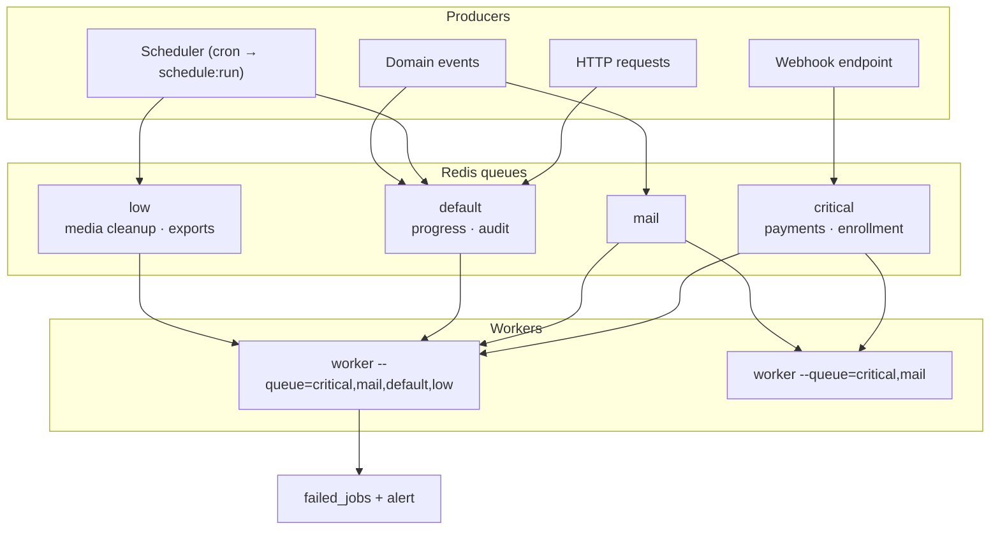

| Job | Queue | Tries / backoff | Idempotency key |
|---|---|---|---|
| `ProcessPaymentWebhook` | critical | 5, exponential | `webhook_events.event_id` |
| `ReconcileOrder` | critical | 3 | order status guard |
| `SendMailJob` (all mailables) | mail | 3, 60s | `email_logs` + mailable + recipient |
| `RecalculateCourseProgress` | default | 3 | recompute is naturally idempotent |
| `RecalculateProgressForCourseEnrollments` (batched) | default | 3 | per-enrollment child jobs |
| `DeleteOrphanedMedia` | low | 3 | existence check before delete |
| `GenerateReportExport` | low | 2 | export record status |
| `ExpireStaleAttempts` | default | 1 | status guard |
| `CancelAbandonedOrders` | low | 1 | status guard |

**Scheduled tasks:** `orders:reconcile` (*/10 min), `attempts:expire` (*/5 min), `orders:cancel-abandoned` (hourly), `enrollments:expire` (daily), `media:prune-orphans` (daily), `backup:run` (daily), `logs:prune`, `audit:archive` (monthly).

**Job rules.** Every job takes explicit IDs or serialised models — never ambient state (FR-SYS-04, and the seam multi-tenancy needs). Every job is safe to run twice. Every job that mutates money or access re-checks preconditions inside its own transaction.

---

## 14. Email architecture

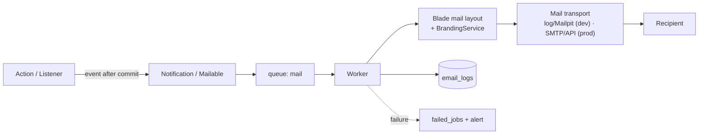

| Mailable | Trigger | Contains |
|---|---|---|
| `VerifyEmail` | Self-registration | Signed verification link |
| `WelcomeAndActivate` | Purchase created a new account | Course name + one-time set-password link |
| `PurchaseConfirmation` | Purchase by an existing active account | Course name + My Courses link |
| `PaymentFailed` | `payment.failed` | Retry link |
| `ResetPassword` | Forgot password | Expiring reset link |
| `PasswordChanged` | Password changed | Security notice |
| `EnrollmentGranted` | Admin grant | Course + login link |
| `EnrollmentRevoked` | Admin revoke / refund | Reason |
| `AssessmentResult` | Attempt graded (configurable) | Score, pass/fail |
| `CourseCompleted` | Progress reaches completion | Summary |

All emails extend one Blade layout drawing organisation name, logo, support address and footer from `BrandingService` → `settings` (FR-MAIL-08, FR-SYS-06). No template hardcodes organisation identity — this is the seam that makes per-organisation branding a configuration change in V2.

---

## 15. File storage architecture

### 15.1 Disks

| Disk | Driver (dev) | Driver (prod) | Purpose | Public? |
|---|---|---|---|---|
| `public` | local → `storage/app/public` | S3 public bucket / CDN | Thumbnails, avatars, logos | Yes |
| `content` | local → `storage/app/content` | S3 private bucket | Videos, PDFs, PPTX, resources | **No** |
| `temp` | local | local / S3 | Livewire temporary uploads, exports | No |

`content` is **never** symlinked into `public/`. Requirement FR-FILE-10 is satisfied by configuration alone — the code only ever calls `Storage::disk(config('lms.disks.content'))`.

### 15.2 Path resolution — the multi-tenancy seam

```
MediaPathResolver::forLesson(Lesson $lesson, string $purpose): string
```

V1 returns: `courses/{course_id}/lessons/{lesson_id}/{purpose}/{ulid}.{ext}`
V2 returns: `org/{organisation_id}/courses/{course_id}/...`

**No other class in the codebase ever constructs a storage path** (FR-FILE-11, FR-SYS-02). One method changes, and every existing object is reachable by keeping the old prefix for pre-migration records.

### 15.3 Upload pipeline

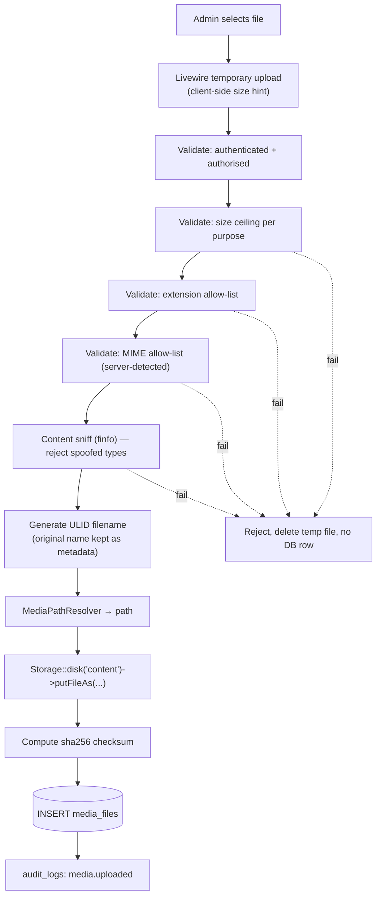

Allow-lists (tuned in Phase 5): video `mp4, webm, mov`; document `pdf`; presentation `ppt, pptx, odp`; resource `pdf, zip, docx, xlsx, csv, txt, png, jpg`. Executables, `.php`, `.html`, `.svg` and archives with executable content are rejected. Size ceilings per purpose, defaulting to 2 GB video / 50 MB document / 100 MB resource, are settings, not constants.

---

## 16. Video & protected content delivery

### 16.1 Two delivery strategies, one interface

`MediaUrlService::urlFor(MediaFile $file, User $user): string` returns:

| Environment | Strategy | Mechanism |
|---|---|---|
| Local disk | **Application streaming** | Laravel signed URL (short TTL) → `MediaStreamController` → policy check → `StreamedResponse` with HTTP Range support |
| S3-compatible | **Pre-signed object URL** | Policy check in the application, then a ≤5-minute pre-signed GET issued by the storage driver |

Callers never know which is in use. Switching is a config change (FR-FILE-10).

### 16.2 Delivery flow

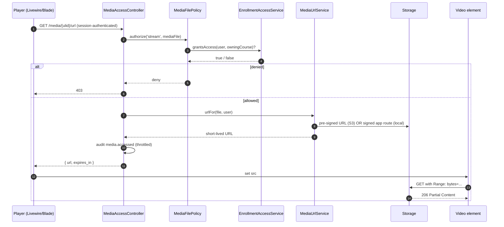

### 16.3 Protection measures in V1

Private storage outside the document root · generated non-guessable filenames · authorisation on every URL issue · short TTL (≤5 min) · signed URLs bound to the request context where the driver allows · `Content-Disposition: attachment` and `nosniff` for downloads · no directory listing · download rate limiting · throttled access audit logging · right-click/`controlsList` discouragement on the player (cosmetic only).

### 16.4 Stated limitation

**Without DRM, protection is economic, not absolute.** A student with an active enrollment can screen-record or capture the stream within the URL's validity window. These measures defeat hot-linking, URL sharing after expiry, unauthenticated access and casual copying. If the business requires stronger guarantees, the options are encrypted HLS with key rotation and signed cookies, a commercial video platform (Mux / Bunny / Cloudflare Stream) behind the same `MediaUrlService` interface, or full DRM (Widevine/FairPlay) — all [FUTURE], and all pluggable behind the existing interface without touching the domain.

This limitation is recorded as assumption **A-07** and requires an explicit business answer via **PD-12** in `planning.md` §16 **before Phase 5 begins**, because choosing a commercial video platform instead would change the scope of Phases 5 and 6.

---

## 17. Progress tracking architecture

### 17.1 Fact vs derived

| Level | Storage | Why |
|---|---|---|
| **Lesson** | `lesson_progress` row — **fact** | The only thing actually observed |
| **Module** | Derived at read time | `completed_lessons / published_lessons` — one grouped query serves a whole curriculum sidebar |
| **Course** | Derived, **cached** on `enrollments.progress_percentage` | Dashboards must not scan lesson rows (NFR-PERF-04) |
| **Student overall** | Aggregated from enrollment caches | Cheap |

The cache is always rebuildable from `lesson_progress` — `php artisan lms:progress:rebuild` is a supported operation, which is what makes caching safe.

### 17.2 Write path

```mermaid
graph TD
    A["Player: video tick / mark complete / quiz graded"] --> B["RecordLessonProgress action"]
    B --> C["Throttle: ≤1 write / 15s per lesson"]
    C --> D["UPSERT lesson_progress<br/>(enrollment_id, lesson_id)"]
    D --> E{"Crosses completion rule?"}
    E -->|"video ≥ threshold"| F["status=completed, source=video"]
    E -->|"manual"| F2["status=completed, source=manual"]
    E -->|"quiz passed"| F3["status=completed, source=assessment"]
    E -->|No| G["status=in_progress"]
    F --> H["LessonCompleted event"]
    F2 --> H
    F3 --> H
    G --> I["Update enrollment.last_lesson_id, last_accessed_at"]
    H --> I
    H --> J["Queue RecalculateCourseProgress(enrollment)"]
    J --> K["COUNT completed / COUNT published lessons"]
    K --> L["UPDATE enrollments.progress_percentage,<br/>completed_lessons_count"]
    L --> M{"100% and final test passed<br/>(if required)?"}
    M -->|Yes| N["status=completed, completed_at=now<br/>→ CourseCompleted event → email"]
    M -->|No| O["done"]
```

**Concurrency (FR-PROG-14, AC-32):** the upsert relies on `UNIQUE(enrollment_id, lesson_id)`; `status` uses a monotonic guard so `completed` never regresses to `in_progress`; `video_watched_seconds` takes the maximum, not the last value.

**Curriculum change (FR-PROG-09, AC-30):** publishing or unpublishing a lesson fires `CourseStructureChanged`, which dispatches a batched recalculation across that course's enrollments on the `default` queue.

---

## 18. Security architecture

### 18.1 Defence in depth

```mermaid
graph TD
    subgraph Network
        N1["HTTPS + HSTS"] --> N2["WAF / provider DDoS protection (optional)"]
    end
    subgraph Edge
        E1["Rate limiters<br/>login · register · reset · webhook · media · submit"]
        E2["Security headers<br/>CSP · nosniff · Referrer-Policy · frame-ancestors"]
    end
    subgraph AppSec["Application"]
        A1["Session guard + active-user middleware"]
        A2["Role middleware"]
        A3["CSRF on all state-changing browser routes"]
        A4["Form Request validation"]
        A5["Policies (record-level, deny by default)"]
        A6["Action-level invariant re-assertion"]
    end
    subgraph DataSec["Data"]
        D1["Eloquent / bound parameters only"]
        D2["Guarded mass assignment"]
        D3["Hashed passwords + hashed tokens"]
        D4["DB constraints as the last line"]
    end
    subgraph Content
        C1["Private disks, generated names"]
        C2["Authorised short-lived URLs"]
        C3["Upload allow-lists + content sniffing"]
    end
    subgraph Money
        M1["Server-side pricing"]
        M2["Raw-body signature verification"]
        M3["Idempotency keys"]
        M4["Amount/currency reconciliation"]
    end
    subgraph Observe
        O1["Append-only audit log"]
        O2["Security event logging + alerting"]
    end
    Network --> Edge --> AppSec --> DataSec
    AppSec --> Content
    AppSec --> Money
    AppSec --> Observe
```

### 18.2 Threat model — top risks and mitigations

| Threat | Mitigation |
|---|---|
| Forged payment success → free access | Enrollment only from verified webhook/reconciliation; callback route has no write path (AC-09) |
| Webhook replay / duplicate delivery | `UNIQUE(event_id)`, `UNIQUE(gateway_payment_id)`, `UNIQUE(user_id, course_id)` (AC-11) |
| Price tampering | Amount read from DB; gateway order created server-side; amount re-verified on capture (AC-12) |
| IDOR on courses/lessons/media/attempts | Policy check after every fetch-by-ID; ULIDs for URL-exposed handles (AC-02, AC-04) |
| Instructor scope escape | All instructor queries begin at `Course::assignedTo($user)`; policies re-check (AC-03) |
| Hot-linked / shared media URLs | Short-TTL signed URLs, authorisation at issue time (AC-19) |
| Malicious upload → RCE | Extension + MIME + content sniff, generated names, private non-executable storage (AC-21) |
| Answer key leakage | Presenter strips `is_correct`; correct answers never serialised pre-submission (AC-23) |
| Timer bypass on timed assessments | Server-side `expires_at`; client timer advisory (AC-24) |
| Credential stuffing / brute force | Per-email+IP throttling, generic errors, no user enumeration |
| Session fixation / hijack | Regeneration on login and privilege change, secure cookies, logout-others on password change |
| Privilege escalation via mass assignment | `role`, `status`, `price_amount`, ownership fields never fillable |
| XSS via rich text | Escaped output by default; allow-list sanitisation on save for descriptions |
| Secret leakage | Env-only secrets, `.env` git-ignored, `APP_DEBUG=false`, secrets never logged |
| Insider/accidental destruction | Soft deletes, typed confirmation, append-only audit log, tested backups |

### 18.3 Rate limiters

| Limiter | Limit |
|---|---|
| `login` | 5 / min per email+IP, escalating lockout |
| `register` | 5 / hour per IP |
| `password-reset` / `activation-resend` | 3 / hour per email |
| `webhook` | 120 / min per IP (generous; signature is the real control) |
| `media` | 60 / min per user |
| `attempt-submit` | 10 / min per user |
| `checkout` | 10 / hour per IP+email |
| `export` | 5 / hour per user |

### 18.4 Audit logging

`AuditLogger::record(actor, action, subject, changes, context)` — called from Actions, never from controllers. Audited: authentication success/failure, role and status changes, user create/delete, course publish/unpublish/delete, module and lesson deletion, media upload/delete, enrollment grant/revoke/suspend, order and payment state changes, webhook signature failures, settings changes, report exports, and (when built) impersonation. The table has no update or delete path in application code.

---

## 19. Reporting architecture

Read-only query services in `app/Services/Reporting`, each returning a DTO consumed by a Blade view and a CSV exporter — one query definition, two renderings. Every report method takes the acting user and applies role scoping internally (instructors get assigned-course, non-financial data only — FR-RPT-07). Exports above a row threshold are queued (`GenerateReportExport`) and delivered by a signed, expiring download link (FR-RPT-08). Aggregations use SQL `GROUP BY` against indexed columns and the enrollment progress cache; they never load collections into PHP to sum them.

---

## 20. Logging & monitoring

| Channel | Content |
|---|---|
| `stack` (default) | Application log — daily files in dev, stdout/aggregator in prod |
| `payments` | Order lifecycle, gateway calls, webhook receipt and processing, reconciliation |
| `security` | Auth failures, authorisation denials, signature failures, rate-limit trips, upload rejections |
| `audit` | DB-backed (`audit_logs`), not a file channel |

**Never logged:** passwords, tokens, gateway secrets, full card data (never received), session IDs, complete personal records.

**Monitoring (V1 baseline):** uptime check on a health endpoint; failed-job count alert; `webhook_events.status = failed` alert; `pending` orders older than 30 minutes alert; queue depth and worker liveness; disk and database size; error-rate alerting (Sentry or equivalent — **PD-08**). A `/up` health endpoint reports database, Redis, storage and queue reachability.

---

## 21. Development environment

| Item | Choice |
|---|---|
| Runtime | PHP 8.5 via Laravel Herd / Sail / Valet — developer's choice; a `docker-compose.yml` for PostgreSQL + Redis + Mailpit is provided for parity |
| Database | PostgreSQL 16 locally; separate `lms_test` database for the suite |
| Queue | `database` driver by default; `redis` when Redis is running |
| Mail | **Mailpit (or `log`) — the only mail transport used throughout development (PD-07).** A live transport is never reachable from a developer machine (FR-MAIL-09) |
| Storage | `local` private disks; nothing writable served by the web server |
| Payments | Razorpay **test mode**; webhooks tunnelled (ngrok/Expose/Cloudflare Tunnel) |
| Assets | `npm run dev` (Vite HMR) |
| Seeded data | Super Admin, 2 instructors, 20 students, 3 paid courses with full content, quizzes, a final test, enrollments and progress |
| Quality | `composer lint` (Pint), `composer analyse` (Larastan), `composer test` (Pest) |

```mermaid
graph LR
    DEV["Developer machine"] --> HERD["PHP-FPM / Herd / Sail"]
    HERD --> PG[("PostgreSQL 16")]
    HERD --> RD[("Redis")]
    HERD --> MP["Mailpit"]
    HERD --> LFS["storage/app/content<br/>(private)"]
    HERD --> VITE["Vite dev server"]
    TUN["Tunnel (ngrok)"] --> HERD
    RZP["Razorpay test mode"] --> TUN
```

---

## 22. Production environment

```mermaid
graph TB
    U["Users"] --> DNS["DNS + TLS"]
    DNS --> CDN["CDN (static + public media)"]
    DNS --> LB["Load balancer / reverse proxy"]
    LB --> APP1["App node 1<br/>Nginx + PHP-FPM"]
    LB -.scale out.-> APP2["App node 2"]
    APP1 --> PG[("PostgreSQL (managed)<br/>+ PITR backups")]
    APP1 --> RD[("Redis (managed)<br/>cache · session · queue")]
    APP1 --> S3[["S3-compatible storage<br/>private content bucket"]]
    CDN --> S3
    WRK["Queue workers<br/>(Supervisor/systemd)"] --> RD
    WRK --> PG
    WRK --> S3
    WRK --> SMTP["Email provider"]
    CRON["Scheduler (cron → schedule:run)"] --> APP1
    RZP["Razorpay"] -->|webhook| LB
    APP1 --> LOGS["Log aggregation + error tracking"]
    WRK --> LOGS
```

Requirements: HTTPS with HSTS; `APP_DEBUG=false`, `APP_ENV=production`; config, route, view and event caches warmed on deploy; OPcache enabled; Redis for cache/session/queue (NFR-SCAL-01 — the app holds no local state); at least one always-on worker under a process supervisor; cron running `schedule:run` every minute; nightly database backups with PITR and a **rehearsed** restore (AC-38); private bucket with versioning; separate staging environment mirroring production with test-mode gateway keys.

---

## 23. Deployment architecture

```mermaid
graph LR
    G["git push"] --> CI["CI pipeline"]
    CI --> L["Pint (format)"]
    CI --> SA["Larastan (static analysis)"]
    CI --> T["Test suite (PostgreSQL service)"]
    CI --> AU["composer audit / npm audit"]
    L --> GATE{"All green?"}
    SA --> GATE
    T --> GATE
    AU --> GATE
    GATE -->|No| STOP["Block"]
    GATE -->|Yes| BLD["Build assets (vite build)"]
    BLD --> STG["Deploy to staging"]
    STG --> SMK["Smoke tests + manual acceptance"]
    SMK --> APPV{"Approved?"}
    APPV -->|Yes| PRD["Deploy to production"]
    PRD --> STEP["down → pull → composer install --no-dev<br/>→ migrate --force → cache warm<br/>→ queue:restart → up"]
    STEP --> VER["Post-deploy verification + health check"]
    VER -.failure.-> RB["Rollback: previous release + documented migration reversal"]
```

**Migration safety.** Every migration is reversible or paired with a documented forward fix. Destructive migrations (drop/rename column) are split across releases: add → backfill → dual-write → switch reads → drop, so a rollback never loses data.

---

## 24. Future multi-tenancy migration strategy

> **Not implemented in V1.** This section exists so that today's decisions are provably compatible with tomorrow's requirement (C-11, FR-SYS-F01…F06).

### 24.1 Chosen future model

**Single database, shared schema, `organisation_id` discriminator column, enforced by an Eloquent global scope.** Rejected alternatives: database-per-tenant (operationally heavy for the expected scale, painful migrations), schema-per-tenant (PostgreSQL-specific, complicates connection handling and backups). Shared-schema is the cheapest correct option at this scale and the easiest to reach from where V1 lands.

### 24.2 Seams built in V1

| Seam | V1 state | V2 use |
|---|---|---|
| `settings` table | All organisation config lives here (FR-SYS-01) | Add `organisation_id`; key becomes `(organisation_id, key)` |
| `MediaPathResolver` | Sole producer of storage paths (FR-SYS-02) | Prefix `org/{id}/`; legacy paths keep resolving |
| `BrandingService` | Sole source of name/logo/sender (FR-SYS-06) | Resolves per current organisation |
| Eloquent-only data access | No raw cross-model SQL (FR-SYS-03) | One `BelongsToOrganisation` trait adds a global scope per model |
| Explicit job payloads | Jobs carry IDs/models, never ambient state (FR-SYS-04) | Jobs carry `organisation_id`; workers restore context |
| Composite-ready uniques | `courses.slug`, `categories.slug`, `settings.key`, `orders.order_number` documented (FR-SYS-05) | Become composite with `organisation_id` |
| `PaymentGateway` interface | Credentials injected, not static | Per-organisation credentials from settings |
| Route files split by audience | `admin.php`, `instructor.php`, `student.php` | A tenant-resolution middleware group wraps them unchanged |
| Roles as an enum accessor | Single `hasRole()` call site pattern | Roles become organisation-scoped |

### 24.3 Migration path

```mermaid
graph TD
    S0["V1 in production<br/>single organisation, no org column"] --> S1["1 · Add organisations table<br/>insert existing org as id=1"]
    S1 --> S2["2 · Add nullable organisation_id<br/>to every tenant-owned table"]
    S2 --> S3["3 · Backfill all rows to 1"]
    S3 --> S4["4 · Make NOT NULL + FK + indexes"]
    S4 --> S5["5 · Convert uniques to composite<br/>(org_id, slug) etc."]
    S5 --> S6["6 · Add BelongsToOrganisation trait<br/>+ global scope to models"]
    S6 --> S7["7 · Add TenantContext + resolution middleware<br/>(subdomain or path)"]
    S7 --> S8["8 · Make jobs, mail and storage tenant-aware<br/>(seams already in place)"]
    S8 --> S9["9 · Add Platform Owner role<br/>+ organisation management UI"]
    S9 --> S10["10 · Cross-tenant isolation test suite<br/>(every policy, every route)"]
    S10 --> S11["V2 live<br/>org #1 = the original organisation"]
    style S0 fill:#d4f5dd,stroke:#1a7f4b
    style S11 fill:#e8e0ff,stroke:#5b3fd8
```

Steps 1–5 are additive and run online with zero downtime. Step 6 is where behaviour changes, and it is a single trait applied model by model, each covered by an isolation test. **No existing table is dropped, no relationship is restructured, and no domain logic is rewritten** — which is precisely the requirement.

### 24.4 Rules that keep this true

Enforced continuously from Phase 1 (see `planning.md` §7):

1. No organisation identity is hardcoded in code, views, emails or config — it comes from `settings`.
2. No raw SQL that a global scope cannot later filter.
3. No storage path built outside `MediaPathResolver`.
4. No job relying on ambient request or session state.
5. No cross-user query that assumes a single global dataset without going through a model scope.
6. Every new table added after Phase 3 is classified in its migration comment as **tenant-owned** or **platform-global**.

---

## 25. Architecture Decision Records

Full ADRs live in `docs/adr/`. Summary:

| ADR | Decision | Key rationale |
|---|---|---|
| ADR-001 | Modular monolith, not microservices | Cohesive domain, small team, payment↔enrollment consistency must be transactional |
| ADR-002 | Unified `assessments` table for quizzes and tests | Structurally identical; one engine, one policy set, half the code |
| ADR-003 | Polymorphic `media_files` + content type registry | New content types without schema change (FR-CNT-07, P-7) |
| ADR-004 | Laravel password broker for activation tokens | Same security properties, zero new surface, framework-maintained |
| ADR-005 | Enum role column + policies, no permission package | Three fixed roles; documented single-call-site migration path to many-to-many |
| ADR-006 | Enrollment granted only by `GrantEnrollment`, only from verified sources | The central business guarantee, made structurally testable |
| ADR-007 | Money as integer minor units + `Money` value object | Eliminates float error; matches Razorpay's paise API |
| ADR-008 | Progress: lesson is fact, module derived, course cached and rebuildable | Correctness plus dashboard performance without duplicated truth |
| ADR-009 | `orders` separated from `payments` | Retries and refunds are first-class; mirrors the gateway's own model |
| ADR-010 | Shared-schema multi-tenancy as the future target, with seams built now | Cheapest correct path at this scale; additive migration |
| ADR-011 | Livewire only where interactivity needs server state | Avoids an unnecessary SPA and a second authorisation surface |
| ADR-012 | Native PHP enums + DB CHECK constraints instead of PostgreSQL enum types | Type safety in code and data, without `ALTER TYPE` migration pain |
| ADR-013 | **Laravel Fortify as the headless auth backend, with LMS-owned views**; Fortify's pipeline actions are thin adapters delegating to LMS domain Actions | Framework-maintained security primitives (hashing, throttling, session handling, verification, reset) without adopting starter-kit UI we would rewrite. Keeps `RegisterStudent` etc. as the single implementation callable outside HTTP (P-5). Status gating moves into `authenticateUsing` so it cannot be bypassed by pipeline ordering |
| ADR-014 | **All V1 courses are paid; no free-course path and no guest preview content** | Removes the zero-amount order branch, the `is_free` column, the `ClaimFreeCourse` action, the `is_preview` column and the preview branch of the access gate. Fewer paths into enrollment and content means fewer places for an access bug to hide. Both are additive [V1.1] changes |

---

## 26. Requirements coverage

| Requirement area | Architecture sections |
|---|---|
| FR-AUTH | §7 |
| FR-RBAC | §8 |
| FR-CRS, FR-CNT | §6.4, §9 |
| FR-FILE | §15, §16 |
| FR-ASMT | §10 |
| FR-ENR | §12 |
| FR-PAY | §11 |
| FR-MAIL | §14 |
| FR-PROG | §17 |
| FR-STU, FR-INS, FR-ADM | §5, §8, §9 |
| FR-RPT | §19 |
| NFR-SEC | §18 (+ §7, §8, §11, §15, §16) |
| NFR-PERF, NFR-SCAL | §6.1, §13, §17, §22 |
| NFR-AVAIL | §13, §20, §22, §23 |
| NFR-MAINT | §3, §25 |
| FR-SYS (multi-org readiness) | §24 |
