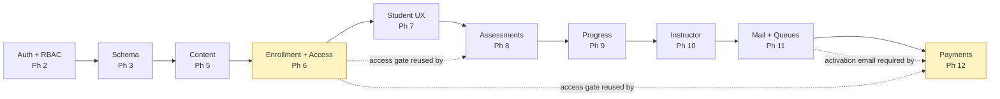
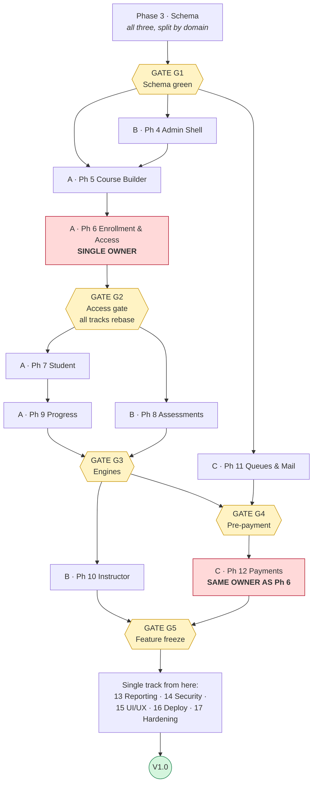

# Development Roadmap — LMS

| Field | Value |
|---|---|
| Product | Learning Management System (single organisation) |
| Document | Phased Development Roadmap |
| Version | 1.1 |
| Status | Revision 1.1 — incorporates the customer Phase 0 decisions of 2026-08-12. Awaiting Phase 0 sign-off. |
| Last updated | 2026-08-12 |
| Related documents | [requirements.md](requirements.md), [architecture.md](architecture.md), [planning.md](planning.md) |

---

## 1. How to read this document

- Phases are executed **strictly in order**. One phase at a time (Development Rule 1 in `planning.md`).
- A phase begins only when the previous phase's **Definition of Done** is fully satisfied — no partial carry-over without an explicit, recorded decision.
- Every phase lists: Objective · Features · Database work · Backend work · Frontend work · Dependencies · Testing requirements · Definition of Done · Deliverables.
- Requirement IDs (`FR-*`, `NFR-*`, `AC-*`) refer to `requirements.md`. Architecture sections (`§n`) refer to `architecture.md`.
- **Nothing from a future phase may be built early.** If a future need forces a change, record it as a decision in `planning.md` first.

### 1.1 Universal Definition of Done

Every phase must satisfy all of the following **in addition** to its own criteria:

| # | Criterion |
|---|---|
| U-1 | All phase features implemented and manually verified against their requirement IDs |
| U-2 | Automated tests written and passing for the phase's behaviour; the **whole** suite is green |
| U-3 | Laravel Pint reports no violations |
| U-4 | Larastan passes at the agreed level with no new baseline entries |
| U-5 | All migrations run cleanly on a fresh database **and** on the existing development database |
| U-6 | Seeders/factories updated so a fresh `migrate:fresh --seed` produces a usable system |
| U-7 | No secret, key or credential added to the repository; `.env.example` updated for any new variable |
| U-8 | Authorisation verified for every new route and record type (deny-by-default confirmed by test) |
| U-9 | All user input on new surfaces is server-side validated |
| U-10 | `planning.md` updated: current phase, next phase, new decisions, new risks, resolved assumptions |
| U-11 | `requirements.md` / `architecture.md` updated if this phase changed either |
| U-12 | No unrelated file modified; no dependency added without a recorded justification |
| U-13 | Phase reviewed against the "Never mark a phase complete without satisfying its DoD" rule and signed off |

### 1.2 Deviation from the originally proposed phase order

The brief proposed a 17-phase sequence. Architectural analysis produced four changes, each for a dependency reason:

| # | Change | Reason |
|---|---|---|
| 1 | **Enrollment core moved earlier** (new Phase 6, before the Student Module) — split from Payments | The student experience, protected content delivery, assessments and progress all depend on "does this student have access?". Building that at Phase 12 would mean building the entire student side against a stub and reworking it. Phase 6 delivers enrollment + the access gate with **admin-granted** enrollments; Phase 12 attaches the payment source to the same, already-tested `GrantEnrollment` action. |
| 2 | **Mail & queue infrastructure moved before Payments** (Phase 11 → precedes Phase 12) | The purchase flow's most important output is the activation email (FR-MAIL-01). Payments cannot be finished, let alone accepted, without working queued mail. |
| 3 | **Instructor Module moved after Assessments and Progress** (Phase 10) | An instructor's entire job in V1 is authoring assessments and reading progress. Building the module before those engines exist means building empty screens twice. |
| 4 | **"Security and Testing" is no longer a single phase** | Testing is in the universal DoD of every phase. Phase 14 is a dedicated *hardening and audit* phase — a deliberate adversarial review, not the first time security is considered. |

Mapping from the brief's numbering to this roadmap:

| Brief | This roadmap |
|---|---|
| 0 Planning | Phase 0 |
| 1 Foundation | Phase 1 |
| 2 Auth & RBAC | Phase 2 |
| 3 Database & Core LMS | Phase 3 |
| 4 Super Admin Area | Phase 4 |
| 5 Course Builder | Phase 5 |
| 6 Instructor Module | **Phase 10** *(moved — depends on 8 and 9)* |
| 7 Student Module | Phase 7 *(now preceded by new Phase 6)* |
| 8 Quiz & Test Engine | Phase 8 |
| 9 Progress Tracking | Phase 9 |
| 10 Payment & Enrollment | **split → Phase 6 (enrollment) + Phase 12 (payment)** |
| 11 Email & Notifications | **Phase 11** *(moved before payments)* |
| 12 Security & Testing | **Phase 14** *(hardening; testing is continuous)* |
| 13 UI/UX Polish | Phase 15 |
| 14 Deployment | Phase 16 |
| 15 Production Hardening | Phase 17 |
| 16 Multi-Organisation | Phase 18 |
| — | **Phase 13 Reporting & Analytics** *(new — FR-RPT was unassigned in the original list)* |

---

## 2. Phase overview

```mermaid
graph TD
    P0["Phase 0<br/>Planning & Architecture"] --> P1["Phase 1<br/>Project Foundation"]
    P1 --> P2["Phase 2<br/>Identity, Auth & RBAC"]
    P2 --> P3["Phase 3<br/>Core Domain Schema"]
    P3 --> P4["Phase 4<br/>Admin Shell & Administration"]
    P4 --> P5["Phase 5<br/>Course Builder & Content"]
    P5 --> P6["Phase 6<br/>Enrollment & Protected Delivery"]
    P6 --> P7["Phase 7<br/>Student Learning Experience"]
    P7 --> P8["Phase 8<br/>Assessment Engine"]
    P8 --> P9["Phase 9<br/>Progress Tracking"]
    P9 --> P10["Phase 10<br/>Instructor Module"]
    P10 --> P11["Phase 11<br/>Queues, Mail & Notifications"]
    P11 --> P12["Phase 12<br/>Payments & Auto-Enrollment"]
    P12 --> P13["Phase 13<br/>Reporting & Analytics"]
    P13 --> P14["Phase 14<br/>Security Hardening & Audit"]
    P14 --> P15["Phase 15<br/>UI/UX Polish & Accessibility"]
    P15 --> P16["Phase 16<br/>Deployment & Environments"]
    P16 --> P17["Phase 17<br/>Production Hardening"]
    P17 --> REL(("V1.0 RELEASE"))
    REL -.future.-> P18["Phase 18<br/>Multi-Organisation Support"]

    style P0 fill:#e8e0ff,stroke:#5b3fd8
    style P6 fill:#fff3c4,stroke:#c79100
    style P12 fill:#fff3c4,stroke:#c79100
    style REL fill:#d4f5dd,stroke:#1a7f4b
    style P18 fill:#f0f0f0,stroke:#888,stroke-dasharray: 5 5
```

| Phase | Name | MVP? | Rough effort |
|---|---|:--:|---|
| 0 | Planning & Architecture | ✔ | S |
| 1 | Project Foundation | ✔ | S |
| 2 | Identity, Authentication & RBAC | ✔ | M |
| 3 | Core Domain Schema & Models | ✔ | M |
| 4 | Admin Shell & Administration Area | ✔ | M |
| 5 | Course Builder & Content Management | ✔ | L |
| 6 | Enrollment Core & Protected Delivery | ✔ | M |
| 7 | Student Learning Experience | ✔ | L |
| 8 | Assessment Engine | ✔ | L |
| 9 | Progress Tracking | ✔ | M |
| 10 | Instructor Module | ✔ | M |
| 11 | Queues, Mail & Notifications | ✔ | M |
| 12 | Payments & Automated Enrollment | ✔ | L |
| 13 | Reporting & Analytics | ✔ | M |
| 14 | Security Hardening & Audit | ✔ | M |
| 15 | UI/UX Polish & Accessibility | ✔ | M |
| 16 | Deployment & Environments | ✔ | M |
| 17 | Production Hardening & Observability | ✔ | S |
| 18 | Multi-Organisation Support | ✖ V2 | L |

*S ≈ small, M ≈ medium, L ≈ large. Deliberately relative — calendar estimates are set per phase at kickoff, not guessed now.*

---

# Phase 0 — Planning & Architecture

### Objective
Produce and agree the complete specification, architecture and development-control documents so that every later phase has an unambiguous reference, and no significant design question is answered mid-implementation.

### Features
- Software Requirements Specification with traceable IDs and MVP/future separation
- Full technical architecture with diagrams and ADRs
- This phased roadmap
- Master development-control document

### Database work
- Conceptual schema design and entity analysis (§6.2, §6.3)
- Consolidation decisions recorded (quizzes+tests → assessments; media tables → `media_files`; results → attempt columns; progress derivation)
- Database-enforced invariants identified (§6.5)
- **No migrations written**

### Backend work
- Layering, folder structure and dependency rules defined (§3)
- Key abstractions specified: `ContentTypeRegistry`, `QuestionTypeRegistry`, `PaymentGateway`, `MediaPathResolver`, `MediaUrlService`, `EnrollmentAccessService`, `GrantEnrollment`, `ProgressCalculator`, `AuditLogger`, `SettingsRepository`, `BrandingService`
- **No code written**

### Frontend work
- Layout and component strategy defined (§5)
- Livewire-versus-Blade boundary decided
- **No views written**

### Dependencies
None.

### Testing requirements
Document review only:
- Requirements are complete, unambiguous and non-contradictory
- Architecture covers every requirement (traceability matrix, §26)
- Phases follow the architecture and respect dependency order
- `planning.md` governs the process consistently with the other three documents

### Definition of Done
- [ ] `requirements.md`, `architecture.md`, `phases.md`, `planning.md` exist in the project root
- [ ] Cross-document consistency review completed and inconsistencies fixed
- [ ] Every MVP requirement maps to at least one phase
- [ ] Every architecture component maps to at least one requirement
- [ ] Pending decisions (PD-01…) are listed in `planning.md` and raised with the customer
- [ ] Customer sign-off obtained before Phase 1 starts
- [ ] Universal DoD items U-10…U-13 satisfied (U-1…U-9 are not applicable — no code)

### Deliverables
The four planning documents, an entity-relationship model, an ADR summary, and a list of decisions requiring customer approval.

---

# Phase 1 — Project Foundation

### Objective
Stand up a running, empty, quality-gated Laravel application connected to PostgreSQL, with tooling, conventions and environment configuration in place — so every later phase adds features to a stable base rather than fighting setup.

### Features
- Laravel application boots at a local URL
- Version control initialised with correct ignore rules
- Code style, static analysis and test tooling operational
- Tailwind + Vite building assets
- Layout skeletons and a base component library
- Health-check endpoint

### Database work
- PostgreSQL databases created: `lms_dev`, `lms_test`
- Connection configured and verified
- Laravel framework tables migrated: `sessions`, `cache`, `cache_locks`, `jobs`, `job_batches`, `failed_jobs`, `password_reset_tokens`
- Migration naming and structure conventions applied (`planning.md` §9)
- **No domain tables yet**

### Backend work
- **First task, before installing anything: verify version compatibility.** Confirm from official sources the current stable Laravel 13.x patch, its supported PHP range, and that Livewire 4, Laravel Fortify, Pest, Larastan, Laravel Pint and the Razorpay PHP SDK all have releases compatible with Laravel 13 on PHP 8.5. Report the verified matrix before proceeding. If any dependency does not support PHP 8.5, drop to the highest PHP version all of them support and record the deviation as a decision — **do not** compromise the dependency set to reach a version number.
- Install **Laravel 13.x** (pinned to the major version) with **Livewire 4**, **Fortify** and Tailwind
- `.env.example` with every variable, no values; `.env` git-ignored
- Directory skeleton per §3.3 (`Actions/`, `Services/`, `Enums/`, `Support/`, `Policies/`, split route files)
- Route files registered: `web.php`, `admin.php`, `instructor.php`, `student.php`, `webhooks.php`, `media.php`
- `config/lms.php` — application config (disk names, thresholds, TTLs, limits) reading from env with safe defaults
- Base exception handling and error pages (403/404/419/500)
- `Model::preventLazyLoading()` + `preventSilentlyDiscardingAttributes()` in non-production
- `Money` value object in `app/Support`
- Laravel Pint config; Larastan config and baseline; composer scripts `lint`, `analyse`, `test`
- CI pipeline: lint → analyse → test (PostgreSQL service) → dependency audit
- `/up` health endpoint (database + cache reachability)
- `docker-compose.yml` for PostgreSQL, Redis and Mailpit (parity, optional to use)

### Frontend work
- Tailwind configured with design tokens (colour scale, typography, spacing, radii)
- Layouts: `layouts/public`, `layouts/app`, `layouts/admin`, `layouts/instructor`, `layouts/mail`
- Base Blade components: `x-button`, `x-card`, `x-input`, `x-select`, `x-textarea`, `x-checkbox`, `x-table`, `x-modal`, `x-alert`, `x-badge`, `x-empty-state`, `x-pagination`
- Placeholder home page proving the asset pipeline
- Vite HMR working

### Dependencies
Phase 0 sign-off. PHP 8.5, Composer, Node, PostgreSQL 16+ installed. **PD-01** (Laravel 13.x / PHP 8.5), **PD-03** (Fortify) and **PD-04** (Pest) resolved — all three are answered. No open decision blocks this phase.

### Testing requirements
- Smoke test: home page returns 200
- Health endpoint test: reports database and cache status
- A trivial feature test proving the test database connects and migrates
- CI pipeline green on a clean clone

### Definition of Done — ✅ SATISFIED 2026-08-12 (commit `5aac4cb`)
- [x] Version compatibility matrix verified and reported before installation — checked against Packagist and laravel.com; **PHP 8.5 supported across the whole set, risk R-16 closed with no deviation** (planning.md §3.0)
- [x] `php artisan serve` serves the application without error — `GET /` → 200 with built assets; `GET /up` → 200 `{"status":"ok"}` with database, cache and storage all reachable
- [x] Laravel pinned to a major version; no dependency floats its major — `laravel/framework: ^13.17` resolved to **13.25.0**; `php: ^8.5`
- [x] `migrate:fresh` succeeds on dev and test databases — 3 migrations, 7 framework tables, **0 domain tables** (asserted by test)
- [x] `composer lint`, `composer analyse`, `composer test` all pass locally — Pint clean · Larastan **level 8**, 0 errors · Pest **16/16**, 44 assertions
- [~] …**and in CI** — pipeline authored at `.github/workflows/ci.yml` (lint → analyse → test on a real PostgreSQL 17 service → `composer audit` + `npm audit`). **Not yet executed: the repository has no remote.** Its first real run happens when a remote is added; both audits pass locally (0 advisories)
- [x] `npm run build` produces production assets — Vite 8, CSS 24.53 kB / gzip 5.59 kB
- [~] `npm run dev` hot-reloads — dev server configured and starts; **HMR not interactively verified in this session**
- [x] `.env` is git-ignored and `.env.example` is complete and value-free — verified via `git check-ignore`; `.env.example` documents every variable with no real values
- [x] All base layouts render with the component library — `public`, `app`, `admin`, `instructor`, `mail`; 12 components; home page renders through `layouts.public` using `x-badge`, `x-card`, `x-button`, `x-alert`
- [x] Repository contains no secrets (verified by scan) — `.env` not staged; no `vendor/`, `node_modules/` or `storage/app/content/`; the live DB password confirmed absent from all staged content
- [x] Universal DoD satisfied — U-1…U-13, with the two `[~]` items above declared rather than glossed

**Deviations, all recorded in planning.md §16.4:** stock `users` table removed from the framework
migration (it is a Phase 2 domain table); Larastan `checkModelProperties` disabled as
incompatible with Laravel's own factory signature (revisit Phase 3); one dev dependency added
(`pestphp/pest-plugin-phpstan`) with Rule 6 justification.

### Deliverables
A running skeleton application, a CI pipeline, environment documentation in `README.md`, and the base UI component library.

---

# Phase 2 — Identity, Authentication & RBAC

### Objective
Deliver working authentication and a role system whose boundaries are enforced server-side and proven by test, so every later phase can rely on "who is this and what may they do?" being answered correctly.

### Features
- Laravel Fortify installed and configured as the headless auth backend, with LMS-owned views (C-06, ADR-013)
- Student self-registration with email verification
- Login / logout with rate limiting and generic errors
- Password reset
- Account activation via one-time set-password link (mechanism built here; used by Phase 12)
- Three roles, one per user, with role-based routing to distinct home pages
- Account status lifecycle (`pending_activation`, `pending_verification`, `active`, `inactive`, `suspended`)
- Seeded Super Admin
- Audit logging of authentication and identity events

### Database work
- `users` migration (§6.4) — `role`, `status`, nullable `password`, normalised `email`, soft deletes, indexes, CHECK constraints
- `instructor_profiles` migration
- `audit_logs` migration (append-only, indexed)
- `settings` migration + initial settings seed
- `UserFactory` with role/status states; `SuperAdminSeeder`, `SettingsSeeder`

### Backend work
- **Fortify configuration (§7.1.1):** enable `registration`, `emailVerification`, `resetPasswords`, `updatePasswords`; explicitly **disable** `updateProfileInformation` and `twoFactorAuthentication`
- Bind every Fortify view callback to an LMS Blade view — no Fortify or starter-kit markup
- `Fortify::authenticateUsing()` overridden so credential check **and** `status === active` are asserted together, before a session is established
- `app/Actions/Fortify/{CreateNewUser, ResetUserPassword, UpdateUserPassword}` as thin adapters delegating to the LMS domain Actions (ADR-013)
- `App\Enums\UserRole` (`SuperAdmin|Instructor|Student` → `super_admin|instructor|student`), `UserStatus`
- `User` model: casts, `hasRole()` (the single role call-site pattern per ADR-005), scopes, email normalisation mutator, soft deletes
- Domain Actions: `RegisterStudent`, `VerifyEmail`, `LogoutUser`, `SendPasswordResetLink`, `ResetPassword`, `SendActivationLink`, `ActivateAccount`
- Registration forces `role = student` server-side; role is never accepted from request input
- Middleware: `EnsureUserIsActive` (defence in depth for sessions whose user is deactivated mid-session), `EnsureUserHasRole`, `RedirectToRoleHome`
- Form Requests / Fortify validation rules for every auth endpoint
- Rate limiters: Fortify's `login` limiter plus `register`, `password-reset`, `activation-resend` (§18.3)
- `AuditLogger` service + `audit_logs` model (no update/delete methods)
- `SettingsRepository` + `BrandingService` (the multi-tenancy seams — FR-SYS-01, FR-SYS-06)
- Password broker configured for both reset and activation TTLs (ADR-004)
- Session hardening: regeneration, secure cookies, logout-other-devices on password change
- Mail driver set to Mailpit/`log`; auth notifications sent synchronously for now (queued in Phase 11)

### Frontend work
- Pages: register, login, forgot password, reset password, verify email notice, set password (activation), logout
- Role home placeholders: `/admin`, `/instructor`, `/dashboard`
- Profile page: name, phone, avatar, change password
- Inline validation errors, flash messaging, disabled/loading states

### Dependencies
Phase 1. **PD-02** (one role per user) and **PD-03** (Fortify) resolved. **PD-06** (session lifetimes) still open — proposed values are used unless the customer changes them.

### Testing requirements
- Registration creates a `pending_verification` student with `role = student`; verification activates
- Registration cannot set `role` or `status` from request input
- Login succeeds only for `active` users with a password set
- A suspended or inactive user is rejected **inside** `authenticateUsing` — no session is established, verified by asserting the guard is still a guest after the attempt
- `pending_activation` users (null password) cannot authenticate under any input
- Fortify features `updateProfileInformation` and `twoFactorAuthentication` are disabled — their routes return 404
- Rate limiter blocks after the configured attempts
- Password reset token is single-use and expires
- Activation link is single-use, expires, and sets `active` + verified
- Role middleware: each role reaches only its own home; cross-role access returns 403
- Users cannot change their own role or status (mass-assignment test)
- Last active Super Admin cannot be demoted/deactivated/deleted (FR-RBAC-09)
- Email normalisation: `A@X.com` and `a@x.com` resolve to one account
- Audit entries written for login success, login failure, password change, activation
- Session ID regenerates on login; other sessions invalidated on password change

### Definition of Done — ✅ SATISFIED 2026-08-12
- [x] Fortify is the auth backend; no Fortify or starter-kit view is used anywhere — all six view callbacks bound to LMS Blade views, asserted by test
- [x] Unused Fortify features are explicitly disabled, not left enabled and unused — `updateProfileInformation`, `twoFactorAuthentication` and `passkeys` removed; their routes return 404, asserted by test. 2FA/passkeys migrations and the profile-information action deleted rather than left as dead schema
- [x] All auth flows work end to end with emails visible in the log — registration, verification, login, logout, reset, activation, resend, password change; verified live (login → 302 `/admin` → 200, cross-role → 403)
- [x] **AC-05** (no non-admin request can change role or status) — proven by policy tests plus a mass-assignment test that asserts `fill()` *throws*
- [x] **AC-06** (last active Super Admin cannot be deleted, deactivated or demoted) — proven across all three verbs, including that an *inactive* super admin does not count as a safety net
- [x] **AC-14** (activation link single-use and rejected after expiry) — plus forged-token and wrong-email cases
- [x] Deny-by-default confirmed — every protected area tested against every role and against guests; a super admin is *not* exempt from role middleware
- [x] Audit log populated for all identity events — login succeeded/failed/blocked, registration, activation link sent, activation, email verified, password changed
- [x] No raw password is ever emailed, logged or stored — asserted three ways: the stored value is a bcrypt hash, the activation email carries only a link, and a distinctive password string is asserted absent from the entire audit log
- [x] `settings` and `BrandingService` in use — proven by changing a database setting and asserting the login page renders the new organisation name
- [x] Universal DoD satisfied — Pint clean · Larastan **level 8**, 0 errors · Pest **142/142**, 326 assertions

**Deviations, recorded in planning.md §16.4:** the Phase 1 test asserting `users` does not exist was inverted (Phase 2 creates it, by design); `env()` replaced with `config()` in the Super Admin seeder after Larastan surfaced a real cached-config bug.

### Deliverables
Working authentication, the role system, the activation mechanism, the audit logger, the settings/branding services, and the auth test suite.

---

# Phase 3 — Core Domain Schema & Models

### Objective
Create the complete relational foundation for courses, content, commerce and progress, with models, relationships, factories, seeders and policies in place — so that later phases build UI over a schema that is already correct and tested.

### Features
- Full domain schema migrated
- Eloquent models with relationships, casts, enums and scopes
- Policies registered (deny-by-default) for every domain model
- Factories and a rich development seeder
- Console commands for cache rebuild operations

### Database work

Each migration must include: FKs with explicit `ON DELETE` behaviour, CHECK constraints mirroring PHP enums, all indexes from §6.4, the invariant constraints from §6.5 (including the **partial unique index** for one in-progress attempt), and a comment classifying the table as **tenant-owned** or **platform-global** (§24.4 rule 6).

Factories for every model; `DevelopmentSeeder` producing 2 instructors, 20 students, 3 courses with modules, lessons of every type, quizzes, a final test, enrollments and progress.

#### Agreed migration order and ownership (three-person team — planning.md §21)

**These filenames are fixed and agreed BEFORE anyone writes a line.** Deterministic numbering is
the single thing that keeps a three-way split from becoming a merge conflict: each developer
creates only their assigned files, and foreign keys resolve by name because the order is already
correct.

Numbering is **by dependency, not by owner** — ownership is orthogonal to ordering. Gaps of 10
leave room to insert a table without renumbering anything already merged.

| # | Migration | Owner | Key dependencies |
|---|---|:--:|---|
| `2026_08_13_100100` | `create_categories_table` | **A** | — |
| `2026_08_13_100110` | `create_courses_table` | **A** | categories, users |
| `2026_08_13_100120` | `create_course_instructor_table` | **A** | courses, users |
| `2026_08_13_100130` | `create_modules_table` | **A** | courses |
| `2026_08_13_100140` | `create_lessons_table` | **A** | modules |
| `2026_08_13_100150` | `create_media_files_table` | **A** | users *(polymorphic attachable — no FK)* |
| `2026_08_13_100200` | `create_orders_table` | **C** | users, courses |
| `2026_08_13_100210` | `create_payments_table` | **C** | orders |
| `2026_08_13_100220` | `create_webhook_events_table` | **C** | — |
| `2026_08_13_100230` | `create_enrollments_table` | **C** | users, courses, orders, **lessons** |
| `2026_08_13_100300` | `create_assessments_table` | **B** | users *(polymorphic assessable — no FK)* |
| `2026_08_13_100310` | `create_questions_table` | **B** | assessments |
| `2026_08_13_100320` | `create_question_options_table` | **B** | questions |
| `2026_08_13_100330` | `create_assessment_attempts_table` | **B** | assessments, users, **enrollments** |
| `2026_08_13_100340` | `create_attempt_answers_table` | **B** | assessment_attempts, questions |
| `2026_08_13_100400` | `create_lesson_progress_table` | **C** | enrollments, lessons, users |
| `2026_08_13_100410` | `create_email_logs_table` | **C** | — |

**Two ordering constraints that are easy to get wrong and expensive to discover late:**

1. `enrollments` (100230, C) references `lessons` (100140, A) for `last_lesson_id`.
2. `assessment_attempts` (100330, B) references `enrollments` (100230, C).

So the numbering deliberately interleaves owners. It also means Phase 3 has **one internal
stagger**: Track A merges the catalogue block (100100–100150) to `main` first, on day one. B and C
can *write* their migrations immediately, but cannot run `migrate:fresh` locally until A's block
is on `main`. Plan the first day around that.

#### Work split beyond migrations

| Owner | Also delivers |
|---|---|
| **A** | Enums `CourseStatus`, `CourseLevel`, `LessonType`, `MediaPurpose`; models Category, Course, Module, Lesson, MediaFile; `Course::published()`, `Course::assignedTo()`, `Lesson::published()`; Course/Module/Lesson/MediaFile policies; factories |
| **B** | Enums `AssessmentType`, `QuestionType`, `AnswerRevealPolicy`, `AttemptStatus`; models Assessment, Question, QuestionOption, AssessmentAttempt, AttemptAnswer; `Assessment::published()`; Assessment/Attempt policies; factories |
| **C** | Enums `OrderStatus`, `PaymentStatus`, `EnrollmentStatus`, `EnrollmentSource`, `ProgressStatus`, `CompletionSource`; models Order, Payment, WebhookEvent, Enrollment, LessonProgress, EmailLog; `Enrollment::active()`; Order/Payment/Enrollment policies; factories |
| **A** *(sole owner)* | `EnrollmentAccessService::grantsAccess()` and the `GrantEnrollment` skeleton — **single-owner components** (planning.md §21.3), even though the tables belong to C |
| **Whoever finishes first** | `DevelopmentSeeder`, `lms:progress:rebuild`, `lms:counters:rebuild` — these need every model to exist, so they are the natural convergence task |

### Backend work
- Enums: `UserRole`, `UserStatus`, `CourseStatus`, `CourseLevel`, `LessonType`, `MediaPurpose`, `AssessmentType`, `QuestionType`, `AnswerRevealPolicy`, `AttemptStatus`, `OrderStatus`, `PaymentStatus`, `EnrollmentStatus`, `EnrollmentSource`, `ProgressStatus`, `CompletionSource`
- Models with relationships, casts, `$fillable` (never `$guarded = []`), scopes: `Course::published()`, `Course::assignedTo()`, `Lesson::published()`, `Enrollment::active()`, `Assessment::published()`
- `EnrollmentAccessService::grantsAccess()` — the single access definition (§12.2)
- `GrantEnrollment` action skeleton with idempotency (fully exercised in Phase 6)
- Policies for all domain models, registered and denying by default
- Commands: `lms:progress:rebuild`, `lms:counters:rebuild`

### Frontend work
None beyond a temporary internal page listing seeded data for verification. **No user-facing feature work in this phase.**

### Dependencies
Phase 2.

### Testing requirements
- Every migration runs and rolls back cleanly
- Every relationship resolves in both directions
- Unique constraints proven: `(user_id, course_id)` on enrollments; partial unique on in-progress attempts; `event_id`; `gateway_payment_id`; `(enrollment_id, lesson_id)`
- CHECK constraints reject illegal enum values at the database level
- Cascade behaviour verified: deleting a module removes its lessons; deleting a user does **not** remove orders
- Every policy denies by default for an unauthorised user
- `migrate:fresh --seed` produces a complete, browsable dataset
- Factory-generated models satisfy all constraints

### Definition of Done
- [x] All domain tables migrated with constraints and indexes
- [x] Every model has a factory and a registered policy — or a recorded exemption naming what authorises it instead (`PolicyCoverageTest`)
- [x] `migrate:fresh --seed` succeeds and yields realistic data — `SeedingTest`, including idempotence and the local-only guard on the known-password accounts
- [x] Database-level invariants (§6.5) each covered by a test
- [x] Every migration comment classifies the table for future tenancy — all 24, framework tables included
- [x] `EnrollmentAccessService` exists and is the only definition of access
- [x] Universal DoD satisfied

### Deliverables
Complete schema, models, enums, policies, factories, the development seeder, and the schema test suite.

---

# Phase 4 — Admin Shell & Administration Area

### Objective
Deliver the Super Admin's operational home: navigation, dashboard, and full management of students and instructors — including instructor-to-course assignment, which is the basis of all instructor authorisation.

### Features
- Admin layout with navigation, breadcrumbs and role guard
- Admin dashboard with KPI tiles and recent-activity panels
- Student management: list, create, edit, activate/deactivate, soft delete, resend activation, force reset, detail view
- Instructor management: list, create, edit, activate/deactivate, soft delete, detail view
- Instructor ↔ course assignment
- Course list with status, search and filters (CRUD arrives in Phase 5)
- Settings screen
- Audit log viewer
- Reusable admin table pattern (search, filter, sort, paginate, export hook)

### Database work
No new tables. Possible index additions revealed by admin list queries.

### Backend work
- Actions: `CreateStudent`, `UpdateStudent`, `SetUserStatus`, `DeleteUser`, `CreateInstructor`, `UpdateInstructor`, `AssignInstructorToCourse`, `UnassignInstructorFromCourse`, `UpdateSettings`
- `UserPolicy` fully implemented (last-Super-Admin guard, self-modification guard)
- Admin dashboard query service (counts and recent lists; zero N+1)
- Form Requests for all admin mutations
- Audit logging on every admin mutation
- `admin.php` routes behind `auth` + `active` + `role:super_admin`

### Frontend work
- Livewire: `Admin\Dashboard`, `Admin\StudentsTable`, `Admin\StudentForm`, `Admin\StudentDetail`, `Admin\InstructorsTable`, `Admin\InstructorForm`, `Admin\InstructorDetail`, `Admin\CourseInstructorAssignment`, `Admin\SettingsForm`, `Admin\AuditLogTable`
- Admin layout: sidebar, topbar, user menu, breadcrumbs, flash region
- Typed-confirmation modal for destructive actions
- Empty states and loading skeletons on every table

### Dependencies
Phase 3.

### Testing requirements
- Non-super-admin roles receive 403 on every `/admin` route
- Student and instructor CRUD works and is audited
- Deactivating a user immediately prevents their login
- Instructor assignment/unassignment persists and is audited
- Unassignment does not delete instructor-authored records
- Last-Super-Admin guard holds against every path (edit, status change, delete)
- Admin lists paginate; no unbounded query; no N+1 (assert query counts)
- Search, filter and sort return correct results
- Settings changes persist and are read through `SettingsRepository`

### Definition of Done
- [x] Super Admin can fully manage students and instructors
- [x] Instructor↔course assignment works and drives authorisation
- [x] AC-06 passes
- [x] Every destructive action is confirmed and audited
- [~] Dashboard renders in < 400 ms with seeded data — **not measured.** Needs a stopwatch against a seeded database, not a test
- [x] Universal DoD satisfied

### Deliverables
The Administrator Area shell, dashboard, user management, instructor assignment, settings, audit viewer, and the admin table pattern.

---

# Phase 5 — Course Builder & Content Management

### Objective
Enable the Super Admin to build complete courses — modules, lessons, and every content type — with secure upload and storage, and publish them, so that real content exists for every subsequent phase.

### Features
- Course CRUD with rich metadata
- Publish/unpublish with validation
- Course Builder: drag-reorderable modules and lessons
- Per-type lesson editors driven by the content type registry
- Secure upload of video, PDF, PPT/PPTX and generic resources
- Media replace and delete with orphan cleanup
- Public catalogue and course detail pages — **metadata only**, no purchase yet

### Database work
No new tables (schema exists from Phase 3). Add counter-cache maintenance for `modules_count`, `lessons_count`, `total_duration_seconds`. Add any index needed by catalogue queries.

### Backend work
- Actions: `CreateCourse`, `UpdateCourse`, `PublishCourse`, `UnpublishCourse`, `ArchiveCourse`, `DeleteCourse`, `CreateModule`, `UpdateModule`, `DeleteModule`, `ReorderModules`, `CreateLesson`, `UpdateLesson`, `DeleteLesson`, `ReorderLessons`, `AttachMedia`, `ReplaceMedia`, `DetachMedia`
- `ContentTypeRegistry` + handlers for `video`, `document`, `presentation`, `resource`, `text` (`quiz` handler stubbed until Phase 8) — §9.2
- `MediaStorageService`, `MediaPathResolver` (**the only path producer** — FR-FILE-11), `FileValidationService` (extension + MIME + content sniff)
- `CoursePublishValidator` — one implementation, used by both UI and action
- `DeleteOrphanedMedia` job
- Rich-text sanitisation on save (allow-list)
- Disks configured: `public`, `content` (private), `temp`
- `CoursePolicy`, `ModulePolicy`, `LessonPolicy`, `MediaFilePolicy` completed
- Audit logging for publish/unpublish, deletions and uploads

### Frontend work
- Livewire: `Admin\CoursesTable`, `Admin\CourseForm`, `Admin\CourseBuilder`, `Admin\ModuleList`, `Admin\LessonList`, `Admin\LessonEditor`, `Admin\MediaUploader`
- Drag-and-drop reordering with optimistic UI and server confirmation
- Upload progress, size/type feedback, clear rejection messages
- Publish checklist showing exactly what blocks publishing
- Public pages: catalogue (search, category filter, sort, paginate) and course detail (curriculum **titles and durations only**, outcomes, requirements, instructors, price). No lesson body, media, resource or assessment is rendered or linked

### Dependencies
Phase 4. **PD-12 resolved** — private storage with short-lived signed URLs, no DRM, no commercial video platform in V1, media architecture kept abstract so a provider can be added later without redesign. **PD-05** (max upload sizes and allowed types) still open; the proposed values are used unless the customer changes them, and they are stored as settings so they can be changed without a code change.

### Testing requirements
- Course CRUD, publish and unpublish behave per FR-CRS-03…06
- Publish is blocked when validation fails, with the reason surfaced
- Unpublishing does not affect existing enrollments
- Reordering is transactional; a failed reorder leaves order intact; no duplicate positions
- Reorder rejects an ID set that does not exactly match current children
- Upload rejects: oversized file, disallowed extension, spoofed MIME, mismatched content — and stores nothing (AC-21)
- Stored files land on the private disk with generated names, outside the document root (AC-20)
- Deleting a lesson schedules orphan media cleanup
- Guests can see the catalogue and course detail metadata but **no** learning content of any kind, by any URL (AC-01)
- Publish is blocked for a course with a price of zero (all V1 courses are paid — FR-CRS-10)
- A new content type can be added by registering a handler with no schema change (proven by a test-only handler)
- Counter caches stay accurate through create/delete/reorder

### Definition of Done
- [x] A complete multi-module course with all content types can be built and published through the UI
- [x] AC-16, AC-17, AC-20, AC-21 pass
- [x] No storage path is constructed outside `MediaPathResolver` (verified by inspection/static check) — seam S-2
- [x] `content` disk is private and not web-reachable
- [x] Public catalogue and detail pages leak no protected content
- [x] Universal DoD satisfied

### Deliverables
Course CRUD, the Course Builder, the content type registry with five handlers, the secure upload pipeline, the public catalogue, and the content test suite.

---

# Phase 6 — Enrollment Core & Protected Content Delivery

### Objective
Establish the single, authoritative definition of course access, and deliver protected media through it — using **admin-granted** enrollments only. This is the foundation Phase 12 will later attach payment to.

> **Why here:** every subsequent student-facing phase asks "does this user have access?". Defining and testing that once, now, prevents building Phases 7–10 against a stub. Payment is a *source* of enrollment, not the definition of it.

### Features
- `GrantEnrollment` action fully implemented and idempotent
- Admin manual enrollment grant and revoke, with mandatory reason
- Enrollment listing with filters and CSV export
- Enrollment status lifecycle including expiry
- Protected media access: authorised, short-lived URLs
- Video streaming with HTTP Range support (local disk) and pre-signed URLs (S3)
- Scheduled enrollment expiry

### Database work
No new tables. Verify `UNIQUE(user_id, course_id)` and the enrollment indexes under load. Add indexes revealed by enrollment list queries.

### Backend work
- `GrantEnrollment` — idempotent, transactional, audited, event-emitting (§12.1)
- `RevokeEnrollment`, `SuspendEnrollment`, `ReinstateEnrollment`
- `EnrollmentAccessService` completed and request-memoised (§12.2)
- `EnrollmentPolicy` completed
- `MediaUrlService` with both strategies behind one interface (§16.1)
- `MediaAccessController` + `MediaStreamController` (Range support, correct headers)
- `MediaFilePolicy` wired to `EnrollmentAccessService`
- Rate limiter: `media`
- `ExpireEnrollments` scheduled command
- Throttled media-access audit logging
- `EnrollmentGranted` / `EnrollmentRevoked` events (listeners added in Phase 11)

### Frontend work
- Livewire: `Admin\EnrollmentsTable`, `Admin\GrantEnrollmentForm`, `Admin\RevokeEnrollmentModal`
- Enrollment detail panel on student and course detail pages
- A minimal authenticated content-access harness (temporary; replaced by the real player in Phase 7) to prove protected delivery works

### Dependencies
Phase 5.

### Testing requirements
- `GrantEnrollment` is idempotent — calling it twice yields one enrollment
- Concurrent grants for the same user+course produce exactly one row (constraint proven)
- Revoke immediately removes access
- Suspended, expired and refunded enrollments deny access; `active` and `completed` allow it
- Unenrolled student receives 403 on every media route by direct URL (AC-02)
- Guest receives redirect/403 on every protected media route (AC-01)
- Media URL expires after its TTL and then fails (AC-19)
- Range requests return `206 Partial Content` with correct byte ranges
- **No** media is reachable without an active enrollment — there is no preview path to test, and its absence is asserted
- Admin grant and revoke are audited with the reason recorded
- Scheduled expiry moves enrollments to `expired` and removes access

### Definition of Done
- [x] `GrantEnrollment` is the only code path that creates an enrollment (verified by inspection) — ADR-006, Rule 22
- [x] `EnrollmentAccessService` is the only definition of access, used by every relevant policy
- [x] AC-01, AC-02, AC-19 pass
- [x] Admin can grant and revoke access, fully audited
- [~] Video seeking works on a real browser against a real uploaded file — **not verified.** Range handling is covered by tests; the browser half needs a person
- [x] Universal DoD satisfied

### Deliverables
The enrollment engine, the access gate, protected media delivery with Range support, admin enrollment management, and the access-control test suite.

---

# Phase 7 — Student Learning Experience

### Objective
Deliver the complete student-facing consumption experience for enrolled courses — dashboard, My Courses, and a course player that renders every content type — using enrollments granted by an admin.

### Features
- Student dashboard
- My Courses
- Course player: curriculum sidebar, content area, next/previous navigation
- Video player with position persistence (full progress engine arrives in Phase 9)
- PDF viewing and download; presentation and resource download
- Text lesson rendering
- Basic "mark as complete" (persisted; aggregation arrives in Phase 9)
- Student profile management
- Purchase-history placeholder (populated in Phase 12)

### Database work
No new tables. `lesson_progress` writes begin here in simple form. Indexes for player queries (curriculum + progress in one round trip).

### Backend work
- `StudentDashboardService`, `CoursePlayerService` (curriculum with progress in a single efficient query)
- `RecordLessonProgress` action — basic version (position + manual completion); full rules in Phase 9
- Player controllers/Livewire behind `auth` + `active` + `role:student` + enrollment policy
- `UpdateProfile`, `ChangePassword`, `ChangeEmail` (with re-verification) actions
- Every content type rendered through `ContentTypeRegistry::playerView()`
- Media URLs issued through `MediaUrlService` only

### Frontend work
- Livewire: `Student\Dashboard`, `Student\MyCourses`, `Student\CoursePlayer`, `Student\CurriculumSidebar`, `Student\LessonPlayer`, `Student\ProfileForm`
- Per-type player partials: video, document, presentation, resource, text
- Video element with resume, seek, rate, volume, poster
- Responsive player layout; sidebar collapses on mobile (NFR-UX-02)
- Continue-learning entry point on the dashboard
- Empty states for no enrollments

### Dependencies
Phase 6.

### Testing requirements
- Dashboard and My Courses show only actively enrolled courses
- Player denies access for unenrolled students on every lesson route (AC-02)
- Every content type renders correctly for an enrolled student
- Video resumes from the saved position (AC-18)
- Downloads are served with `Content-Disposition: attachment` and `nosniff`
- Unpublished modules/lessons are invisible to students
- Next/previous navigation respects publication state and ordering
- Profile updates work; email change requires re-verification
- Player loads with a bounded query count (no N+1 across the curriculum)
- Mobile viewport renders a usable player

### Definition of Done
- [x] A student with an admin-granted enrollment can complete an entire course end to end
- [x] AC-18 passes; AC-01 and AC-02 still pass on the new routes
- [x] All six content types render and download correctly
- [~] Player is usable at 360 px width — **not verified.** The layout is written for it; confirming it needs a real viewport
- [x] Universal DoD satisfied

### Deliverables
Student dashboard, My Courses, the full course player, content renderers for every type, profile management, and the student test suite.

---

# Phase 8 — Assessment Engine

### Objective
Deliver the complete quiz and test engine — authoring, taking, server-side timing, auto-grading and result presentation — with assessment secrets never reaching the browser before submission.

### Features
- Assessment CRUD (admin), attachable to lesson, module or course
- Question authoring: single choice, multiple choice, true/false, short answer
- Marks, negative marks, passing percentage, time limit, attempt limit
- Shuffle questions and options; answer-reveal policy
- Publish validation
- Student attempt runner with autosave and server-side timer
- Server-side auto-grading
- Result screen honouring the reveal policy
- Attempt history
- Final test with optional completion prerequisite

### Database work
No new tables. Verify the partial unique index on in-progress attempts. Indexes for attempt lookups and result aggregation. `total_marks` / `questions_count` counter maintenance.

### Backend work
- Actions: `CreateAssessment`, `UpdateAssessment`, `PublishAssessment`, `DeleteAssessment`, `CreateQuestion`, `UpdateQuestion`, `DeleteQuestion`, `ReorderQuestions`, `StartAttempt`, `SaveAnswer`, `SubmitAttempt`
- `QuestionTypeRegistry` + four handlers (validate, edit view, play view, grade, present-for-student) — §10.4
- `GradingService` (§10.3), `AttemptClock` (server-authoritative deadline)
- `QuestionPresenter` — strips `is_correct` and answer keys (NFR-SEC-21)
- `AssessmentPublishValidator`
- `AssessmentPolicy`, `AttemptPolicy`
- `ExpireStaleAttempts` scheduled command
- Rate limiter: `attempt-submit`
- `AttemptGraded` event (listeners in Phases 9 and 11)
- Quiz content type handler completed in `ContentTypeRegistry`

### Frontend work
- Livewire: `Admin\AssessmentsTable`, `Admin\AssessmentForm`, `Admin\QuestionEditor`, `Admin\QuestionList`, `Student\AttemptRunner`, `Student\AttemptResult`, `Student\AttemptHistory`
- Per-type question editors with live validation
- Attempt runner: question navigation, autosave indicator, visible countdown (advisory), submit confirmation, unsaved-answer warning
- Result screen: score, percentage, pass/fail, per-question review when policy allows
- Quiz lesson rendered inside the course player

### Dependencies
Phase 7.

### Testing requirements
- Grading is correct for all four question types, including partial and negative marking
- `is_correct` and answer keys are absent from every pre-submission response (AC-23)
- Attempt limit is enforced server-side and survives request replay (AC-25)
- A second in-progress attempt is impossible (constraint + action) (AC-26)
- Submission after the server deadline is rejected or auto-submitted with only pre-deadline answers (AC-24)
- Autosave persists answers and survives a simulated disconnect
- Reveal policy honoured in all three modes (AC-27)
- Publish blocked with zero questions or zero total marks
- Single-choice/true-false questions require exactly one correct option
- Question order is snapshotted per attempt and used in review (FR-ASMT-18)
- Unenrolled student cannot start an attempt
- Scoring policy (`highest`) selects the correct official score across attempts

### Definition of Done
- [x] An admin can author a mixed-type quiz and a final test; a student can take both and be graded correctly — `AuthorAndSitTest`
- [x] AC-22 … AC-27 pass — grading and negative marking (AC-22), the deadline (AC-24), the attempt limit (AC-25), one in-progress attempt (AC-26), the three reveal modes (AC-27)
- [x] No assessment secret is observable in browser traffic before submission (verified by response inspection) — `AnswerSecrecyTest` asserts the presenter's payload, which is what reaches the browser
- [x] Timing, attempt limits and concurrency are enforced server-side
- [x] Universal DoD satisfied

> **Closed 2026-08-13, on a completeness pass — the engine shipped without a behavioural test.**
>
> What existed was schema tests (constraints, casts, mass assignment) and policy tests. Neither
> touches what the code does, and grading is what this product certifies. Writing the missing
> suite found **three live bugs**, all of them invisible without it:
>
> 1. **Quiz authoring did not work at all.** `AssessmentCounterService` ran its aggregate over
>    `Assessment::questions()`, which carries `->orderBy('position')`. PostgreSQL rejects an
>    aggregate with a non-grouped `ORDER BY` — SQLSTATE 42803 — so every question-mutating action
>    threw. MySQL and SQLite both accept the same query, which is exactly why C-03 insists the
>    suite runs on real PostgreSQL.
> 2. **Autosave could not create a first answer row** outside production. `SaveAnswer`
>    mass-assigned `attempt_id`/`question_id`, which are deliberately not fillable (NFR-SEC-07),
>    so `preventSilentlyDiscardingAttributes` threw.
> 3. **`time_spent_seconds` was always zero.** The Carbon diff was the wrong way round and
>    `max(0, …)` floored every value. Phase 13 would have inherited it as "students spend no time
>    on assessments".

### Deliverables
The assessment engine (authoring + runner + grading), the question type registry with four handlers, result presentation, and the assessment test suite.

---

# Phase 9 — Progress Tracking

### Objective
Deliver accurate, performant progress at lesson, module, course and student-overall level, with correct behaviour under concurrency and under curriculum change.

### Features
- Full lesson completion rules per content type
- Throttled video watch tracking with auto-completion threshold
- Quiz-driven lesson completion
- Derived module progress
- Cached course progress on enrollments
- Student overall progress
- Continue-learning resume point
- Course completion detection and recording
- Recalculation on curriculum change
- Progress rebuild command

### Database work
No new tables. Indexes for progress aggregation queries. Verify `UNIQUE(enrollment_id, lesson_id)` under concurrent writes.

### Backend work
- `RecordLessonProgress` completed: throttling, monotonic status, max-watched semantics (§17.2)
- `ProgressCalculator` service: module (derived), course (cached), student overall
- `RecalculateCourseProgress` job; `RecalculateProgressForCourseEnrollments` batch job
- `CompletionStrategy` per content type via `ContentTypeRegistry` (video threshold, manual, assessment-driven)
- `LessonCompleted`, `CourseStructureChanged`, `CourseCompleted` events and listeners
- Course completion rule including the optional final-test requirement
- `lms:progress:rebuild` command completed (proves the cache is derived, not authoritative)
- Configurable video completion threshold via settings

### Frontend work
- Progress bars: course card, curriculum sidebar, module header, dashboard
- Per-lesson completion indicators; mark-complete control where applicable
- Continue-learning card resolving to the exact last lesson
- Overall progress summary on the student dashboard
- Course-completion state and celebration surface
- Admin/instructor-facing progress views prepared (consumed in Phase 10)

### Dependencies
Phase 8.

### Testing requirements
- Completing lessons updates lesson, module and course figures consistently (AC-28)
- Video auto-completes at the configured threshold and not before
- Watch tracking is throttled to the configured interval
- `video_watched_seconds` takes the maximum; a completed lesson never regresses (AC-32)
- Concurrent writes from two sessions produce one correct row
- Continue-learning opens the exact last accessed lesson (AC-29)
- Publishing a new lesson recalculates all affected enrollments and lowers percentages correctly (AC-30)
- Unpublishing a lesson recalculates correctly
- Course completion is recorded only when all lessons are complete **and** the final test is passed where required (AC-31)
- `lms:progress:rebuild` reproduces identical figures from `lesson_progress` alone
- Dashboard with 20 enrollments issues a bounded number of queries (NFR-PERF-04)

### Definition of Done
- [x] Progress is correct at all four levels and matches a rebuild from raw facts
- [x] AC-28 … AC-32 pass
- [x] Curriculum changes propagate to every affected enrollment
- [x] Dashboards read cached aggregates, not raw scans
- [x] Universal DoD satisfied

> **Completed 2026-08-13** (Track A, branch `phase/09-progress-tracking`).
> 59 progress tests; whole suite **1006/1006**, 2,119 assertions; Pint clean; Larastan level 8, 0 errors.
>
> **Two deviations from the plan above, both deliberate:**
>
> 1. **`RecalculateCourseProgress` (the per-enrollment job) was not shipped.** The refresh it would
>    have carried is two COUNTs on indexed columns and runs only on a completion transition, so it
>    happens inline in `RecordLessonProgress`. `queue.default` is `database`: queued, a student with
>    no worker running ticks a lesson and watches the bar never move. The batch job
>    (`RecalculateProgressForCourseEnrollments`) stays queued, because that one touches every
>    enrollment in a course and nobody is watching a single figure.
> 2. **`CompletionStrategy` maps to the existing `CompletionSource` rather than sharing its
>    backing values.** `lesson_progress.completion_source` is CHECK-constrained to
>    `CompletionSource` (ADR-012), which carries a case the strategy set does not (`Download`).
>    `CompletionStrategy::toSource()` is the single explicit crossover; a test asserts every arm
>    lands inside the constraint.

### Deliverables
The progress engine, completion strategies, recalculation jobs, progress UI throughout the student experience, the rebuild command, and the progress test suite.

---

# Phase 10 — Instructor Module

### Objective
Deliver the instructor's complete workspace — assessment authoring and student monitoring — rigorously scoped to assigned courses, with financial data entirely invisible.

### Features
- Instructor dashboard for assigned courses
- Assigned course detail with enrolled students and average progress
- Assessment CRUD restricted to assigned courses
- Question authoring with marks, pass percentage, time limit, attempt limits
- Assessment results: per attempt, per student, aggregate statistics
- Individual student progress within an assigned course
- Course-level progress overview
- Instructor profile

### Database work
No new tables. Indexes for instructor-scoped queries (`course_instructor` joins, per-course attempt aggregation).

### Backend work
- `InstructorDashboardService`, `InstructorCourseService` — **every query starts from `Course::assignedTo($user)`** (§8.4)
- Reuse of Phase 8 assessment actions with `AssessmentPolicy` enforcing assignment
- `AssessmentStatisticsService`: attempts, average score, pass rate, per-question correct rate
- `instructor.php` routes behind `auth` + `active` + `role:instructor`
- Policies extended for instructor read scope on enrollments, progress and attempts
- `OrderPolicy` / `PaymentPolicy` explicitly deny instructors (FR-INS-10)

### Frontend work
- Livewire: `Instructor\Dashboard`, `Instructor\CoursesList`, `Instructor\CourseDetail`, `Instructor\StudentsTable`, `Instructor\StudentProgressDetail`, `Instructor\AssessmentsTable`, `Instructor\AssessmentForm`, `Instructor\QuestionEditor`, `Instructor\ResultsTable`, `Instructor\AssessmentStatistics`
- Instructor layout and navigation
- Result tables with filters and per-question breakdown
- Progress visualisations reusing Phase 9 components

### Dependencies
Phase 9.

### Testing requirements
- Instructor assigned to A and not B receives 403 on **every** route of B: view, students, progress, assessments, questions, results, reports (AC-03)
- Instructor cannot create, edit or delete courses, modules, lessons or content (FR-INS-08)
- Instructor cannot view any order, payment or revenue figure anywhere (FR-INS-10)
- Instructor can fully manage assessments on assigned courses
- Instructor sees only students enrolled in assigned courses
- Unassignment removes access immediately; assessments they authored survive (FR-INS-12)
- Statistics are correct against a known fixture
- All instructor lists are scoped, paginated and free of N+1

### Definition of Done
- [x] An instructor can author assessments and monitor students on assigned courses and nothing else
- [x] AC-03 passes, exhaustively, across every instructor route — enumerated from the router, so a screen added later is covered automatically
- [x] Zero financial data is reachable by an instructor — `InstructorScopingTest`
- [x] Universal DoD satisfied

### Deliverables
The instructor workspace, scoped assessment management, results and statistics, and the instructor scoping test suite.

---

# Phase 11 — Queues, Mail & Transactional Notifications

### Objective
Make all slow work asynchronous and deliver the full branded transactional email set — the infrastructure the purchase flow depends on.

> **Why before payments:** the most important output of a successful purchase is the activation email (FR-MAIL-01). Payments cannot be completed or accepted without queued, reliable, branded mail.

### Features
- Redis queue with named queues and priorities
- Supervised worker configuration
- Scheduler with all recurring tasks
- Failed-job handling, retry policy and alerting
- Complete transactional email set with a shared branded layout
- Email logging
- Queued notifications for all existing events

### Database work
`email_logs` in use (table created in Phase 3). Verify `jobs`, `job_batches`, `failed_jobs`. Optional index tuning for job polling on the database driver.

### Backend work
- Queue connections and the four named queues (§13)
- All existing jobs moved to appropriate queues with tries, backoff and timeout set
- All jobs verified idempotent and carrying explicit payloads (FR-SYS-04)
- `ShouldQueue` on every notification/mailable; dispatch after commit
- Mailables: `VerifyEmail`, `WelcomeAndActivate`, `PurchaseConfirmation`, `PaymentFailed`, `ResetPassword`, `PasswordChanged`, `EnrollmentGranted`, `EnrollmentRevoked`, `AssessmentResult`, `CourseCompleted` (§14)
- Shared mail layout using `BrandingService` — no hardcoded organisation identity (FR-MAIL-08)
- `EmailLogger` recording every send attempt
- Listeners wired to `EnrollmentGranted`, `EnrollmentRevoked`, `AttemptGraded`, `CourseCompleted`
- Scheduled tasks registered (§13)
- Failed-job alerting
- `WelcomeAndActivate` carries the one-time activation link built on the Phase 2 mechanism

### Frontend work
- Branded, responsive email templates (tested in major clients)
- Admin: failed-jobs / queue-health panel
- Admin: email log viewer with status and error
- Mail preview routes for local development

### Dependencies
Phase 10. **No blocking decision.** Per PD-07, this phase is built and tested entirely against Mailpit/`log`; the production transactional provider is selected and configured in Phase 16. The mail layer is therefore written transport-agnostically, so switching to a provider is configuration only.

### Testing requirements
- Every mailable renders with correct branding from settings and correct links
- All mail is queued, never sent synchronously in a request
- A mail failure does not roll back or block its originating transaction (AC-33)
- Failed jobs land in `failed_jobs`, are retryable and trigger an alert
- Each job is idempotent when run twice
- Scheduled tasks are registered with the expected frequencies
- `email_logs` records every attempt with status
- Activation link inside `WelcomeAndActivate` is single-use and expiring
- No live mail transport is reachable from the development environment (FR-MAIL-09)

### Definition of Done
- [ ] All ten transactional emails render, queue and deliver correctly — **8 of 10; see below**
- [x] AC-33 passes
- [x] Queue workers process all named queues; failures alert
- [x] Scheduler runs every recurring task
- [x] No email hardcodes organisation identity
- [x] Universal DoD satisfied

> **Status 2026-08-13: everything buildable is built. The phase stays OPEN, and deliberately so.**
>
> Infrastructure landed in PR #6. The remaining work was completed once Phases 8 and 9 shipped the
> triggers it had been waiting for:
>
> - `AssessmentResult` — on `AttemptGraded`. Sent for a fail as well as a pass; a student who did
>   not pass is the one who most needs to know where they stand.
> - `CourseCompleted` — on Phase 9's `CourseCompleted`. Fires once, on the transition only.
> - **Admin email log viewer** — `email_logs` had been written since PR #6 and read by nothing. A
>   delivery record nobody can look at answers no question, and the question is "the student says
>   they never got it".
> - **Admin queue-health panel** — depth per named queue, the age of the oldest waiting job, and
>   failed jobs with retry and discard. `AlertOnFailedJob` shouts; this is where somebody can then
>   act. Depth reports **null rather than zero** on a non-database driver: a panel confidently
>   showing "0 pending" against a backed-up Redis queue is worse than one admitting it cannot see.
>
> **Two emails remain, and neither can be honestly built yet:** `PurchaseConfirmation` and
> `PaymentFailed`. Their trigger is a signature-verified payment, which does not exist until
> Phase 12. Writing them now would mean shipping two mailables no code path can reach and no test
> can exercise — building ahead (Rule 5) dressed up as completeness. Phase 12 adds both to
> `MailPreviewController` and to `transactionalEmails()` in `MailBrandingTest`, at which point every
> branding, queueing and logging guarantee already covers them and this box can be ticked.

### Deliverables
Queue infrastructure, worker and scheduler configuration, the complete branded email set, email logging, queue-health tooling, and the mail/queue test suite.

---

# Phase 12 — Payments & Automated Enrollment

### Objective
Deliver the purchase-to-access flow with backend-verified payment as the **only** trigger for enrollment — the customer's most important requirement.

### Features
- Checkout for guests and logged-in students
- Server-side order creation with server-side pricing
- Razorpay hosted checkout integration
- Signature-verified webhook endpoint
- Idempotent asynchronous webhook processing
- Automatic account creation, enrollment and activation email
- Purchase-status page that resolves on server confirmation
- Reconciliation of missed webhooks
- Refund handling
- Admin order/payment management and webhook event log
- Student payment history

### Database work
No new tables (`orders`, `payments`, `webhook_events` exist from Phase 3). Verify `UNIQUE(gateway_order_id)`, `UNIQUE(gateway_payment_id)`, `UNIQUE(event_id)`, `UNIQUE(user_id, course_id)` under concurrent load. Indexes for order/payment lists and reconciliation queries.

### Backend work
- `PaymentGateway` interface + `RazorpayGateway` + `FakeGateway` for tests (§11.1)
- Actions: `PlaceOrder`, `CreateGatewayOrder`, `ProcessPaymentWebhook`, `ReconcileOrder`, `HandleRefund`
- `ProcessPaymentWebhook` job — the transactional sequence of FR-MAIL-01, calling the **existing, already-tested** `GrantEnrollment`
- `WebhookSignatureVerifier` — raw body, constant-time comparison
- Webhook route: CSRF-exempt, rate-limited, fast-ack, verify-before-parse
- Amount and currency reconciliation against the order (FR-PAY-13)
- `ResolveBuyerAccount` — find-or-create by normalised email, never duplicating
- `ReconcileOrders` and `CancelAbandonedOrders` scheduled commands
- Order state machine enforcement (§11.4)
- `OrderPolicy`, `PaymentPolicy`
- Audit logging on every order, payment and enrollment transition
- Alerting on signature failure, amount mismatch and failed webhook processing
- Razorpay credentials from env only

### Frontend work
- Livewire: `Student\Checkout`, `Student\PaymentStatus` (polls for server-confirmed state), `Student\PaymentHistory`, `Admin\OrdersTable`, `Admin\OrderDetail`, `Admin\PaymentsTable`, `Admin\WebhookEventsTable`
- Buy button on the course detail page, disabled when already enrolled
- Guest checkout capturing name, email and phone
- Post-payment page: "Payment received — activating your access", resolving automatically
- Failure page with a retry path
- Activation landing page from the welcome email → set password → logged in → straight to the purchased course
- Admin webhook event detail with raw payload and a guarded re-process control

### Dependencies
Phase 11. **PD-09** (Razorpay account, test keys, webhook secret, tunnel for local testing) resolved.

### Testing requirements
Using `FakeGateway` — **no test ever calls Razorpay**:
- A guest with no account can buy and reach the course through the activation link (AC-07)
- An existing student buying a second course gets an enrollment on the existing account, no duplicate (AC-08)
- A forged browser success callback grants nothing (AC-09)
- An invalid signature is rejected with 400, logged, and creates nothing (AC-10)
- A replayed valid event produces exactly one payment, one enrollment and one email (AC-11)
- An amount or currency mismatch blocks enrollment and raises an alert (AC-12)
- A missed webhook is settled by reconciliation exactly once (AC-13)
- A refund webhook revokes access (AC-15)
- Price tampering in the request has no effect — the amount comes from the database
- Concurrent duplicate webhooks produce one enrollment (constraint-proven)
- Email dispatch happens after commit, never inside the transaction
- Order state machine rejects illegal transitions
- The webhook endpoint responds within its latency budget (processing is deferred)
- An order cannot be placed for a zero-amount course — no such course can exist (FR-CRS-10)
- Students see only their own payment history; instructors see none

Plus a **manual end-to-end test in Razorpay test mode** through a tunnel, covering success, failure and refund.

### Definition of Done
- [ ] The full purchase → webhook → account → enrollment → email → access flow works end to end in test mode
- [ ] AC-07 … AC-15 all pass
- [ ] `GrantEnrollment` remains the only enrollment writer; the payment path calls it unchanged
- [ ] No browser-originated request can create an enrollment (verified by inspection and test)
- [ ] No gateway secret exists outside environment variables
- [ ] Reconciliation demonstrably recovers a deliberately dropped webhook
- [x] Universal DoD satisfied

### Deliverables
The complete payment and automated enrollment flow, the gateway abstraction with a test double, webhook processing and reconciliation, admin order/payment/webhook management, student payment history, and the payment test suite.

---

# Phase 13 — Reporting & Analytics

### Objective
Give Super Admin and instructors the operational insight they need, correctly scoped by role, with exports that never block a request.

### Features
- Enrollment report
- Revenue report (admin only)
- Course progress report
- Assessment performance report
- Student report
- Date-range filtering on every report
- CSV export with queued generation for large sets
- Dashboard KPI refinement using real report queries

### Database work
No new tables (optionally an `exports` table to track queued export jobs and their download links). Indexes and, if measurement justifies it, materialised views for heavy aggregates.

### Backend work
- `app/Services/Reporting` — one query service per report, each returning a DTO and applying role scope internally (§19)
- Shared CSV exporter using streamed writes
- `GenerateReportExport` job + signed, expiring download links
- `ReportPolicy`: instructors get assigned-course, non-financial data only
- Report queries measured and indexed; no in-PHP aggregation of large sets

### Frontend work
- Livewire: `Admin\Reports\*`, `Instructor\Reports\*`
- Filter bar (date range, course, status) shared across reports
- Result tables with sorting and pagination
- Export button with queued-job feedback and download notification
- Refined admin dashboard KPI tiles

### Dependencies
Phase 12 (revenue reporting needs real order data).

### Testing requirements
- Every report returns correct figures against a known fixture
- Date-range filtering is inclusive and correct at boundaries
- Instructors see only assigned-course data and **no** financial figures (FR-RPT-07)
- Students cannot reach any report route
- CSV output matches the on-screen data exactly
- Large exports queue and deliver via a signed link that expires
- Report queries stay within the performance budget on a seeded large dataset
- Export download links are authorised, not merely obscure

### Definition of Done
- [ ] All five reports work with filtering and export
- [ ] Role scoping verified by test for every report
- [ ] Large exports are queued and delivered by expiring signed link
- [ ] Reports meet the performance budget on a realistic dataset
- [x] Universal DoD satisfied

### Deliverables
Five reports with CSV export, the queued export mechanism, role-scoped report policies, refined dashboards, and the reporting test suite.

---

# Phase 14 — Security Hardening & Audit

### Objective
Adversarially review the complete system, close every gap, and prove the security requirements by test. This is a deliberate audit — **not** the first time security is considered, since NFR-SEC requirements are enforced in every phase's DoD.

### Features
- Full security header suite including CSP
- Complete rate-limiter coverage
- Audit-log completeness review
- Dependency vulnerability remediation
- Penetration-style self-testing against the threat model
- Error handling and information-disclosure review
- Data-retention and deletion procedure

### Database work
Audit-log index review and retention/archival strategy. Verification that every invariant from §6.5 exists in the production schema. Review of soft-delete behaviour against financial-record retention.

### Backend work
- Security headers middleware: CSP (tuned for Livewire/Vite), `X-Content-Type-Options`, `Referrer-Policy`, `frame-ancestors`, `Permissions-Policy`
- Rate limiters verified against §18.3 with correct keys and responses
- Mass-assignment audit: no unguarded model; `role`, `status`, price and ownership fields never fillable
- Every `{!! !!}` occurrence reviewed and justified or removed; sanitisation verified
- Every route's authorisation reviewed; deny-by-default confirmed
- Every fetch-by-ID confirmed followed by a policy check (IDOR sweep)
- `AuditLogger` coverage completed per NFR-SEC-16; append-only verified
- File upload validation re-reviewed against a malicious-upload corpus
- Session and cookie configuration hardened
- Error pages verified to leak nothing; `APP_DEBUG=false` behaviour confirmed
- Log scrubbing confirmed: no passwords, tokens, secrets or personal records
- `composer audit` / `npm audit` clean of critical advisories
- Documented data-retention and account-deletion procedure

### Frontend work
- CSP compliance across all pages (no inline handlers that violate policy)
- Confirmation dialogs verified on every destructive action
- Session-expiry and 419 handling made graceful
- Error pages styled and information-free

### Dependencies
Phase 13.

### Testing requirements
A dedicated security test suite covering every threat in §18.2:
- IDOR sweep: every ID-bearing route tested with a foreign ID for every role
- Privilege escalation: role/status mass-assignment attempts on every user-mutating endpoint
- Instructor scope escape across all instructor routes (AC-03 re-run exhaustively)
- Unenrolled and guest access to every protected route (AC-01, AC-02 re-run exhaustively)
- Forged payment callbacks and forged webhooks (AC-09, AC-10)
- Webhook replay (AC-11)
- Assessment key leakage across all pre-submission responses (AC-23)
- Timer and attempt-limit bypass (AC-24, AC-25)
- Malicious upload corpus: spoofed MIME, double extension, oversized, embedded script (AC-21)
- Expired media URL reuse (AC-19)
- Rate-limiter trip tests on every limited route
- CSRF absence rejection on state-changing routes
- XSS payloads in every rich-text and free-text field
- SQL-injection payloads in every search and filter input
- Audit completeness: each NFR-SEC-16 action produces an entry
- Security headers present on all responses (AC-35 partial)
- No secret in git history (AC-36)

### Definition of Done
- [ ] Every threat in §18.2 has a passing mitigation test
- [ ] AC-01…AC-06, AC-09…AC-12, AC-19…AC-27, AC-34, AC-36 all pass
- [ ] Security headers present and CSP enforced without breaking the UI
- [ ] No critical dependency advisory outstanding
- [ ] Audit log covers every required action and cannot be mutated
- [ ] Data-retention procedure documented
- [x] Universal DoD satisfied

### Deliverables
The security test suite, security headers and hardened configuration, completed audit coverage, a documented threat-model verification, and the data-retention procedure.

---

# Phase 15 — UI/UX Polish & Accessibility

### Objective
Bring the interface to a professional, consistent, accessible standard across all four audiences and all supported devices.

### Features
- Consistent visual language across public, student, instructor and admin areas
- Full responsive behaviour, 360 px → 1920 px
- WCAG 2.1 AA compliance for contrast, focus, keyboard and labelling
- Loading, empty and error states everywhere
- Refined video player and assessment runner experience
- Cross-browser verification

### Database work
None.

### Backend work
- Query-count and response-time profiling on every significant page; fix any remaining N+1
- Cache warming for catalogue and dashboard where measurement justifies it
- Pagination sizes tuned
- Image handling: responsive thumbnail sizes for course cards

### Frontend work
- Component library audit and consolidation; remove one-off styling
- Responsive pass on every screen at 360/768/1024/1440/1920
- Accessibility pass: semantic landmarks, form labels, focus order and visibility, ARIA where required, contrast ratios, keyboard operability of the player and attempt runner
- Loading skeletons, empty states, error states on all data surfaces
- Consistent flash/toast messaging
- Player polish: keyboard shortcuts, progress persistence indicator, next-lesson affordance
- Attempt runner polish: question navigator, answered/unanswered indicators, clearer time warnings
- Print-friendly result pages
- Favicon, meta tags, Open Graph for public pages
- Cross-browser check on the latest two versions of Chrome, Edge, Firefox and Safari

### Dependencies
Phase 14.

### Testing requirements
- Automated accessibility scan on key pages with no critical violations
- Manual keyboard-only navigation of registration, checkout, player and attempt runner
- Screen-reader smoke test on the player and attempt runner
- Responsive verification at all breakpoints on real devices or emulation
- Cross-browser verification of video playback and the attempt runner
- Performance budget met: server-rendered pages < 400 ms p95 (NFR-PERF-01)
- No page issues an unbounded or N+1 query (assert query counts on key routes)

### Definition of Done
- [ ] All screens are visually consistent and responsive from 360 px
- [ ] WCAG 2.1 AA met on all primary flows
- [ ] Every data surface has loading, empty and error states
- [ ] Performance budget met on key pages
- [ ] Cross-browser verification complete
- [x] Universal DoD satisfied

### Deliverables
A polished, accessible, responsive interface; an accessibility report; a performance report; and a cross-browser verification record.

---

# Phase 16 — Deployment & Environments

### Objective
Get the application running on staging and production infrastructure with a repeatable, verifiable deployment process and a tested backup/restore capability.

### Features
- Staging environment mirroring production
- Production environment
- Automated deployment pipeline
- Backup and restore
- TLS, domain and email sending domain configured
- Live Razorpay webhook registered

### Database work
- Managed PostgreSQL provisioned for staging and production
- Migration strategy for production (`migrate --force`, reversibility, expand-contract for destructive changes)
- Nightly backups with PITR where available; retention configured
- **Restore rehearsal executed** into a scratch environment (AC-38)
- Connection pooling and limits tuned

### Backend work
- Production configuration: `APP_ENV=production`, `APP_DEBUG=false`, HTTPS + HSTS
- Redis provisioned for cache, session and queue
- S3-compatible private bucket for the `content` disk; versioning enabled; disk switched by config alone
- Queue workers under a process supervisor; `queue:restart` in the deploy sequence
- Cron running `schedule:run` every minute
- Deploy sequence: maintenance mode → pull → `composer install --no-dev` → `migrate --force` → config/route/view/event cache → `queue:restart` → up
- OPcache tuned; PHP limits set for uploads
- Live Razorpay keys and webhook secret in production environment variables only; webhook URL registered
- Production email provider configured with SPF, DKIM and DMARC
- Log aggregation and error tracking wired
- Rollback procedure documented and rehearsed

### Frontend work
- Production asset build in the pipeline
- CDN configuration for public assets (if used)
- Cache-busting verified

### Dependencies
Phase 15. **PD-10** (hosting platform), **PD-07** (production transactional email provider and sending domain, with SPF/DKIM/DMARC), **PD-08** (error tracking) and **PD-09** (live gateway credentials) resolved. All four are needed here and nowhere earlier.

### Testing requirements
- Full smoke test on staging: register, browse, purchase (test mode), activate, learn, take assessment, view progress
- Deployment executes cleanly on staging, then production
- Rollback rehearsed successfully on staging
- Backup taken and **restored** successfully (AC-38)
- HTTPS, HSTS and all security headers verified in production (AC-35)
- Queue workers and scheduler confirmed running and processing
- Webhook reachable from Razorpay and verified end to end
- Health endpoint reports all dependencies healthy
- Storage read/write verified against the production bucket
- Production email delivers with passing SPF/DKIM/DMARC

### Definition of Done
- [ ] Staging and production both running the same release
- [ ] Deployment and rollback are documented and rehearsed
- [ ] Backup and **restore** both verified (AC-38)
- [ ] AC-35 passes in production
- [ ] Live webhook verified end to end
- [ ] Workers and scheduler confirmed operational
- [x] Universal DoD satisfied

### Deliverables
Live staging and production environments, the deployment pipeline, backup/restore with a rehearsal record, a runbook, and a rollback procedure.

---

# Phase 17 — Production Hardening & Observability

### Objective
Make the running system operable: monitored, alerted, measured, documented, and validated with real content before launch.

### Features
- Monitoring and alerting
- Error tracking
- Performance monitoring under realistic load
- Operational runbook
- User documentation
- Go-live readiness review

### Database work
- Slow-query logging and review; final index tuning against production access patterns
- Table growth projections and archival plan for `audit_logs`, `webhook_events` and `email_logs`
- Backup verification automated and alerted

### Backend work
- Uptime monitoring on `/up`
- Alerts: failed jobs, failed webhook events, `pending` orders older than 30 minutes, queue depth, worker liveness, error rate, disk and database size, backup failure
- Error tracking (Sentry or equivalent) with release tagging
- Load test on catalogue, player, media streaming and assessment submission
- Log retention and rotation configured
- Final review that no personal data or secret reaches logs
- Support runbook: common failures and their remedies (stuck order, failed webhook, expired activation, storage failure, worker down)

### Frontend work
- Final content review of all user-facing copy and emails
- Real course content loaded and verified end to end by the organisation
- Help/FAQ page and support contact surface

### Dependencies
Phase 16.

### Testing requirements
- Load test meets NFR-PERF-05 (200 concurrent learners) without error-rate degradation
- Every alert fires correctly when its condition is simulated
- Error tracking captures a deliberately triggered exception with correct context
- Full production smoke test with a real (small-value) live transaction, then refunded
- Backup restore verified once more on production data
- Final quality gate: full suite green, Pint clean, Larastan clean (AC-37)
- Every acceptance criterion in `requirements.md` §23 re-verified on production (AC-39)

### Definition of Done
- [ ] Monitoring and alerting operational and proven by simulation
- [ ] Load test passes the performance and concurrency targets
- [ ] Runbook and user documentation complete
- [ ] A real live transaction completes the full purchase → access flow
- [ ] **Every acceptance criterion in `requirements.md` §23 passes** — the release gate
- [ ] Go-live approved by the customer
- [x] Universal DoD satisfied

### Deliverables
Monitoring and alerting, error tracking, a load-test report, the operational runbook, user documentation, and signed go-live approval. **V1.0 released.**

---

# Phase 18 — Multi-Organisation Support *(future — V2, not part of V1.0)*

### Objective
Extend the single-organisation platform to host multiple isolated organisations, migrating the existing organisation to become organisation #1 with no data loss and no functional regression.

> **This phase is not started until V1.0 is live, stable and explicitly approved for V2.** No part of it may be implemented during Phases 1–17.

### Features
- Organisation entity and management
- Tenant resolution by subdomain or path
- Complete data isolation between organisations
- Per-organisation branding, sender identity and payment credentials
- Platform Owner role above Super Admin
- Migration of the existing organisation

### Database work
Per §24.3:
1. `organisations` table; insert the existing organisation as id 1
2. Nullable `organisation_id` on every tenant-owned table (already classified in each migration's comment)
3. Backfill all rows to 1
4. `NOT NULL` + FK + indexes
5. Convert composite-ready uniques to `(organisation_id, …)` — `courses.slug`, `categories.slug`, `settings.key`, `orders.order_number`
6. Decide and implement per-organisation vs global user identity (**PD-11**, must be settled before this phase)

Steps 1–5 are additive and run online with zero downtime.

### Backend work
- `BelongsToOrganisation` trait with an Eloquent global scope, applied model by model, each with an isolation test
- `TenantContext` service and resolution middleware (subdomain or path)
- Tenant-aware storage paths — change `MediaPathResolver` only (§15.2)
- Tenant-aware branding and mail — change `BrandingService` only (§14)
- Tenant-aware jobs — payloads already explicit (FR-SYS-04)
- Per-organisation payment credentials injected into `PaymentGateway`
- Platform Owner role and organisation management
- Cross-tenant isolation test suite covering every policy and every route

### Frontend work
- Organisation management UI for the Platform Owner
- Per-organisation branding configuration
- Organisation switcher for platform staff
- Tenant-aware URLs throughout

### Dependencies
V1.0 live and stable. Customer approval for V2. **PD-11** (global vs per-organisation user identity) resolved.

### Testing requirements
- **Isolation is the headline test:** for every model and every route, a user of organisation A cannot read, write or enumerate organisation B's data — by ID, by slug, by search, by export or by direct URL
- Global scope applied to every tenant-owned model (verified by an automated model-coverage test)
- Migration executed against a copy of production data with zero loss and zero regression
- All V1.0 acceptance criteria still pass for organisation #1 after migration
- Per-organisation branding, sender identity and payment credentials verified in isolation
- Jobs process with correct tenant context
- Storage paths resolve for both pre- and post-migration objects

### Definition of Done
- [ ] Multiple organisations operate in complete isolation, proven by an exhaustive isolation suite
- [ ] The original organisation runs as organisation #1 with no data loss and no regression
- [ ] Every V1.0 acceptance criterion still passes
- [ ] The migration was rehearsed on a production data copy before execution
- [x] Universal DoD satisfied

### Deliverables
Multi-organisation platform, the tenant migration with a rehearsal record, the cross-tenant isolation test suite, Platform Owner tooling, and updated planning documents.

---

## 3. Phase → requirement coverage

| Phase | Primary requirements delivered |
|---|---|
| 0 | — (specification) |
| 1 | NFR-MAINT-01…04, NFR-SEC-14, FR-SYS foundations |
| 2 | FR-AUTH-00…12, FR-RBAC-01…10, FR-SYS-01, FR-SYS-06, NFR-SEC-09, NFR-SEC-16 |
| 3 | Schema for all domains; §6.5 invariants; FR-SYS-05 |
| 4 | FR-ADM-01…02, 07…08, 15…17, 19; FR-INS-01, FR-INS-11 |
| 5 | FR-CRS-01…11, FR-CNT-01…08, 10…12 *(FR-CNT-09 is [V1.1])*, FR-FILE-01…05, 10…14, FR-ADM-03…05, FR-STU-03…04 |
| 6 | FR-ENR-01…11, FR-FILE-06…09, FR-ADM-09…10, FR-RBAC-05 |
| 7 | FR-STU-01…09, 12, 14…15, FR-CNT rendering, NFR-UX-01…02 |
| 8 | FR-ASMT-01…19, FR-STU-10…11, FR-ADM-06 |
| 9 | FR-PROG-01…14, FR-ADM-13 |
| 10 | FR-INS-02…12, FR-RBAC-04 |
| 11 | FR-MAIL-01…10, NFR-PERF-06, NFR-AVAIL-04 |
| 12 | FR-PAY-01…16, FR-ENR-02…06, 09, FR-MAIL-01, FR-ADM-11…12, FR-STU-05, 13 |
| 13 | FR-RPT-01…08, FR-ADM-14 |
| 14 | NFR-SEC-01…22, NFR-DATA-01…05 |
| 15 | NFR-UX-01…06, NFR-COMP-01…03, NFR-PERF-01…04 |
| 16 | NFR-AVAIL-01…03, NFR-SCAL-01…02, deployment |
| 17 | NFR-PERF-05, NFR-AVAIL-04…05, monitoring, AC-39 |
| 18 | FR-SYS-F01…F06 |

## 4. Critical-path dependencies

The two highest-risk phases are **6** (the access gate — everything downstream trusts it) and **12** (payment-driven enrollment — the customer's central requirement). Both are scheduled so that their dependencies are complete and tested before they begin, and Phase 12 reuses the enrollment engine proven in Phase 6 rather than introducing a second path to access.

---

## 5. Parallel execution — tracks and convergence gates

> Adopted 2026-08-12 for a three-person team. Governed by `planning.md` §21, which holds the
> ownership rules, branch/PR rules and prerequisites. This section shows the **shape** of the
> parallelism against the roadmap.

**The numbering above is a dependency order, not a schedule.** Several phases have no dependency
on one another and may run concurrently on separate tracks. A phase's Definition of Done is
unchanged — parallelism alters when work happens, never whether it is finished.

### 5.1 Why phases 13–17 collapse back to one track

Reporting, security hardening, UI polish and production hardening are **cross-cutting audits of
the whole system**. Splitting an audit three ways is how gaps appear between the seams: three
people each checking "their" area is exactly the condition under which nobody checks the boundary
between two areas. Phase 14 in particular exists to look at the finished system adversarially,
which is impossible while it is still moving.

### 5.2 What each gate actually blocks

| Gate | Blocks | Because |
|---|---|---|
| **G1** Schema | Everything | Three tracks cannot build on three different versions of the schema |
| **G2** Access gate | Phases 7, 8 | `EnrollmentAccessService` changes what every downstream policy *means*. B and C must rebase, not merge later |
| **G3** Engines | Phase 10, Phase 12 | The instructor module reads assessment and progress data; building it against stubs means building it twice |
| **G4** Pre-payment | Phase 12 | Payments need queued mail (Phase 11) and the proven enrollment engine (Phase 6). Both, not either |
| **G5** Feature freeze | Phases 13–17 | An audit of a moving target is not an audit |

### 5.3 The rule that survives parallelism unchanged

Phase 6 and Phase 12 remain **single-owner, single-branch** work (`planning.md` §21.3). ADR-006
says there is exactly one code path that creates an enrollment and exactly one definition of
"has access". That guarantee is not a code-review outcome — it is an ownership decision, and it is
the one place where adding people to the project makes the result worse rather than better.
