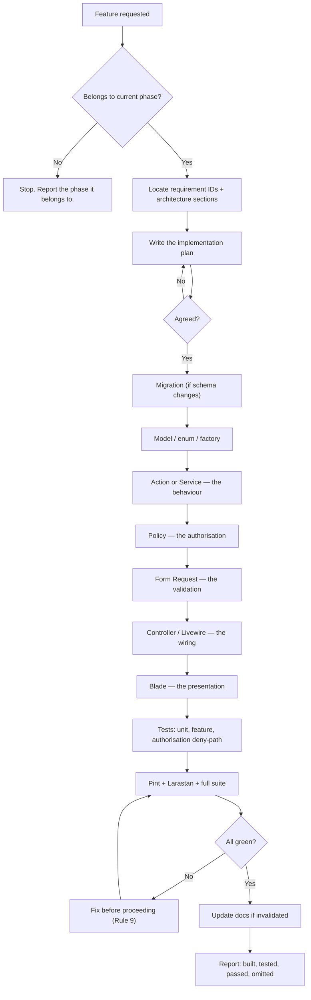

# Master Development Plan & Control Document — LMS

| Field | Value |
|---|---|
| Product | Learning Management System (single organisation) |
| Document | Master Development Control Document |
| Version | 1.1 |
| Status | **Phase 0 — Planning & Architecture.** Revision 1.1 incorporates the customer decisions of 2026-08-12. Awaiting explicit Phase 0 sign-off. |
| Last updated | 2026-08-12 |
| Related documents | [requirements.md](requirements.md), [architecture.md](architecture.md), [phases.md](phases.md) |

> **This document governs how the project is built.** Where it conflicts with a habit, a preference or an assumption, this document wins. Where it conflicts with `requirements.md` or `architecture.md`, the conflict is a defect — fix the documents before writing code.

---

## 1. Project vision

Build a professional, secure, maintainable Learning Management System that lets one education organisation sell and deliver structured online courses — where **course access is granted only against payment the backend has independently verified**, content is genuinely protected, learning is measurably tracked, and the architecture is clean enough that supporting many organisations later is a migration, not a rewrite.

**The three commitments that define success:**

1. **Access integrity.** No student ever obtains course access except through a gateway-verified payment or an explicitly audited administrator grant. The browser is never trusted.
2. **Role integrity.** An instructor can never see or touch a course they are not assigned to. A student can never see another student's data. Backend policy is the only authority.
3. **Future integrity.** V1 ships for one organisation, but every seam multi-tenancy will need already exists — so V2 adds a column and a scope, not a rebuild.

---

## 2. Current project status

| Item | Value |
|---|---|
| **Current phase** | **Phase 3 — Core Domain Schema. Track A slice COMPLETE; Tracks B and C not started** (2026-08-12) |
| **Phase 0 status** | 🟢 Signed off by the customer, 2026-08-12. |
| **Phase 1 status** | 🟢 Complete. Approved by the customer, 2026-08-12. |
| **Phase 2 status** | 🟢 Complete. Approved by the customer, 2026-08-12. |
| **Phase 3 status** | 🟡 In progress. **Track A (Govind) complete**; Track B (Srivathsa) and Track C (Shashank) not started. Gate **G1** does not clear until all three are merged. |
| Code written | Foundation, identity, catalogue. Laravel 13.25.0 on PHP 8.5.9 / PostgreSQL 17.10. **17 tables**: 7 framework + 4 identity + 6 catalogue/media. **No Track B or C tables** (asserted by test). |
| Repository | Branch `main`, pushed to **github.com/MaieuticEdutech/LMS_Maieutic**. Two Phase 3 commits are **local only** — `c036e44` must be pushed to unblock Shashank. |
| Environments | Local development only. Staging/production provisioned in Phase 16. |
| Quality gates | Pint clean · Larastan **level 8**, 0 errors · Pest **142/142**, 326 assertions |
| Open decisions, none blocking Phase 3 | **PD-05** (upload limits — Phase 5), **PD-07** (production email provider — Phase 16), **PD-08** (error tracking — Phase 16), **PD-10** (hosting — Phase 16), **PD-11** (V2 identity model — Phase 18). **PD-06** resolved by default: proposed session lifetimes adopted. |
| Outstanding verification items | (1) **CI never executed** — pipeline authored in Phase 1, awaiting a push to the remote. (2) **Vite HMR not interactively verified.** Neither blocks Phase 3; carried forward per customer instruction. |
| Team | **Three full-stack developers from 2026-08-12.** Work is organised into three tracks with convergence gates — see **§21**. Development Rule 1 amended accordingly. Phase 3 is split three ways by domain with pre-agreed migration ordering (`phases.md` Phase 3). |
| **Blocking parallel work** | The repository has **never been pushed**. Three people cannot work without a shared remote, and the push is also what starts CI running on pull requests. See §21.8. |

### 2.1 Phase status ledger

Update this table at the close of every phase. Nothing else in this document tracks progress.

| Phase | Name | Status | Completed | Notes |
|---|---|---|---|---|
| 0 | Planning & Architecture | 🟢 Complete | 2026-08-12 | Four documents produced; customer decisions incorporated; signed off |
| 1 | Project Foundation | 🟢 Complete | 2026-08-12 | Laravel 13.25.0 / PHP 8.5.9 / PostgreSQL 17.10. Larastan level 8, Pest 16/16. Commit `5aac4cb` |
| 2 | Identity, Authentication & RBAC | 🟢 Complete | 2026-08-12 | Fortify (ADR-013) with LMS-owned views. Status gate inside `authenticateUsing`. Pest 142/142 |
| 3 | Core Domain Schema & Models | ⚪ **Next** | — | No `is_free`, no `is_preview`. Creates the remaining 17 domain tables |
| 4 | Admin Shell & Administration Area | ⚪ Not started | — | |
| 5 | Course Builder & Content Management | ⚪ Not started | — | PD-12 resolved. PD-05 defaults stand |
| 6 | Enrollment Core & Protected Delivery | ⚪ Not started | — | High risk — access gate. No preview path |
| 7 | Student Learning Experience | ⚪ Not started | — | |
| 8 | Assessment Engine | ⚪ Not started | — | |
| 9 | Progress Tracking | ⚪ Not started | — | |
| 10 | Instructor Module | ⚪ Not started | — | |
| 11 | Queues, Mail & Notifications | ⚪ Not started | — | **Unblocked** — built against Mailpit; provider deferred to Phase 16 |
| 12 | Payments & Automated Enrollment | ⚪ Not started | — | High risk. PD-09 resolved; test credentials needed before start |
| 13 | Reporting & Analytics | ⚪ Not started | — | |
| 14 | Security Hardening & Audit | ⚪ Not started | — | |
| 15 | UI/UX Polish & Accessibility | ⚪ Not started | — | |
| 16 | Deployment & Environments | ⚪ Not started | — | Needs PD-07, PD-08, PD-10 |
| 17 | Production Hardening | ⚪ Not started | — | Release gate |
| 18 | Multi-Organisation Support | ⛔ V2 — not in scope | — | Needs PD-11 |

Legend: ⚪ not started · 🟡 in progress · 🟢 complete · 🔴 blocked · ⛔ out of scope

---

## 3. Technology stack

| Layer | Technology | Locked? |
|---|---|---|
| Language | **PHP 8.5** | ✔ |
| Framework | **Laravel 13.x** — pinned to the major version, latest stable patch at installation | ✔ |
| Database | PostgreSQL 16+ | ✔ |
| Templating | Blade | ✔ |
| Interactivity | **Livewire 4** + Alpine.js | ✔ |
| Styling | Tailwind CSS (v4) + Vite | ✔ |
| Authentication | **Laravel Fortify** (headless) + LMS-owned UI — no starter-kit UI (ADR-013) | ✔ |
| Authorisation | Laravel Gates & Policies — **no permission package** (ADR-005) | ✔ |
| Payments | Razorpay, behind a `PaymentGateway` interface. All V1 courses are paid | ✔ |
| Queue | Redis (prod) / database (dev) | ✔ |
| Cache & Session | Redis (prod) / file + database (dev) | ✔ |
| Storage | Local private disk (dev) / S3-compatible (prod) — config switch only | ✔ |
| Mail | Laravel Mail — Mailpit/log through development; production provider chosen in Phase 16 (**PD-07**) | ✔ |
| Testing | **Pest** + Laravel testing helpers | ✔ |
| Code style | Laravel Pint | ✔ |
| Static analysis | Larastan | ✔ |
| CI | Lint → analyse → test → dependency audit | ✔ |

### 3.0 Verified compatibility matrix — checked 2026-08-12 against Packagist and laravel.com

Risk **R-16** is **closed**. **PHP 8.5 is supported across the entire dependency set**; no deviation from the PD-01 decision is required.

| Package | Latest stable | Requires PHP | Requires Laravel | PHP 8.5 OK? |
|---|---|---|---|:--:|
| `laravel/framework` | **13.25.0** (2026-08-11) | `^8.3` — officially 8.3–8.5 | — | ✔ |
| `livewire/livewire` | **4.4.0** (2026-08-10) | `^8.1` | `^10\|^11\|^12\|^13` | ✔ |
| `laravel/fortify` | **1.38.0** (2026-08-07) | `^8.2` | `^11\|^12\|^13` | ✔ |
| `pestphp/pest` | **5.1.0** (2026-08-10) | `^8.4` ← **binding constraint** | — | ✔ |
| `pestphp/pest-plugin-laravel` | **5.0.1** (2026-07-29) | `^8.4` | `^13.23.0` ← **framework floor** | ✔ |
| `larastan/larastan` | **3.10.0** (2026-05-28) | `^8.2` | `^11.44.2\|^12.4.1\|^13` | ✔ |
| `laravel/pint` | **1.30.5** (2026-08-10) | `^8.3.0` | — | ✔ |
| `razorpay/razorpay` | **2.9.3** (2026-06-08) | `>=7.3` (no upper bound) | — | ✔ *(see note)* |

**Consequences of the matrix:**

1. **PHP 8.5 stands.** The tightest floor is Pest 5 / pest-plugin-laravel at `^8.4`; PHP 8.5 satisfies it. Laravel 13 officially supports 8.3–8.5.
2. **Laravel must be ≥ 13.23.0**, because `pest-plugin-laravel` 5.0.1 requires `^13.23.0`. 13.25.0 satisfies this comfortably. The constraint in `composer.json` remains `^13.0`.
3. **Razorpay carries a caveat.** Its `>=7.3` constraint has no upper bound, so Composer will install it on PHP 8.5 — but an open-ended constraint is the *absence of a ceiling*, not a positive certification of 8.5. It is a **Phase 12** dependency and is deliberately **not installed in Phase 1**. Its behaviour on PHP 8.5 will be verified against the live test-mode API at the start of Phase 12, where `FakeGateway` already isolates the rest of the suite from it.

Laravel 13 support policy: released 2026-03-17, bug fixes to Q3 2027, security fixes to 2028-03-17.

### 3.1 Dependency policy

The MVP dependency list is deliberately short: Laravel, Livewire, Fortify, Tailwind, the Razorpay SDK, Pint, Larastan and Pest. **Anything else requires justification recorded in §16.4 before installation** (Development Rule 6).

Before proposing a package, answer: does Laravel already do this? Can it be done in under ~100 lines we fully understand? Is it actively maintained and compatible with our Laravel version? Does it introduce a competing abstraction for something we already own (authorisation, storage paths, tenancy)? If any answer is unfavourable, do not add it.

---

## 4. Architectural decisions

The full ADR set is in `architecture.md` §25 and `docs/adr/`. The decisions that most constrain daily work:

| # | Decision | Daily consequence |
|---|---|---|
| 1 | Modular monolith, not microservices | One deployable; payment and enrollment share a transaction |
| 2 | Quizzes and tests are one `assessments` entity | Never write "quiz" and "test" code twice |
| 3 | Polymorphic `media_files` + `ContentTypeRegistry` | New content types add a handler, never a table |
| 4 | Laravel password broker serves activation tokens | No custom token table |
| 5 | Role enum column + policies, no permission package | Always `$user->hasRole(UserRole::X)` — one call-site pattern |
| 6 | `GrantEnrollment` is the **only** enrollment writer | Never insert an enrollment anywhere else, for any reason |
| 7 | Money as integer minor units + `Money` value object | Never a float, never a decimal cast, for any amount |
| 8 | Lesson progress is fact; course progress is cached and rebuildable | Never treat the cache as truth; `lms:progress:rebuild` must always reproduce it |
| 9 | `orders` separate from `payments` | An order may have many payment attempts |
| 10 | Shared-schema tenancy is the V2 target; seams built now | Obey §7 rules in every phase |
| 11 | Livewire only where interactivity needs server state | Do not reach for Livewire by default |
| 12 | PHP enums + DB CHECK constraints | Every status/type is an enum, and the database enforces it |
| 13 | Fortify is the auth backend; its actions are adapters over LMS Actions | Never duplicate auth logic into a Fortify action; never use a Fortify or starter-kit view |
| 14 | All courses paid; guests see metadata only | Never add a zero-amount order path or a public content path without an explicit decision |

---

## 5. Development rules

These are binding. A change that violates one is rejected in review regardless of whether it works.

### 5.1 Process rules

1. **One phase at a time — *per track*.** Amended 2026-08-12 for a three-person team (§21). A single developer still works one phase at a time; the team may run **at most one phase per track**, and only where §21.2 shows the tracks are genuinely independent. Tracks must be green on `main` together at every convergence gate (§21.4). The two single-owner components in §21.3 are never parallelised. Before the amendment this rule read simply "never implement multiple major phases at once" — the tightening it provided is now supplied by the gates.
2. **Read before writing.** Before coding a phase, read `requirements.md`, `architecture.md`, `phases.md` and `planning.md`.
3. **Plan before implementing.** Before implementing a feature, state the implementation plan and get agreement.
4. **Small, testable changes.** Prefer a sequence of small verifiable steps to one large change.
5. **Stay in scope.** Do not modify unrelated files. Do not do "while I'm here" refactors.
6. **No unnecessary dependencies.** See §3.1.
7. **Do not break what works.** Before changing existing behaviour, find its dependants and its tests.
8. **Test after changing.** Run the relevant tests, then the whole suite, after every change.
9. **Fix before advancing.** A failing test, a lint error or a static-analysis error is fixed before the next feature starts.
10. **Documentation is part of the change.** If a change invalidates a planning document, update it in the same change.
11. **Never hardcode secrets.**
12. **Never commit `.env`.**
13. **Migrations for all schema changes.** No manual schema edits, in any environment.
14. **Seeders and factories for all development and test data.** Never hand-inserted rows.
15. **Follow Laravel conventions** unless there is a documented reason not to (record it as an ADR).

### 5.2 Design rules

16. **Business logic lives in Actions and Services**, not in controllers or Livewire components.
17. **Authorisation lives in policies and middleware**, not in inline conditionals scattered through views.
18. **Validate all user input**, server-side, before it reaches domain logic.
19. **Protect uploaded files** — private disks, validated types, generated names, authorised access only.
20. **Backend permissions are authoritative.** Hiding a button is presentation, never security.

### 5.3 Money and access rules

21. **Browser payment success grants nothing.** A client-side success callback must never, by any path, create an enrollment or unlock content.
22. **Enrollment only after verified payment confirmation** — gateway webhook or reconciliation — or an explicitly audited admin grant.

### 5.4 Future-proofing rules

23. **No multi-tenancy in V1.** Do not add organisation columns, tenant middleware or scopes now.
24. **Keep the architecture extensible for multi-tenancy.** Obey the seam rules in §7.

### 5.5 Completion rule

25. **Never mark a phase complete without satisfying its Definition of Done** — the phase's own criteria *and* the universal DoD in `phases.md` §1.1.

---

## 6. Coding standards

### 6.1 PHP

- PSR-12, enforced by Pint (`laravel` preset). CI fails on any violation.
- `declare(strict_types=1);` at the top of every PHP file.
- Type-hint every parameter and return type. Use typed properties. Use `readonly` for value objects.
- Native backed enums for every status, type and role. Never a bare string literal for a domain value.
- Constructor property promotion and dependency injection. Avoid facades inside domain services — inject the dependency instead.
- No business logic in models beyond relationships, casts, scopes and trivial derived accessors.
- Throw domain exceptions from `app/Exceptions`, not generic `\Exception`.
- No `env()` outside `config/`. Configuration is read through `config()`; organisation settings through `SettingsRepository`.
- Docblocks on public methods of Actions and Services stating intent, invariants and thrown exceptions.
- Early returns over nested conditionals. Guard clauses at the top.

### 6.2 Actions

An Action is one write use-case. It has one public method (`handle` or `__invoke`), takes the acting user explicitly when authorisation or audit depends on it, wraps its writes in a transaction when it touches more than one row, is safe to call from HTTP, a job or a console command, and returns a result — never a response.

```php
final class GrantEnrollment
{
    public function handle(User $student, Course $course, EnrollmentSource $source, ?Order $order = null, ?User $grantedBy = null): Enrollment
    { /* transactional, idempotent, audited, event-emitting */ }
}
```

### 6.3 Blade & Livewire

- Views contain presentation only — no queries, no business logic.
- Reuse the shared component library; avoid one-off markup and arbitrary Tailwind values.
- Escape output by default. `{!! !!}` requires a sanitised value and a review justification.
- Livewire components authorise on **every** mutating method — public properties are client-influenceable.
- Never place a secret, an authorisation flag or an answer key in a public Livewire property.
- Paginate every list; never hydrate an unbounded collection.

### 6.4 Naming conventions

| Thing | Convention | Example |
|---|---|---|
| Class | `StudlyCase` | `GrantEnrollment` |
| Method / variable | `camelCase` | `grantsAccess()` |
| Constant / enum case | enum cases `StudlyCase` | `EnrollmentStatus::Active` |
| Table | plural `snake_case` | `assessment_attempts` |
| Pivot table | singular models, alphabetical | `course_instructor` |
| Column | `snake_case` | `progress_percentage` |
| Foreign key | `{singular}_id` | `course_id` |
| Boolean column | `is_` / `has_` prefix | `is_published` |
| Timestamp column | past-tense `_at` | `completed_at` |
| Amount column | `_amount` (integer minor units) | `price_amount` |
| Route name | dot-namespaced | `admin.courses.edit` |
| Blade view | dot-namespaced lowercase | `admin.courses.edit` |
| Livewire component | area-namespaced | `Admin\CourseBuilder` |
| Action | imperative verb phrase | `PublishCourse` |
| Service | noun + `Service` / `Registry` / `Resolver` | `MediaUrlService` |
| Job | imperative verb phrase | `RecalculateCourseProgress` |
| Event | past-tense fact | `EnrollmentGranted` |
| Policy | `{Model}Policy` | `AssessmentPolicy` |
| Test | `it_does_the_thing` / `test_...` | `it_denies_unenrolled_media_access` |
| Config key | `snake_case` under `config/lms.php` | `lms.media.video_max_bytes` |
| Env variable | `SCREAMING_SNAKE_CASE` | `RAZORPAY_WEBHOOK_SECRET` |

Domain vocabulary is fixed: **Course · Module · Lesson · MediaFile · Assessment · Question · Attempt · Enrollment · Order · Payment · Progress.** Use these words and no synonyms — no "chapter", "topic", "exam", "purchase", "subscription", "registration" (for enrollment) anywhere in code, database or UI.

---

## 7. Folder structure principles

The structure is specified in `architecture.md` §3.3. The principles behind it:

1. **Standard Laravel skeleton.** `artisan` generators, IDE tooling and every Laravel developer's expectations keep working.
2. **Group by bounded context inside conventional folders.** `app/Actions/Billing`, `app/Services/Media`, `app/Livewire/Admin`.
3. **Dependencies point downward only.** Presentation → HTTP → Domain → Data → Infrastructure. Never upward.
4. **One responsibility per file.** One Action per use-case, one handler per content type.
5. **Infrastructure behind interfaces.** `PaymentGateway`, `LessonContentHandler`, `QuestionTypeHandler` — implementations are replaceable.
6. **Route files split by audience.** `web.php`, `admin.php`, `instructor.php`, `student.php`, `webhooks.php`, `media.php` — so a tenant middleware group can later wrap them unchanged.
7. **`app/Support` is framework-agnostic.** Value objects and helpers with no Laravel dependency.

### 7.1 Multi-tenancy seam rules — enforced in every phase

These are the rules that make Phase 18 a migration instead of a rewrite. Violating one is a defect even though multi-tenancy is not being built.

| # | Rule |
|---|---|
| S-1 | No organisation identity (name, logo, address, support email, sender) is hardcoded in code, views, emails or config. It comes from `settings` via `SettingsRepository` / `BrandingService`. |
| S-2 | No storage path is constructed anywhere except `MediaPathResolver`. |
| S-3 | No raw SQL that an Eloquent global scope could not later filter. Data access goes through models and scopes. |
| S-4 | No job depends on ambient request, session or auth state. Jobs receive explicit IDs or serialised models. |
| S-5 | Every migration comment classifies its table as **tenant-owned** or **platform-global**. |
| S-6 | Uniqueness constraints that would become per-organisation later (`courses.slug`, `categories.slug`, `settings.key`, `orders.order_number`) are documented as composite-ready in `architecture.md` §24.2. |
| S-7 | Role checks use exactly one pattern: `$user->hasRole(UserRole::X)`. Never `$user->role === 'x'` anywhere. |
| S-8 | Access checks use exactly one entry point: `EnrollmentAccessService::grantsAccess()`. Never an ad-hoc enrollment query in a policy or view. |

---

## 8. Database conventions

1. **Every schema change is a migration.** No exceptions, no environments excluded.
2. **Migrations are reversible** or paired with a documented forward fix. `down()` is written and tested.
3. **Every foreign key declares its `ON DELETE` behaviour explicitly** — `CASCADE` down the content hierarchy, `RESTRICT`/`SET NULL` for financial and audit references.
4. **Every foreign key is indexed.** Composite indexes are added for real access paths, not speculatively.
5. **Every enum-backed column has a CHECK constraint** mirroring the PHP enum (ADR-012).
6. **Business invariants are enforced in the database** where possible — see `architecture.md` §6.5. Application-level checks are a convenience, not the guarantee.
7. **Money is `bigint` in minor units** plus a `char(3)` currency column. Never `float`, never `decimal` for money.
8. **Timestamps are `timestamptz` in UTC.** Conversion happens at display time only.
9. **JSONB only for genuinely open-ended data.** Never for anything needing referential integrity or frequent filtering.
10. **Soft deletes** on `users`, `courses`, `modules`, `lessons`. Financial records are never deleted.
11. **Every table gets a factory**; every model gets a policy.
12. **No destructive migration in a single release.** Expand → backfill → dual-write → switch reads → contract, across releases.
13. **Seeders are idempotent** and safe to re-run.
14. **Never edit a migration that has run in staging or production.** Write a new one.
15. **Table classification comment** at the top of every migration (S-5).

---

## 9. Security rules

Beyond the NFR-SEC requirements, these are the rules for daily work:

1. Every route is authenticated and authorised unless it is deliberately public — and deliberately public routes are listed and reviewed.
2. Every fetch-by-ID is followed by a policy check. No exceptions. This is the single most common source of real vulnerabilities.
3. Every model declares `$fillable`. `$guarded = []` is prohibited. `role`, `status`, `price_amount` and ownership columns are never fillable.
4. Every form has a Form Request or explicit Livewire rules. Nothing reaches an Action unvalidated.
5. Every upload passes size, extension, MIME and content-sniff validation, then stores under a generated name on a private disk.
6. Every protected asset URL is short-lived and issued only after an authorisation check.
7. Correct answers and marking keys never leave the server before submission.
8. Every secret comes from an environment variable. Nothing sensitive is ever logged.
9. Every money- or access-changing operation writes an audit entry.
10. The webhook endpoint verifies the signature against the **raw** body with a constant-time comparison, before parsing.
11. Rate limiting is applied to every authentication, payment, media and submission route.
12. `APP_DEBUG=false` in every non-local environment.

---

## 10. Git rules

| # | Rule |
|---|---|
| G-1 | `.env`, `.env.*` (except `.env.example`), `/vendor`, `/node_modules`, `/storage/app/content`, `/storage/app/public`, `/public/build`, `/public/storage`, `.phpunit.result.cache` are git-ignored. |
| G-2 | **No secret is ever committed.** If one is, rotate it immediately — removing the commit is not sufficient. |
| G-3 | Branch per phase: `phase/NN-short-name`. Branch per fix: `fix/short-name`. **With a parallel team, branch per _task_ and merge daily — see §21.6. Long-lived per-track branches are merge debt disguised as organisation.** |
| G-4 | Conventional commit subjects: `feat:`, `fix:`, `refactor:`, `test:`, `docs:`, `chore:`, `perf:`, `security:`. Subject ≤ 72 characters, imperative mood. |
| G-5 | Commits are atomic and self-consistent — the suite passes at every commit on the main branch. |
| G-6 | Never force-push a shared branch. |
| G-7 | A phase branch merges to main only when its Definition of Done is satisfied. |
| G-8 | Every merge to main is tagged with the phase (`phase-05-complete`); releases are tagged `v1.0.0` semantically. |
| G-9 | `main` is always deployable. |
| G-10 | Generated artefacts (compiled assets, coverage reports) are not committed. |
| G-11 | Planning-document updates are committed with the change that caused them, not separately. |

---

## 11. Environment variable rules

| # | Rule |
|---|---|
| E-1 | Every environment variable appears in `.env.example` with an empty or safe placeholder value — never a real value. |
| E-2 | `.env` is never committed, never shared over chat or email, and never printed to logs or terminals. |
| E-3 | `env()` is called only inside `config/`. Application code reads `config()`. |
| E-4 | Secrets (`APP_KEY`, database password, `RAZORPAY_KEY_SECRET`, `RAZORPAY_WEBHOOK_SECRET`, mail credentials, S3 credentials, error-tracking DSN) exist only as environment variables in each environment. |
| E-5 | Local, staging and production use **different** credentials. Staging never uses live payment keys. |
| E-6 | Adding a variable means updating `.env.example`, `config/`, the deployment configuration and the README in the same change. |
| E-7 | A leaked secret is rotated immediately and the incident recorded in the decision log (§16.4) and, if it reveals a systemic gap, in the risk register (§17). |
| E-8 | Organisation-level *settings* (name, logo, thresholds, TTLs) belong in the `settings` table, **not** in `.env`. Only infrastructure credentials and environment-specific endpoints belong in `.env` (rule S-1). |

Anticipated variables: `APP_*`, `DB_*`, `REDIS_*`, `QUEUE_CONNECTION`, `CACHE_STORE`, `SESSION_*`, `MAIL_*`, `FILESYSTEM_DISK`, `AWS_*` / S3-compatible credentials, `RAZORPAY_KEY_ID`, `RAZORPAY_KEY_SECRET`, `RAZORPAY_WEBHOOK_SECRET`, `LMS_CONTENT_DISK`, `LMS_MEDIA_URL_TTL`, `SENTRY_DSN`.

---

## 12. Testing strategy

Testing is **continuous**, not a phase. Every phase's DoD requires tests for its own behaviour and a green suite overall.

### 12.1 Test layers

| Layer | Scope | Where |
|---|---|---|
| **Unit** | Pure logic with no framework or database — grading, `Money`, progress percentage maths, publish validators, signature verification | `tests/Unit` |
| **Feature** | HTTP + database + policies + jobs. The primary layer for this project. | `tests/Feature` |
| **Security** | Adversarial: IDOR, privilege escalation, scope escape, forged webhooks, key leakage, upload abuse | `tests/Feature/Security` |
| **Browser** *(selective)* | Course Builder drag-and-drop, video playback and resume, the attempt runner | `tests/Browser` |

### 12.2 What must always be tested

- Every policy: allow **and** deny paths, for every role.
- Every Action: happy path, invalid input, authorisation failure, idempotency where applicable.
- Every database invariant from `architecture.md` §6.5.
- Every acceptance criterion in `requirements.md` §23 — each maps to at least one automated or documented manual test (AC-39).
- Every money or access path, adversarially.

### 12.3 Rules

- Tests use factories and seeders, never hand-written SQL.
- Tests are independent, order-independent and use database transactions or refresh.
- No test calls a real external service. Razorpay is always `FakeGateway`; mail is always faked or captured.
- Time-dependent behaviour uses time travel, never `sleep()`.
- Query-count assertions guard the pages with known N+1 risk (player, dashboards, admin tables).
- A bug fix begins with a failing test that reproduces the bug.

### 12.4 Coverage expectation

Coverage percentage is not a target. The requirement is behavioural: **every access-control decision, every money path, every grading rule and every progress calculation has an explicit test.** Code without a meaningful test does not satisfy a phase DoD.

---

## 13. Definition of Done

### 13.1 For a feature

- [ ] Implements its requirement ID(s) as specified
- [ ] Business logic in an Action or Service, not a controller or component
- [ ] Input validated server-side
- [ ] Authorisation enforced by policy/middleware and tested for both allow and deny
- [ ] Audit logged if it touches money, identity or access
- [ ] Tests written and passing; whole suite green
- [ ] Pint and Larastan pass
- [ ] Errors handled with a clear user-facing message and a useful log entry
- [ ] Responsive and accessible on the surfaces it touches
- [ ] No new dependency without recorded justification
- [ ] No unrelated file changed

### 13.2 For a phase

Its own DoD in `phases.md` **plus** the universal DoD (`phases.md` §1.1), **plus**:

- [ ] `planning.md` §2 status ledger updated
- [ ] New decisions recorded in §16.4; resolved pending decisions moved out of §16.3; new risks in §17
- [ ] Manual verification of the phase's acceptance criteria performed and recorded
- [ ] Phase branch merged and tagged

### 13.3 For the release

Every acceptance criterion in `requirements.md` §23 passes on production (Phase 17), backup restore is rehearsed, monitoring is proven, and the customer has signed off.

---

## 14. Agent development rules — how Claude Code works on this project

### 14.1 The 25 binding rules

These are the rules the customer set for this project. They are restated here verbatim as the operative list; §5 organises the same rules by theme.

1. Never implement multiple major phases at once. *(Amended 2026-08-12 — now scoped per track: see §5.1 rule 1 and §21. One phase per track, never two phases by one person, never a parallel owner on the components in §21.3.)*
2. Before coding a phase, read `requirements.md`, `architecture.md`, `phases.md` and `planning.md`.
3. Before implementing a feature, explain the implementation plan.
4. Prefer small, testable changes.
5. Do not modify unrelated files.
6. Do not introduce unnecessary dependencies.
7. Do not overwrite working functionality without checking dependencies.
8. Run appropriate tests after changes.
9. Fix errors before moving to the next feature.
10. Keep documentation updated.
11. Never hardcode secrets.
12. Never commit `.env` files.
13. Use migrations for database changes.
14. Use seeders/factories for development/test data.
15. Follow Laravel conventions unless there is a documented reason not to.
16. Keep business logic out of controllers where practical; use services/actions when appropriate.
17. Use policies/middleware for authorisation.
18. Validate all user input.
19. Protect uploaded files.
20. Backend permissions are authoritative; frontend hiding is not security.
21. Payment success in the browser must never directly grant course access.
22. Enrollment must be granted only after verified payment confirmation.
23. Do not build multi-tenancy in V1.
24. Keep the architecture extensible for future multi-tenancy.
25. Never mark a phase complete without satisfying its Definition of Done.

### 14.2 Operating procedure for every work session

1. **Read the four planning documents** before touching code (Rule 2). Confirm the current phase in §2.
2. **Confirm scope.** Identify which phase and which requirement IDs the request belongs to. If it belongs to a future phase, say so and stop — do not build ahead.
3. **State the plan** before writing code (Rule 3): what will be built, which files will be created or changed, which requirement IDs it satisfies, which tests will be written, and any deviation from the architecture. Wait for agreement.
4. **Implement in small steps** (Rule 4), touching only related files (Rule 5).
5. **Test** — the new tests, then the full suite, then Pint and Larastan (Rules 8, 9).
6. **Update documentation** in the same change if any planning document is now inaccurate (Rule 10).
7. **Report honestly.** State exactly what was built, what was tested, what passed, what failed, and what was deliberately left out. Never report a phase complete when its DoD is unmet (Rule 25).

### 14.3 Hard stops — stop and ask, do not proceed

- The request requires implementing a phase that is not the current one.
- The request conflicts with a requirement, an ADR or a development rule.
- The request implies multi-tenancy work in V1 (Rule 23).
- The request would create a second path to enrollment or content access (Rule 22, ADR-006).
- The request requires a new dependency (Rule 6).
- The request requires a breaking schema change to a table already deployed.
- A pending decision in §16.3 blocks the work.
- Something in the codebase contradicts the planning documents — the documents are wrong, or the code is; either way it is decided, not guessed.

### 14.4 Prohibited without explicit instruction

Installing packages · running `migrate:fresh` against any non-local database · deleting or rewriting migrations that have run outside local · modifying `.env` · committing · pushing · deploying · disabling a test to make a suite pass · editing generated files · changing the technology stack · restructuring folders · adding a second way to do something that already has one way.

---

## 15. Process guides

### 15.1 How a feature is implemented



**Inside-out order is mandatory.** Data → behaviour → authorisation → validation → wiring → presentation → tests. Building the UI first produces business logic in components, which violates Rule 16 and is expensive to unwind.

### 15.2 How changes are reviewed

Review checklist, applied to every change:

| Area | Question |
|---|---|
| Scope | Only related files touched? Nothing built ahead of the phase? |
| Requirements | Does it implement its stated requirement IDs, completely? |
| Architecture | Does it match `architecture.md`? Any deviation recorded as an ADR? |
| Authorisation | Policy enforced? Deny path tested? Fetch-by-ID followed by a check? |
| Validation | All input validated server-side? |
| Security | Secrets, mass assignment, escaping, uploads, rate limits, audit entries? |
| Money & access | Does any new path create an enrollment outside `GrantEnrollment`? |
| Data | Migration reversible? Constraints and indexes present? Table classified? |
| Performance | Pagination? Eager loading? No N+1? Bounded queries? |
| Tenancy seams | Rules S-1…S-8 respected? |
| Tests | New behaviour covered? Deny paths covered? Suite green? |
| Style | Pint clean, Larastan clean, naming conventions followed? |
| Docs | Planning documents still accurate? |

Any "no" blocks the change.

### 15.3 How migrations are handled

- One logical change per migration; descriptive name; classification comment (S-5).
- `down()` written and tested by running `migrate:rollback` locally.
- Never edit a migration that has run in staging or production — write a new one.
- Adding a non-nullable column to a populated table: add nullable → backfill → set NOT NULL, across separate steps.
- Renaming or dropping a column: expand → backfill → dual-write → switch reads → contract, across releases (§8 rule 12).
- Adding an index to a large table in production uses PostgreSQL's `CONCURRENTLY` where the framework allows.
- Data migrations are separate from schema migrations, and idempotent.
- Production migrations run as part of the deploy sequence with `--force`, after a backup, with rollback documented.
- After any schema change: update the model, the factory, the seeder, the relevant tests and `architecture.md` §6.4.

### 15.4 How breaking changes are handled

A breaking change is anything that would corrupt existing data, invalidate existing enrollments/progress/attempts, change a public URL that users have bookmarked, or alter a payment or access rule.

1. **Stop and raise it.** Breaking changes are never made unilaterally.
2. Document what breaks, who is affected, and what the alternatives are.
3. Prefer additive change. If a rename is genuinely needed, use expand-and-contract across releases.
4. Provide a data migration for existing records, tested against a copy of real data.
5. Provide a rollback plan before deploying.
6. Record it in the decision log (§16.4), and update the affected planning documents.
7. Never break progress, enrollment, order or payment history. Those records are permanent.

### 15.5 How documentation is maintained

| Document | Updated when |
|---|---|
| `requirements.md` | A requirement is added, removed, clarified or reprioritised |
| `architecture.md` | A structural decision changes; a new ADR is made; the schema changes |
| `phases.md` | A phase's scope changes; a phase completes; the sequence changes |
| `planning.md` | Every phase transition; every decision, risk, assumption or dependency change |
| `docs/adr/` | Any decision that deviates from convention or has long-lived consequences |
| `README.md` | Setup steps, environment variables or commands change |

Rules: documentation is updated in the **same change** as the code that invalidated it (Rule 10). No planning document is edited to match code that violated it — fix the code, or make an explicit decision to change the plan and record why. Every document carries a "Last updated" date.

---

## 16. Decisions

§16.1–16.2 record what the customer has settled. §16.3 lists what remains open — **blocking** items must be resolved before the stated phase begins. §16.4 is the running log of every decision made during the project.

### 16.1 Resolved — customer decisions of 2026-08-12

| ID | Decision | Answer | Consequence |
|---|---|---|---|
| **PD-01** | Laravel and PHP versions | **Laravel 13.x** (latest stable patch at installation, major version pinned, never floated). **PHP 8.5** if supported by all selected dependencies. | Stack tables updated in all four documents. Phase 1's first task is a compatibility verification before any install. |
| **PD-02** | Roles per user | **One role per user in V1** — `SuperAdmin`, `Instructor`, `Student`. Architecture stays extensible for many-to-many later. | ADR-005 stands unchanged. `$user->hasRole(UserRole::X)` remains the single call-site pattern (rule S-7). |
| **PD-03** | Authentication | **Laravel Fortify** as the headless backend; LMS builds its own auth UI and customises the flows. Not hand-rolled, and the default starter-kit UI is not adopted. | New **ADR-013**. `architecture.md` §7.1 rewritten; §7.1.1 added covering feature flags, view binding, pipeline adapters and status gating inside `authenticateUsing`. Phase 2 rewritten. |
| **PD-04** | Test framework | **Pest**. | Locked in the stack; `composer test` runs Pest. |
| **PD-09** | Payment gateway | **Razorpay**. Test credentials and webhook secret before Phase 12. Tests use `FakeGateway` and never call Razorpay. Browser payment success never grants access; only verified server-side confirmation triggers enrollment. | Confirms ADR-006 and the whole of `architecture.md` §11. No change needed beyond marking it resolved. |
| **PD-12** | Video protection | **Private storage with short-lived signed URLs.** No DRM in V1. No commercial video platform initially. Media architecture kept abstract so a provider can be added later without redesign. | Confirms A-05 and A-07 and `architecture.md` §16. `MediaUrlService` remains the seam. Phase 5 unblocked. |

### 16.2 Business decisions of 2026-08-12

| Area | Decision | Documentation impact |
|---|---|---|
| Catalogue | Guests browse courses, view details, price and syllabus **metadata only**. No learning content is publicly reachable. | **Removed the free-preview feature from V1.** FR-CNT-09 → [V1.1]; FR-RBAC-05 tightened; FR-STU-04 tightened; `lessons.is_preview` column dropped; the preview branch removed from the access gate (§8.5); Phase 5/6 tests changed from "preview is reachable" to "nothing is reachable". |
| Free courses | **Not in V1.** All V1 courses are paid. | FR-CRS-10 rewritten; `courses.is_free` dropped and replaced by a `CHECK price_amount > 0`; `ClaimFreeCourse` action removed from Phase 12; FR-ENR-02 reduced from three enrollment sources to two. |
| Instructor permissions | Instructors do not author course content in V1 — assessments, questions, marks, pass %, time limits, and read-only progress/results on assigned courses only. | Matches the existing FR-INS set and Phase 10. No change required. Confirms A-04. |
| Course access | Enrollment-based. Payment is one source; administrator-granted enrollment must exist for testing and operations. | Confirms the Phase 6 / Phase 12 split and ADR-006. No change required. |
| Account creation | Purchase → create-or-find account by email → enrollment → activation or confirmation email. Never duplicate an account for the same email. | Matches FR-MAIL-01 exactly. No change required. |
| Passwords | Never stored or emailed in plaintext; one-time activation link only. | Matches FR-AUTH-05, FR-MAIL-02. No change required. |
| Refunds | Manual in the Razorpay dashboard; LMS reacts to verified webhooks. | Confirms A-14. |
| GST / invoicing | Outside the LMS in V1. | Confirms A-15. |
| Multi-organisation | Not in V1; keep the architectural seams. | Confirms Rules 23–24 and seam rules S-1…S-8. |

### 16.3 Still open

| ID | Decision | Options | Recommendation | Blocks | Status |
|---|---|---|---|---|---|
| **PD-05** | Upload limits and allowed types | Proposed: video 2 GB (`mp4, webm, mov`); document 50 MB (`pdf`); presentation 100 MB (`ppt, pptx, odp`); resource 100 MB (`pdf, zip, docx, xlsx, csv, txt, png, jpg`) | Proceed on the proposed values — they are stored as settings, so changing them later is a configuration change, not a code change | Phase 5 | 🟡 Proposed defaults stand |
| ~~PD-06~~ | ~~Session lifetimes~~ | — | **🟢 RESOLVED BY DEFAULT 2026-08-12.** Phase 2 adopted a single 120-minute lifetime (`SESSION_LIFETIME=120`) for all roles. The proposed shorter admin window was NOT implemented: Laravel's session lifetime is global, and per-role expiry needs custom middleware that would have been Phase 2 scope creep. Revisit in Phase 14 (security hardening), where it belongs | Closed | 🟢 |
| **PD-07** | **Production** transactional email provider and sending domain | SES / Postmark / Mailgun / SendGrid / SMTP | Per the customer's answer, development uses Mailpit/`log` throughout and the production provider is selected before deployment. It must support SPF, DKIM and DMARC — activation-email deliverability is the critical path of onboarding (A-09) | Phase 16 | 🟡 Deferred to Phase 16 |
| **PD-08** | Error tracking service | Sentry / Bugsnag / Flare / none | Sentry or equivalent — running production without error tracking is not advisable | Phase 16 | 🟡 Open |
| **PD-10** | Hosting platform | VPS (DigitalOcean/Hetzner + Forge/Ploi) / managed platform / cloud | Must support PHP 8.5/Laravel, PostgreSQL, HTTPS, **persistent queue workers**, the Laravel scheduler, a publicly reachable webhook endpoint, and object storage. Decide by Phase 15 so Phase 16 is not blocked | Phase 16 | 🟡 Open |
| **PD-11** | V2: global user identity or per-organisation? | Affects whether `users.email` stays globally unique | Defer to V2; the answer determines the Phase 18 migration shape | Phase 18 | ⚪ Deferred |

### 16.4 Decision log

Decisions made during the project are appended here with date, decision, rationale and consequence.

| Date | Decision | Rationale | Consequence |
|---|---|---|---|
| 2026-08-12 | Laravel 13.x + PHP 8.5 + Livewire 4, all majors pinned | Customer decision PD-01 and stack decision 10 | Compatibility verification is Phase 1's first task; if any dependency lacks PHP 8.5 support the project drops to the highest commonly supported version and records it here |
| 2026-08-12 | Laravel Fortify as the auth backend with LMS-owned views (ADR-013) | Customer decision PD-03 — framework-maintained security primitives without starter-kit UI | Fortify actions become thin adapters over LMS domain Actions; status gating moves inside `authenticateUsing`; unused Fortify features explicitly disabled |
| 2026-08-12 | All V1 courses are paid; no free-course path (ADR-014) | Business decision | `is_free` dropped, `CHECK price_amount > 0` added, `ClaimFreeCourse` removed, enrollment sources reduced from three to two |
| 2026-08-12 | No guest preview content; guests see metadata only (ADR-014) | Business decision | `is_preview` dropped, preview branch removed from the access gate, tests inverted to assert nothing is publicly reachable |
| 2026-08-12 | Production email provider deferred to Phase 16; development uses Mailpit/`log` throughout | Customer decision PD-07 | Phase 11 loses its blocking dependency; the mail layer is written transport-agnostically |
| 2026-08-12 | **PD-01 verified, not assumed.** PHP 8.5 confirmed supported across the entire dependency set | Phase 1 compatibility check against Packagist and laravel.com | **Risk R-16 closed with no deviation.** Installed: PHP 8.5.9, Laravel 13.25.0, Livewire 4.4.0, Fortify 1.38.0, Pest 5.1.0, Larastan 3.10.0, Pint 1.30.5. Binding floor is Pest at `^8.4`; framework floor is `pest-plugin-laravel` at Laravel `^13.23.0` |
| 2026-08-12 | `composer.json` pins `"php": "^8.5"` rather than Laravel's stock `^8.3` | C-01 states PHP 8.5. A stock `^8.3` would let someone install on 8.3 and hit a confusing Pest failure instead of a clear composer error | Runtime requirement is enforced at install time |
| 2026-08-12 | **Tests run against real PostgreSQL (`lms_test`), never SQLite.** `DB_DATABASE` is hard-coded in `phpunit.xml` | From Phase 3 the schema needs JSONB, partial unique indexes and CHECK constraints, none of which SQLite implements — a green SQLite suite would be worse than no suite. Hard-coding also stops a stray `.env` pointing the suite at `lms_dev` and wiping it via `RefreshDatabase` | Contributors must have PostgreSQL locally; documented in README |
| 2026-08-12 | **Stock `users` table removed** from Laravel's framework migration; only `sessions` + `password_reset_tokens` created | Phase 1 DoD says "No domain tables yet". `users` is a Phase 2 domain table (role, status, nullable password, soft deletes). Creating it early with the wrong shape would force Phase 2 to rewrite a migration | Migration renamed `create_framework_auth_tables`. A test asserts `users` does **not** exist |
| 2026-08-12 | **Larastan set to level 8** at project start, not retrofitted | Raising the level later means retrofitting types across a grown codebase. Level 8 adds nullability checking — exactly the bug class (null enrollment, null attempt) that would otherwise 500 in front of a paying student | Required one `(string)` cast in stock `config/filesystems.php`. All first-party code passes level 8 |
| 2026-08-12 | **`checkModelProperties` disabled** (deviation from intent) | Larastan types `Factory::definition()` as `array<model property of TModel, mixed>`, but that is an INTERNAL type that cannot be written in userland PHPDoc. Satisfying it requires `@phpstan-ignore` or a baseline — both prohibited by U-4 and Rule 9 | Tooling incompatibility with Laravel's own factory signature; no application code is exempted from analysis. **Revisit in Phase 3** when schema-backed models exist |
| 2026-08-12 | **New dependency: `pestphp/pest-plugin-phpstan` ^5.0** (dev) | Rule 6 justification: without it PHPStan cannot resolve Pest's closure-to-TestCase binding, so every test reported false "undefined method" errors. The only alternatives were excluding `tests/` from analysis (a real loss — planning.md §12 makes tests first-class) or suppressing errors (prohibited) | First-party Pest plugin, compatible with Pest 5 / PHPStan 2.2.5+ |
| 2026-08-12 | **Phase 2:** status gate placed inside `Fortify::authenticateUsing()`, not in middleware alone | Middleware runs *after* the guard has logged the user in, so a suspended user would briefly hold a valid session and any pre-middleware code would see them as authenticated | `EnsureUserIsActive` retained as defence in depth for sessions whose user is deactivated mid-session. Both paths delegate to `UserStatus::canAuthenticate()` so they cannot drift apart |
| 2026-08-12 | **Phase 2:** two password brokers (`users` 60m, `activations` 72h) over one token table | Reset and activation need very different lifetimes. A short activation window would strand a buyer who did not open their email immediately — the worst failure on the paid onboarding path | Sharing the email-keyed table means one live token per user: requesting a reset invalidates a pending activation link, which is a desirable property |
| 2026-08-12 | **Phase 2:** password reset also activates a `pending_activation` account | Otherwise a buyer who clicked "forgot password" instead of the activation link would set a password successfully and still be unable to log in — a dead end with no visible cause | `ChangeUserPassword::$activateIfPending` |
| 2026-08-12 | **Phase 2:** Super Admin seeder sets NO usable password outside local/testing | A seeded default credential in production is an open door. The operator takes control via "Forgot password" | Also fixed a real bug Larastan surfaced: `env()` in a seeder returns null once `config:cache` has run, which would have seeded an admin with an empty email |
| 2026-08-12 | **Team grew to three full-stack developers. Development Rule 1 amended from "one phase at a time" to "one phase at a time PER TRACK"** | The roadmap is a dependency order, not a schedule. Running independent phases in series would idle two developers for no engineering reason | New §21 defines three tracks, five convergence gates, single-owner components, shared-file ownership and branch/PR rules. Phase 3 split three ways by domain with pre-agreed migration numbering. **Phases 13–17 stay single-track** — they are cross-cutting audits, and splitting an audit is how gaps appear between the seams |
| 2026-08-12 | **`GrantEnrollment` and `EnrollmentAccessService` designated single-owner, non-parallelisable** | ADR-006 guarantees exactly one enrollment writer and one definition of access. That is an ownership decision, not a code-review outcome — it is the one place where adding people makes the result worse | Phase 6 and Phase 12 are one person, one branch. Other tracks consume them as read-only interfaces |
| 2026-08-12 | **Phase 2:** `guest` middleware alias overridden rather than `$middleware->replace()` | `replace()` operates on middleware groups and does not rebind an alias — the stock class stayed active and every role was redirected to `/`. Caught by test, not by inspection | Role-based post-login and guest-screen redirects now both resolve from `UserRole::homePath()` |
| 2026-08-12 | Local runtime installed **portably**, no admin rights | Herd and the PostgreSQL service installer both need UAC elevation, which is unavailable from the automation shell (winget failed `0x800704c7`). PHP and PostgreSQL run from `C:\Users\<user>\devtools` as user processes | **Developer-machine setup only — not a project decision.** Production provisioning is Phase 16 and unaffected. See §20.1 |
| 2026-08-12 | Quizzes and tests unified as one `assessments` entity | Structurally identical (ADR-002) | One engine, one policy set; `type` discriminates |
| 2026-08-12 | Media tables collapsed into polymorphic `media_files` | New content types must not require schema change (ADR-003, FR-CNT-07) | One upload pipeline, one access policy |
| 2026-08-12 | Enrollment split out of Payments into its own earlier phase (Phase 6) | Everything downstream depends on the access gate | Payment attaches to an already-proven engine |
| 2026-08-12 | Mail and queue infrastructure moved before Payments (Phase 11) | The activation email is the purchase flow's key output | Payments can be completed and accepted |
| 2026-08-12 | Instructor Module moved after Assessments and Progress (Phase 10) | The instructor's job is authoring assessments and reading progress | No screens built twice |
| 2026-08-12 | Testing is continuous, not a phase; Phase 14 is a hardening audit | Security tested only at the end is security not built in | Every phase DoD requires tests |
| 2026-08-12 | Reporting given its own phase (13) | FR-RPT was unassigned in the original sequence | Reporting is delivered, not squeezed in |

---

## 17. Risks

| ID | Risk | Likelihood | Impact | Mitigation | Owner |
|---|---|---|---|---|---|
| R-01 | **Webhook not delivered or delayed** → paid student without access | Medium | **High** | Scheduled reconciliation (FR-PAY-12); "activating your access" UI; alert on `pending` orders > 30 min; admin manual grant as a backstop | Phase 12 |
| R-02 | **Enrollment created outside the verified path** by a later change | Low | **Critical** | `GrantEnrollment` is the only writer (ADR-006); enforced in review; adversarial tests in Phases 6, 12, 14 | Continuous |
| R-03 | **Video piracy** — no DRM in V1 | High | Medium | Signed short-TTL URLs, private storage, rate limiting, audit logging. **Risk explicitly accepted by the business on 2026-08-12 (PD-12).** `MediaUrlService` remains the seam through which a commercial provider or encrypted HLS can be introduced later without redesign | Accepted |
| R-04 | **Large-file upload failures** (PHP limits, timeouts, browser) | Medium | Medium | Chunked/direct-to-storage upload, tuned limits, clear errors, resumable where possible | Phase 5 |
| R-05 | **Activation emails land in spam** → buyers cannot access what they paid for | Medium | **High** | SPF/DKIM/DMARC (PD-07), reputable provider, resend flow, order confirmation page shows the activation state and a resend button | Phase 11 |
| R-06 | **Instructor scope leak** | Low | **High** | Single `assignedTo` entry point (§8.4), policy on every route, exhaustive Phase 10 and 14 test sweeps | Phases 10, 14 |
| R-07 | **Progress cache drifts from truth** | Medium | Medium | Cache is derived and rebuildable; `lms:progress:rebuild` verified in Phase 9; recalculation on curriculum change | Phase 9 |
| R-08 | **Multi-tenancy retrofit turns out expensive** despite the seams | Low | **High** | Seam rules S-1…S-8 enforced every phase; migration path fully specified (§24.3); a violation is a review-blocking defect | Continuous |
| R-09 | **Performance degrades** as content and students grow | Medium | Medium | Pagination everywhere, `preventLazyLoading`, query-count assertions, cached aggregates, load test in Phase 17 | Continuous |
| R-10 | **Scope creep** — certificates, coupons, forums, live classes pulled into V1 | **High** | Medium | Out-of-scope table in `requirements.md` §4.2; new requests become V1.1/V2 items, recorded not built | Continuous |
| R-11 | **Razorpay API or webhook contract changes** | Low | Medium | All gateway specifics isolated in `RazorpayGateway`; `FakeGateway` for tests; contract change touches one class | Phase 12 |
| R-12 | **Data loss** (accidental deletion, failed migration, storage error) | Low | **Critical** | Soft deletes, nightly backups with PITR, **rehearsed** restore (AC-38), bucket versioning, expand-contract migrations | Phase 16 |
| R-13 | **Assessment integrity** — sharing answers, multiple attempts, timer bypass | Medium | Medium | Server-side timing and limits, shuffling, key never sent early, per-question analytics to spot anomalies. Proctoring is [FUTURE] | Phase 8 |
| R-14 | **Single Super Admin lockout** | Low | **High** | Last-Super-Admin guard (FR-RBAC-09); recommend at least two Super Admin accounts in production | Phases 2, 16 |
| R-15 | **Documentation drifts from the code**, so the plan stops governing | Medium | Medium | Rule 10 and the review checklist; documentation updated in the same change | Continuous |
| ~~R-16~~ | ~~Version combination unavailable or incompatible~~ | — | — | **🟢 CLOSED 2026-08-12.** Matrix verified against Packagist and laravel.com before installation. PHP 8.5 is supported across the entire set; no deviation required. Installed versions recorded in §3.0 | Closed |
| R-17 | **Razorpay SDK on PHP 8.5 is unproven.** `razorpay/razorpay` 2.9.3 declares `php: >=7.3` with no upper bound, so Composer will install it on 8.5 — but an open-ended constraint is the absence of a ceiling, not a certification | Low | Medium | Deliberately **not installed** in Phase 1 (it is a Phase 12 dependency, Rule 5). Its behaviour on PHP 8.5 is verified against the test-mode API at the start of Phase 12, where `FakeGateway` already isolates the rest of the suite from it. If it proves incompatible, the `PaymentGateway` interface means the fix is confined to one class | Phase 12 |

---

## 18. Known assumptions

Mirrors `requirements.md` §24. Each is monitored; if one proves false, it becomes a change request, not a silent adjustment.

| ID | Assumption | Verify by |
|---|---|---|
| A-01 | One organisation in V1 | ✅ Confirmed 2026-08-12 |
| A-02 | Razorpay account with keys and webhook capability, INR | ✅ Confirmed (PD-09); credentials needed before Phase 12 |
| A-03 | One-time purchase of a single **paid** course per order; no subscriptions/bundles/coupons/free courses | ✅ Confirmed 2026-08-12 |
| A-03a | Guests see course metadata only; no public learning content | ✅ Confirmed 2026-08-12 |
| A-04 | Instructors author assessments only, not course content | ✅ Confirmed 2026-08-12 |
| A-05 | Pre-encoded MP4 uploads; no server-side transcoding | ✅ Confirmed (PD-12) |
| A-06 | Videos ≤ ~500 MB; tens of courses | PD-05 defaults stand; revisit if real content differs |
| A-07 | Non-DRM protection is acceptable | ✅ Confirmed (PD-12) — **the residual piracy risk R-03 is accepted by the business** |
| A-08 | English, INR, India-first | ✅ Confirmed 2026-08-12 |
| A-09 | Deliverable transactional email with SPF/DKIM/DMARC | ⏳ PD-07, before Phase 16 |
| A-10 | Persistent server able to run workers and cron | ⏳ PD-10, before Phase 16 |
| A-11 | Redis available in production | ⏳ PD-10, before Phase 16 |
| A-12 | Students have broadband adequate for progressive MP4 | Phase 17 load test |
| A-13 | One seeded Super Admin suffices to bootstrap | Phase 2 |
| A-14 | Refunds initiated manually in the Razorpay dashboard | ✅ Confirmed 2026-08-12 |
| A-15 | GST/legal invoicing handled outside the LMS in V1 | ✅ Confirmed 2026-08-12 |

---

## 19. Future roadmap

Nothing here is built in V1. It exists so that today's decisions are made with tomorrow in view.

### V1.1 — first increment after launch
**Free courses** (zero-amount order path) · **free-preview lessons for guests** · completion certificates · coupons and promotional pricing · PDF invoices with GST fields · bulk enrollment by CSV · question bank with random selection · manually-graded question types · in-app notification centre · subtitles/captions · admin impersonation for support · instructor content authoring · two-factor authentication for staff accounts (Fortify feature already present, disabled) · refund initiation from the admin UI.

The first two were deliberately removed from V1 on 2026-08-12 (ADR-014). Both are additive: free courses need the `price_amount > 0` check relaxed plus a claim path; preview lessons need one nullable boolean plus one branch in the access gate. Neither requires restructuring.

### V2 — multi-organisation (Phase 18)
Organisation entity and management · tenant resolution by subdomain or path · complete data isolation · per-organisation branding, sender identity and payment credentials · Platform Owner role · migration of the existing organisation to organisation #1. Fully specified in `architecture.md` §24 and `phases.md` Phase 18.

### V3 and beyond — candidates
Adaptive-bitrate video and DRM · live classes · discussion forums and Q&A · mobile applications · public API · SCORM/xAPI/LTI · learning paths and prerequisites · gamification · multi-currency and additional gateways · AI-assisted authoring and analytics · advanced proctoring.

---

## 20. Quick reference

| Question | Answer |
|---|---|
| What phase are we in? | **Phase 2 complete.** Phase 3 is next and not started (§2) |
| What is next? | **Phase 3 — Core Domain Schema & Models**, on explicit go-ahead |
| May I start Phase 3 now? | Only on explicit instruction. Rule 1: one phase at a time |
| Which track am I on, and what am I blocked by? | §21.2 for allocation, §21.7 for current state, §21.4 for gates |
| May two of us work on the enrollment code? | **No.** `GrantEnrollment` and `EnrollmentAccessService` are single-owner (§21.3) |
| Who owns the file I need to change? | §21.5. If it is not yours, raise it with the owner |
| How do I check a user's role? | `$user->hasRole(UserRole::X)` — the ONLY permitted pattern (rule S-7) |
| Where is the account status enforced? | Inside `Fortify::authenticateUsing()`, with `EnsureUserIsActive` as defence in depth |
| How do I run the quality gates? | `composer check` — Pint, then Larastan level 8, then Pest. All three must pass |
| How is authentication built? | Laravel Fortify, headless, with LMS-owned views. Never hand-rolled, never starter-kit UI (ADR-013) |
| Are there free courses or preview lessons? | **No.** All V1 courses are paid; guests see metadata only (ADR-014). Both are [V1.1] |
| Where do business rules live? | Actions and Services (§6.2) |
| Where do access rules live? | Policies, via `EnrollmentAccessService` (S-8) |
| How is an enrollment created? | Only through `GrantEnrollment` (ADR-006, Rule 22) |
| Can a browser callback grant access? | **Never** (Rule 21) |
| Where do secrets live? | Environment variables only (§11) |
| Where does organisation config live? | The `settings` table, never `.env` or code (S-1, E-8) |
| How do I add a content type? | Register a `LessonContentHandler` — no schema change (ADR-003) |
| How do I change the schema? | A migration, with a classification comment (§8) |
| May I add a package? | Only with recorded justification (§3.1, Rule 6) |
| May I build multi-tenancy? | **No** in V1 (Rule 23) — but obey the seam rules S-1…S-8 (Rule 24) |
| When is a phase complete? | Only when its DoD **and** the universal DoD are satisfied (Rule 25) |

### 20.1 Local development environment (this machine)

Recorded for reproducibility. **This is developer-machine setup, not a project decision** —
production provisioning is Phase 16 and is unaffected by any of it.

Herd and the PostgreSQL service installer both require UAC elevation, which the automation
shell cannot grant (winget failed with `0x800704c7`). Both runtimes were therefore installed
**portably, without administrator rights**, under `C:\Users\<user>\devtools`:

| Component | Location | Notes |
|---|---|---|
| PHP 8.5.9 (NTS, vs17, x64) | `devtools\php` | `php.ini` derived from `php.ini-development`; extensions enabled: curl, exif, fileinfo, gd, intl, mbstring, openssl, pdo_pgsql, pgsql, sodium, zip; opcache on; `memory_limit=512M`, `upload_max_filesize`/`post_max_size=2048M` |
| Composer 2.10.2 | `devtools\php\composer.phar` | Run as `php composer.phar` |
| PostgreSQL 17.10 | `devtools\pgsql`, data in `devtools\pgdata` | User process, not a Windows service. Started with `pg_ctl -D devtools\pgdata start` |
| DB superuser password | `devtools\.pgpass-dev` | Generated locally, 28 chars. Outside the repository. Never entered in chat or committed |

`pg_hba.conf` was hardened from initdb's default `trust` to **`scram-sha-256`** for TCP
connections (127.0.0.1 and ::1), so the password is genuinely required rather than decorative.

**PostgreSQL does not auto-start.** After a reboot, run:

```
C:\Users\<user>\devtools\pgsql\bin\pg_ctl.exe -D C:\Users\<user>\devtools\pgdata -l C:\Users\<user>\devtools\pgsql.log start
```

Any developer may instead use Herd, Sail or a native PostgreSQL service — the project depends
on PHP 8.5 and PostgreSQL 16+, not on how they are installed (architecture.md §21).

---

## 21. Parallel development — the track model

Adopted 2026-08-12 for a three-person, full-stack team. This section governs how the phase
roadmap — which is a **dependency order, not a schedule** — is executed by more than one person.

### 21.1 The principle

`phases.md` numbers phases in the order their dependencies resolve. That numbering was written
for a single worker, where dependency order and calendar order are the same thing. With three
developers they are not: several phases have no dependency on each other at all, and running
them in series would leave two people idle for no engineering reason.

**What does not change:** every phase still has to satisfy its own Definition of Done and the
universal DoD. Parallelism changes *when* work happens, never *whether it is finished*.

**What it costs:** integration debt, merge conflicts on shared files, and a harder time asserting
"the whole suite is green" when three branches are in flight. §21.5–21.7 exist to pay that cost
deliberately rather than discover it.

### 21.2 Track allocation

| Track | Owner | Phases | Why it can run independently |
|---|---|---|---|
| **A — Domain core & money** | **Govind** | 5 Course Builder → **6 Enrollment & Access** → 7 Student → 9 Progress → **12 Payments** | The critical path, and it is genuinely serial: the player needs the access gate, which needs content to protect. Owns both single-owner components (§21.3). |
| **B — Surfaces & assessment** | **Srivathsa** | 4 Admin Shell → 8 Assessment Engine → 10 Instructor → 15 UI/UX Polish | Everything a user looks at. Owns `app/Livewire/**` and `resources/views/**`, so it barely touches Track A's files at all. |
| **C — Infrastructure, commerce & reporting** | **Shashank** | 11 Queues & Mail → 13 Reporting → 16 Deployment → 17 Production Hardening | The least coupled track by design. Mail/queues need only `email_logs`; deployment needs no domain code whatsoever and can start at any time. |

**Phase 14 (Security Hardening) is done by all three together.** It is an adversarial review of the
finished system, and three independent perspectives genuinely catch more than one — it is the one
phase where splitting the work *helps* rather than creating seams.

### 21.2.1 Correction — Phase 12 belongs to Track A

An earlier revision of this table listed **Phase 12 (Payments) under Track C**, which contradicted
§21.3 and both track briefs. §21.3 is correct and this table has been fixed: Phase 12 is **Track A
(Govind)**, because its entire design is *"call the already-tested `GrantEnrollment`, unchanged"* —
far harder to hold to for someone meeting that action for the first time.

Shashank still builds the `orders`, `payments` and `webhook_events` **tables**; Govind wires the
money to the access. That split is deliberate.

### 21.2.2 Why this allocation and not the previous one

The first version was organised around phase *numbers*. Phase numbers follow dependency order, so
allocating by number meant people were constantly waiting for the phase below them. This version
allocates by **area of the codebase**, which is what actually determines whether two people
collide:

| Owner | Owns these directories outright |
|---|---|
| **Govind** | `app/Actions/{Catalog,Content,Enrollment,Billing}`, `app/Services/{Content,Media,Enrollment,Billing,Progress}`, `routes/media.php`, `routes/webhooks.php` |
| **Srivathsa** | `app/Livewire/**`, `resources/views/**`, `app/Actions/Assessment`, `app/Services/Assessment` |
| **Shashank** | `app/Jobs/**`, `app/Mail/**`, `app/Notifications/**`, `app/Services/Reporting`, `.github/**`, `database/seeders` |

Three people, three near-disjoint sets of files. Route files are append-only within their groups,
so simultaneous additions merge cleanly.

### 21.2.3 Work rounds — who does what, when

A round is a set of phases with **no dependency on each other**. Everyone works freely inside a
round; the round boundary is where merges settle.

| Round | Govind | Srivathsa | Shashank | Blocking? |
|---|---|---|---|---|
| **0** *(now)* | ✅ done — starts Round 1 early | Phase 3 assessment tables | Phase 3 commerce tables | None. Both are unblocked today |
| **1** | **5** Course Builder *(backend first)* | **4** Admin Shell | **11** Queues & Mail | None — three disjoint file sets |
| **2** | **6** Enrollment & Access | **8** Assessment authoring | **16** Deployment prep | None |
| **3** | **7** Student Experience | **8** Attempt runner *(needs the player)* | **13** Reporting | Srivathsa's half needs Govind's Phase 7 |
| **4** | **9** Progress → **12** Payments | **10** Instructor Module | **17** Production Hardening | Phase 10 needs 8 + 9 |
| **5** | Phase **14** Security — **all three together** | | | Everything merged first |
| **6** | | **15** UI/UX Polish | | Final pass |

**The one soft dependency worth planning around:** Phase 5's *Course Builder UI* lives inside
Srivathsa's Phase 4 admin shell. So in Round 1, Govind builds Phase 5's **backend first** — the
content type registry, media pipeline, `MediaPathResolver`, course actions, publish validator and
the public catalogue — none of which need the shell. The Builder screens go in once Srivathsa
merges it. That turns a hard block into a sequencing preference.

### 21.2.4 Workload balance

Effort ratings from `phases.md`:

| Owner | Phases | Load |
|---|---|---|
| Govind | 5, 6, 7, 9, 12 | 3 Large + 2 Medium |
| Srivathsa | 4, 8, 10, 15 | 1 Large + 3 Medium |
| Shashank | 11, 13, 16, 17 | 3 Medium + 1 Small |

Govind still carries the most, which is unavoidable: the critical path and both single-owner
components sit on one track by necessity. Track C is deliberately lightest **at the start** and
picks up reporting and production work later, when Track A is at its busiest.

### 21.3 Single-owner components — never parallelised

Two components carry the guarantees the entire system rests on. They have **one owner, one branch,
one reviewer**, and no concurrent work anywhere near them:

| Component | Phase | Why |
|---|---|---|
| `GrantEnrollment` + `EnrollmentAccessService` | 6 | ADR-006 says there is exactly **one** code path that creates an enrollment, and exactly **one** definition of "has access". Two people working near this is precisely how a second path appears. Everything downstream trusts it. |
| Webhook → enrollment path | 12 | Should be the **same person** who wrote Phase 6. Phase 12's whole design is "call the already-tested action, unchanged" — that is far harder to hold to for someone meeting the action for the first time. |

Tracks B and C consume both as **read-only interfaces**. If either needs a change, it is a request
to the owner, not an edit.

### 21.4 Convergence gates

A gate is a point where **all tracks must be merged to `main` and green together** before anyone
proceeds. No track starts its next phase until the gate clears.

| Gate | When | What must be true |
|---|---|---|
| **G1 — Schema** | End of Phase 3 | All 17 migrations merged; `migrate:fresh --seed` green; every model, factory and policy registered; all three tracks building on the same schema |
| **G2 — Access gate** | End of Phase 6 | `GrantEnrollment` and `EnrollmentAccessService` merged and tested. **Track B and C both rebase onto this before continuing** — it changes what every policy means |
| **G3 — Engines** | End of Phases 8 + 9 | Assessment and progress engines merged; Track B may start Phase 10 |
| **G4 — Pre-payment** | Before Phase 12 | Phase 11 mail/queues merged and Phase 6 proven; only then does the payment path get wired |
| **G5 — Feature freeze** | Before Phase 14 | All feature tracks merged. Security hardening audits a complete system, not a moving one |

### 21.5 Shared-file ownership

These files sit on every track's path and will conflict. Each has a named owner; changes by anyone
else are raised with the owner rather than merged directly.

| File / directory | Owner | Rule |
|---|---|---|
| `database/migrations/` | Track A | Filenames and ordering are **agreed in advance** (see `phases.md` Phase 3). Never renumber a merged migration |
| `bootstrap/app.php` | Track A | Middleware aliases and route registration. Announce before editing |
| `composer.json` / `package.json` | Track C | A new dependency needs a recorded Rule 6 justification regardless of who wants it |
| `config/lms.php` | Track C | Add keys, never repurpose existing ones |
| `resources/views/components/` | Track B | The shared component library. Extend, don't fork — a second button component is a defect |
| `planning.md`, `phases.md` | Whoever closes the phase | Update in the same PR as the code, per Rule 10 |
| `requirements.md`, `architecture.md` | Team decision | Changes here affect all tracks; agree before editing |

### 21.6 Branch and pull-request rules

Amends §10 for parallel work:

| # | Rule |
|---|---|
| P-1 | Branch per **task**, not per track: `phase/NN-short-name`. Long-lived track branches are merge debt disguised as organisation |
| P-2 | Merge to `main` **daily**, even mid-phase, behind an incomplete-but-inert surface. A branch older than ~2 days is a warning sign |
| P-3 | Every merge to `main` goes through a pull request. No direct pushes |
| P-4 | CI must be green before merge — lint, Larastan level 8, the full Pest suite |
| P-5 | **The phase's Definition of Done is the PR review checklist.** This is a better use of it than a solo checkbox, and it is how one person's phase gets a second pair of eyes |
| P-6 | A PR touching another track's single-owner component (§21.3) requires that owner's review |
| P-7 | Rebase on `main` before opening a PR; resolve your own conflicts |
| P-8 | `main` stays deployable at all times (G-9 unchanged) |

### 21.7 Per-track status

Maintained alongside the phase ledger in §2.1. The ledger records what is *done*; this records who
is doing *what now*.

| Track | Owner | Current phase | Blocked by |
|---|---|---|---|
| **A — Domain trunk** | **Govind** | 🟢 **Phase 3 slice COMPLETE** (`c036e44`, `43e0134`) | Nothing. **`c036e44` must be PUSHED — Shashank is blocked until it is on `main`** |
| **B — Surfaces** | **Srivathsa** | Phase 3 — assessment (`100300`–`100340`) | `assessment_attempts` waits on Shashank's `enrollments`. The other four are unblocked |
| **C — Infrastructure** | **Shashank** | Phase 3 — commerce + progress (`100200`–`100230`, `100400`–`100410`) | `orders`/`enrollments`/`lesson_progress` wait on Govind's `courses` + `lessons`. `webhook_events` and `email_logs` are unblocked |

**Per-developer Claude Code briefs** live in `docs/tracks/` and are loaded through a git-ignored
`CLAUDE.local.md` containing one import line. Root `CLAUDE.md` holds the shared rules and the
setup instruction. See `CLAUDE.md` → "Set up your track".

### 21.7.1 Phase 3 dependency chain

Migration numbering is by dependency, so ownership interleaves. The practical consequence is a
**three-stage stagger on day one**:

```
Govind    100100–100150  catalogue + media      ── no wait ──▶ push FIRST, migrations only
                │
                ├──▶ Shashank  100200–100230, 100400–100410   commerce + progress
                │                    │
                │                    └──▶ Srivathsa  100330–100340   attempts + answers
                │
                └──▶ Srivathsa  100300–100320   assessments (no FK — starts immediately)
```

Govind's obligation: **push the catalogue block as the first PR, before writing any model,
policy or factory.** Six migration files unblock two developers for two days of work; the tidy
migration-plus-model pairing comes second.

### 21.8 Prerequisites before parallel work can start

1. **Push the repository.** It has never left one machine. Three people cannot work without a
   shared remote, and pushing is also what makes the Phase 1 CI pipeline start running on pull
   requests — which is what will actually catch cross-track breakage.
2. **Each developer sets up their own environment** — PHP 8.5, PostgreSQL 16+, their own `lms_dev`
   and `lms_test`. `README.md` covers it; §20.1 records the portable route if they want it.
3. **Enable branch protection on `main`**: require a passing CI run and one review.
4. **Assign the tracks and fill in §21.7.**
